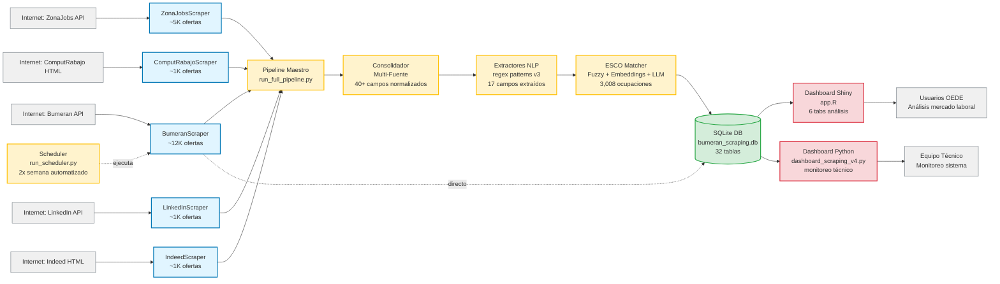

# 🏗️ ARQUITECTURA DEL SISTEMA MOL

**Proyecto:** Monitor de Ofertas Laborales (MOL)
**Versión:** v1.0 (actual) → v2.0 (roadmap)
**Fecha:** 14/11/2025

---

## 📊 DIAGRAMA DE ARQUITECTURA END-TO-END



---

## 🔄 FLUJO DETALLADO POR FASE

### **FASE 1: SCRAPING (Recolección de Datos)**

**Componentes:**
- 5 scrapers especializados por fuente
- IncrementalTracker (evita duplicados)
- AdaptiveRateLimiter (control de velocidad)
- CircuitBreaker (resiliencia ante fallos)
- AlertManager (notificaciones de errores)

**Inputs:**
- APIs REST (Bumeran, ZonaJobs)
- Páginas HTML (ComputRabajo, Indeed)
- JobSpy wrapper (LinkedIn)

**Outputs:**
- CSV/JSON/Excel en `01_sources/{fuente}/data/raw/`
- Campos crudos heterogéneos por fuente

**Volumen estimado:**
- Bumeran: ~12,000 ofertas (fuente principal)
- ZonaJobs: ~5,000 ofertas
- ComputRabajo: ~500-1,000 ofertas
- LinkedIn: ~500-1,000 ofertas (limitado por rate limits)
- Indeed: ~500-1,000 ofertas
- **Total:** ~20,000 ofertas potenciales

**Frecuencia:**
- Scheduler automático: 2x semana (Bumeran)
- Manual incremental: diario (todas las fuentes)
- Manual full: semanal (refresh completo)

---

### **FASE 2: CONSOLIDACIÓN (Normalización)**

**Componentes:**
- ConsolidadorMultiFuente
- Normalizadores específicos por fuente:
  - BumeranNormalizer
  - ZonaJobsNormalizer
  - ComputRabajoNormalizer
  - LinkedInNormalizer
  - IndeedNormalizer

**Proceso:**
1. **Lectura:** Lee CSV/JSON de 01_sources/
2. **Normalización:** Convierte a schema unificado
3. **Limpieza:** Remueve HTML, normaliza fechas, limpia texto
4. **Deduplicación:** Elimina ofertas duplicadas (por ID o título+empresa)
5. **Validación:** Verifica campos obligatorios

**Schema unificado (40+ campos):**
- **Identificación:** id, fuente, titulo, empresa
- **Ubicación:** provincia, ciudad, zona
- **Temporal:** fecha_publicacion, fecha_scraping
- **Modalidad:** modalidad_trabajo (presencial/híbrido/remoto), tipo_jornada
- **Descripción:** descripcion_limpia, descripcion_html
- **Requisitos:** experiencia_requerida, educacion_requerida
- **Compensación:** salario_min, salario_max, moneda
- **Metadata:** url_oferta, logo_empresa, categoria

**Output:**
- `02_consolidation/data/consolidated/ofertas_consolidadas_YYYYMMDD.csv`
- Reporte de cobertura por fuente

---

### **FASE 3: EXTRACCIÓN NLP (Análisis de Texto)**

**Componentes:**
- run_nlp_extraction.py (orquestador)
- Extractores por fuente:
  - BumeranExtractor (v3)
  - ZonaJobsExtractor
  - IndeedExtractor
- regex_patterns_v3.py (patrones optimizados)

**Proceso:**
1. **Lectura:** Ofertas consolidadas
2. **Extracción:** Aplica regex patterns a descripción + título
3. **Parsing:** Extrae 17 campos estructurados
4. **Validación:** Confidence score por campo
5. **Enriquecimiento:** Añade metadata de extracción

**Campos extraídos (17):**
1. **Experiencia:**
   - experiencia_años_min
   - experiencia_años_max
   - nivel_seniority (junior/semi-senior/senior/specialist)

2. **Educación:**
   - nivel_educativo (primaria/secundaria/terciaria/universitaria/posgrado)
   - carrera_especifica
   - estado_estudios (completo/en_curso/estudiante_avanzado)

3. **Idiomas:**
   - idioma_1, nivel_idioma_1
   - idioma_2, nivel_idioma_2

4. **Skills técnicas:**
   - tecnologias (lista de tecnologías mencionadas)
   - certificaciones

5. **Compensación:**
   - salario_min, salario_max (parseados de texto)
   - beneficios

6. **Modalidad:**
   - modalidad_confirmada (extraída de descripción)

**Output:**
- `02.5_nlp_extraction/data/processed/{fuente}_nlp_YYYYMMDD.csv`
- Stats de extracción (coverage, confidence scores)

**Precisión estimada:**
- Experiencia: ~85% coverage
- Educación: ~70% coverage
- Idiomas: ~60% coverage
- Salario: ~40% coverage (muchas ofertas no lo publican)

---

### **FASE 4: CLASIFICACIÓN ESCO (Taxonomía Estándar)**

**Componentes:**
- esco_hybrid_matcher.py (matcher de 3 niveles)
- integracion_esco_semantica.py (integración final)
- populate_esco_from_rdf.py (setup inicial)

**Base de conocimiento ESCO v1.2.0:**
- **3,008 ocupaciones** (ISCO-08)
- **13,890 skills** (conocimientos, habilidades, competencias)
- **60,000+ asociaciones** ocupación-skill
- **Jerarquía ISCO:** 10 major groups → 43 sub-major → 130 minor → 436 unit

**Proceso de matching (3 niveles):**

1. **Nivel 1: Fuzzy Matching (rápido)**
   - Usa difflib para similitud de strings
   - Umbral: score ≥ 80
   - Tiempo: ~1ms por oferta
   - Ejemplo: "Desarrollador Python" → "Software Developer" (score: 85)

2. **Nivel 2: Embeddings Semánticos (medio)**
   - Modelo: paraphrase-multilingual-MiniLM-L12-v2
   - Similitud coseno entre embeddings
   - Umbral: score ≥ 70
   - Tiempo: ~50ms por oferta
   - Ejemplo: "Analista de datos" → "Data Analyst" (score: 92)

3. **Nivel 3: LLM (Ollama llama3) (lento pero preciso)**
   - Solo para casos difíciles (score < 70)
   - Contexto: descripción completa
   - Tiempo: ~2-5s por oferta
   - Ejemplo: "Responsable de calidad en manufactura" → "Quality Assurance Manager" (score: 88)

**Output:**
- Ofertas enriquecidas con:
  - esco_code (código ISCO-08, ej: "2512")
  - occupation_name ("Software Developers")
  - isco_level_1 (major group: "Professionals")
  - isco_level_2 (sub-major: "Information and Communications Technology Professionals")
  - skills_asociadas (lista de skills de esa ocupación)
  - confidence_score (0-100)
  - matching_strategy ("fuzzy"/"embeddings"/"llm")

**Cobertura actual:**
- **268 ofertas clasificadas** con ESCO en dashboard Shiny
- Objetivo v2.0: Clasificar 100% de ofertas nuevas automáticamente

---

### **FASE 5: ALMACENAMIENTO (Base de Datos)**

**Componente:** db_manager.py

**Base de datos:** SQLite - `database/bumeran_scraping.db` (100 MB)

**Schema (32 tablas principales):**

**Tablas de datos:**
1. `ofertas` - Ofertas scrapeadas (campos consolidados)
2. `ofertas_nlp` - Ofertas con NLP extraído
3. `ofertas_esco` - Ofertas con clasificación ESCO

**Tablas ESCO:**
4. `esco_occupations` (3,008 filas)
5. `esco_skills` (13,890 filas)
6. `esco_isco` (jerarquía ISCO-08)
7. `esco_associations` (60K+ ocupación-skill)

**Tablas de métricas:**
8. `metricas_scraping` - Performance de scrapers
9. `alertas` - Errores y warnings
10. `circuit_breaker_stats` - Estado de circuit breakers
11. `rate_limiter_stats` - Estadísticas de rate limiting

**Vistas (reportes pre-calculados):**
- `v_ofertas_recientes` (últimos 30 días)
- `v_cobertura_por_fuente` (stats por fuente)
- `v_ocupaciones_mas_demandadas` (top 20 ESCO)

**Operaciones:**
- **Insert:** Validación de calidad (rechaza si faltan campos críticos)
- **Update:** Dual-write a schema v2 (migración en progreso)
- **Query:** Índices en fecha_publicacion, fuente, provincia, esco_code

**Backups:**
- Manual: `backups/fase0_20251114/ofertas_laborales_backup.db`
- Automático: No implementado aún (roadmap v2.0)

---

### **FASE 6: VISUALIZACIÓN (Dashboards)**

#### **6.1 Dashboard Shiny (app.R) - Análisis del Mercado Laboral**

**Propósito:** Dashboard público para análisis de mercado laboral con taxonomía ESCO

**URL:** https://dos1tv-gerardo-breard.shinyapps.io/dashboard-esco-argentina/

**Tabs (6):**

1. **Panorama General**
   - InfoBoxes: Total ofertas, provincias, ocupaciones, skills
   - Mapa de Argentina con ofertas por provincia (leaflet)
   - Top 10 ocupaciones ESCO más demandadas
   - Distribución temporal (últimos 6 meses)

2. **Perfil Demandado**
   - Nivel educativo requerido (gráfico de torta)
   - Experiencia requerida (histograma)
   - Rango salarial (boxplot por ocupación)
   - Modalidad de trabajo (presencial/híbrido/remoto)

3. **Skills Más Demandadas**
   - Top 20 skills por ocupación ESCO
   - Mapa de calor skills × ocupaciones
   - Skills técnicas vs soft skills
   - Tendencias de skills (series temporales)

4. **Ocupaciones ESCO**
   - Árbol jerárquico ISCO (major → sub-major → minor → unit)
   - Distribución por sector (IT, Admin, Ventas, etc.)
   - Ofertas por código ISCO-08
   - Skills asociadas por ocupación

5. **Explorador de Ofertas**
   - Tabla interactiva (DT) con búsqueda y filtros
   - Filtros por: provincia, ocupación, modalidad, salario, fecha
   - Export a CSV/Excel
   - Vista detalle de oferta (modal)

6. **Tendencias**
   - Series temporales de publicaciones
   - Estacionalidad (por mes/trimestre)
   - Provincias emergentes
   - Ocupaciones en crecimiento

**Tecnologías:**
- Backend: R + Shiny + shinydashboard
- Gráficos: ggplot2 + plotly (interactivos)
- Mapas: leaflet
- Tablas: DT (DataTables)

**Datos actuales:**
- **268 ofertas** con clasificación ESCO completa
- Filtro temporal: últimos 6 meses
- Actualización: manual (cuando hay nuevos datos procesados)

---

#### **6.2 Dashboard Python (dashboard_scraping_v4.py) - Monitoreo Técnico**

**Propósito:** Dashboard interno para monitoreo de operaciones de scraping

**Audiencia:** Equipo técnico DevOps

**Secciones:**

1. **Performance de Scrapers**
   - Tiempo promedio por oferta
   - Tasa de éxito (ofertas scrapeadas vs errores)
   - Cobertura por fuente (% del total)
   - Throughput (ofertas/min)

2. **Circuit Breaker Stats**
   - Estado actual (CLOSED/OPEN/HALF_OPEN)
   - Historial de trips
   - Tiempo de recovery
   - Failures antes de trip

3. **Rate Limiter Stats**
   - Requests por minuto actual
   - Límite configurado
   - Sleeps aplicados
   - Queue de peticiones

4. **Alertas y Errores**
   - Log de errores recientes (últimas 24h)
   - Alertas críticas sin resolver
   - Top 10 errores más frecuentes
   - Correlación error × fuente

5. **Métricas Históricas**
   - Ofertas scrapeadas por día (últimos 30 días)
   - Uptime del scheduler
   - Disponibilidad por fuente
   - SLA metrics

**Tecnologías:**
- Backend: Python + Streamlit/Dash
- Gráficos: Plotly
- Data source: SQLite (tablas de métricas)

**Actualización:** Tiempo real (refresh cada 30s)

---

## 🤖 AUTOMATIZACIÓN (Scheduler)

**Componente:** run_scheduler.py

**Configuración actual:**
```python
SCHEDULER_CONFIG = {
    "days": ["monday", "thursday"],
    "time": "08:00",
    "timezone": "America/Argentina/Buenos_Aires",
    "sources": ["bumeran"],
    "strategy": "incremental"
}
```

**Flujo:**
1. Loop infinito con `schedule` library
2. Cada lunes y jueves a las 8:00 AM:
   - Ejecuta `scrapear_con_diccionario.py` (Bumeran)
   - Modo incremental (solo ofertas nuevas desde último scraping)
   - Guarda en SQLite directamente
3. Log en `logs/scheduler_YYYYMM.log`
4. Heartbeat cada 1h (confirma que el scheduler está vivo)

**Métricas capturadas:**
- Timestamp inicio/fin
- Ofertas scrapeadas (nuevas vs ya conocidas)
- Errores encontrados
- Tiempo total de ejecución

**Roadmap v2.0:**
- Extender a todas las fuentes (no solo Bumeran)
- Ejecutar NLP + ESCO automáticamente después de scraping
- Notificaciones por email/Slack en caso de fallos
- Dashboard en tiempo real del scheduler

---

## 📊 VOLUMETRÍA Y MÉTRICAS

### **Datos actuales (v1.0):**
- **Ofertas en BD:** ~6,521 (histórico)
- **Ofertas con NLP:** ~1,500 (procesadas manualmente)
- **Ofertas con ESCO:** 268 (clasificadas)
- **Scripts Python:** 213
- **Scripts R:** 35
- **Tablas SQLite:** 32
- **Tamaño BD:** 100 MB

### **Capacidad del sistema:**
- **Scraping:** ~20K ofertas/ejecución (5 fuentes combinadas)
- **NLP:** ~500 ofertas/min (procesamiento batch)
- **ESCO Fuzzy:** ~1,000 ofertas/min
- **ESCO Embeddings:** ~20 ofertas/min
- **ESCO LLM:** ~12 ofertas/min (Ollama llama3)

### **Objetivos v2.0 (6 meses):**
- **Ofertas totales:** +39% (de 6,521 a ~9,000)
- **Fuentes automatizadas:** 3/5 (Bumeran ✅, ZonaJobs, ComputRabajo)
- **Cobertura NLP:** 100% de ofertas nuevas
- **Clasificación ESCO:** 100% de ofertas nuevas
- **Trabajo manual:** 0 horas/semana (todo automatizado)

---

## 🔧 DEPENDENCIAS PRINCIPALES

### **Python:**
```txt
requests==2.31.0
beautifulsoup4==4.12.0
pandas==2.0.3
sqlite3 (built-in)
rdflib==7.0.0
sentence-transformers==2.2.2
ollama==0.1.0
jobspy==0.1.0
schedule==1.2.0
tqdm==4.66.0
```

### **R:**
```r
shiny==1.7.5
shinydashboard==0.7.2
ggplot2==3.4.4
plotly==4.10.2
leaflet==2.2.0
DT==0.28
dplyr==1.1.3
tidyr==1.3.0
```

### **Externos:**
- **Ollama:** LLM local (llama3:8b model)
- **ESCO RDF:** esco-v1.2.0.rdf (1.26 GB)

---

## 🚀 ROADMAP v2.0 (6 meses)

### **FASE 1: Fundamentos de Datos (4 semanas)**
- Ampliar ESCO a 100% de ofertas
- Mejorar NLP v6.0 (LLM-based)
- Integrar skills semánticas

### **FASE 2: Dashboard Renovado (4 semanas)**
- Shiny v3.0 con filtros avanzados
- Comparador de perfiles
- Predictor de salarios (ML)

### **FASE 3: Scraping Ampliado (3 semanas)**
- Automatizar ZonaJobs y ComputRabajo
- Añadir nuevas fuentes (Glassdoor, CompuTrabajo Internacional)

### **FASE 4: Automatización Completa (3 semanas)**
- Pipeline end-to-end automatizado
- Monitoreo 24/7
- Alertas automáticas

### **FASE 5: Optimización (4 semanas)**
- Performance tuning
- Testing exhaustivo
- Lanzamiento público

---

## 📞 CONTACTO

**Responsable:** Equipo Técnico OEDE
**Última actualización:** 14/11/2025
**Versión del documento:** 1.0

---

**Documentos relacionados:**
- `INVENTARIO_SCRIPTS_PRINCIPALES.md` - Detalle de 20 scripts críticos
- `schema_bd.sql` - Schema completo de 32 tablas SQLite
- `PROGRESO_FASE_0.md` - Tracking de implementación v2.0
