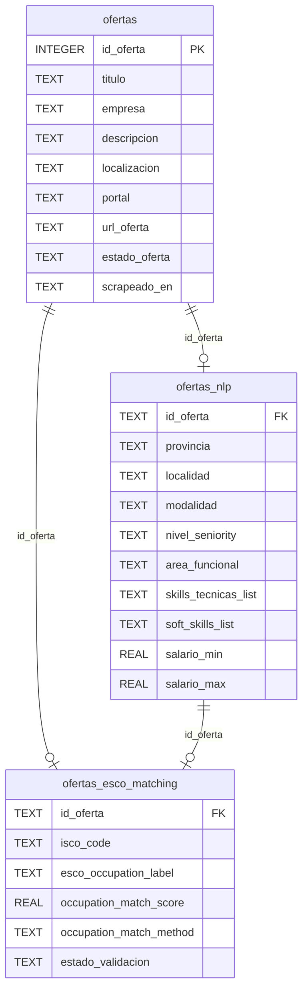
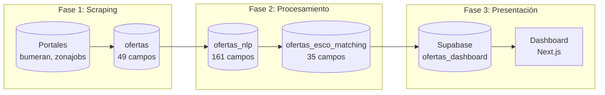

# Diccionario de Datos - Dashboard MOL

**Fecha:** 2026-01-19
**Total de campos:** 245
**Tablas:** 3 (ofertas, ofertas_nlp, ofertas_esco_matching)

---

## 1. Diagrama Relacional

## 2. Flujo de Datos

---

## 3. Tabla: ofertas (49 campos)

Datos crudos del scraping de portales de empleo.

### 3.1 Identificadores

| Campo | Tipo | Descripcion |
|-------|------|-------------|
| `id_oferta` | INTEGER | PK - ID unico de la oferta |
| `id_empresa` | INTEGER | ID de la empresa en el portal |
| `url_oferta` | TEXT | URL original de la oferta |
| `portal` | TEXT | Fuente: bumeran, zonajobs, etc. |

### 3.2 Informacion Basica

| Campo | Tipo | Descripcion |
|-------|------|-------------|
| `titulo` | TEXT | Titulo del puesto |
| `empresa` | TEXT | Nombre de la empresa |
| `descripcion` | TEXT | Descripcion completa (HTML) |
| `descripcion_utf8` | TEXT | Descripcion limpia UTF-8 |
| `confidencial` | INTEGER | 1=oferta confidencial |
| `tipo_aviso` | TEXT | Tipo de publicacion |

### 3.3 Ubicacion

| Campo | Tipo | Descripcion |
|-------|------|-------------|
| `localizacion` | TEXT | Ubicacion raw del portal |
| `provincia_normalizada` | TEXT | Provincia normalizada |
| `codigo_provincia_indec` | TEXT | Codigo INDEC provincia |
| `localidad_normalizada` | TEXT | Localidad normalizada |
| `codigo_localidad_indec` | TEXT | Codigo INDEC localidad |

### 3.4 Modalidad y Tipo

| Campo | Tipo | Descripcion |
|-------|------|-------------|
| `modalidad_trabajo` | TEXT | presencial/remoto/hibrido |
| `tipo_trabajo` | TEXT | full-time/part-time |
| `cantidad_vacantes` | INTEGER | Numero de vacantes |
| `apto_discapacitado` | INTEGER | 1=apto discapacitados |

### 3.5 Fechas

| Campo | Tipo | Descripcion |
|-------|------|-------------|
| `fecha_publicacion_original` | TEXT | Fecha publicacion (raw) |
| `fecha_hora_publicacion_original` | TEXT | Fecha+hora (raw) |
| `fecha_modificado_original` | TEXT | Fecha modificacion (raw) |
| `fecha_publicacion_iso` | TEXT | Fecha ISO 8601 |
| `fecha_hora_publicacion_iso` | TEXT | Fecha+hora ISO |
| `fecha_modificado_iso` | TEXT | Modificacion ISO |
| `fecha_publicacion_datetime` | TEXT | Datetime Python |
| `fecha_hora_publicacion_datetime` | TEXT | Datetime completo |
| `fecha_modificado_datetime` | TEXT | Modificacion datetime |
| `scrapeado_en` | TEXT | Timestamp del scraping |
| `fecha_ultimo_visto` | TEXT | Ultima vez vista activa |
| `fecha_baja` | TEXT | Fecha de cierre |

### 3.6 Empresa

| Campo | Tipo | Descripcion |
|-------|------|-------------|
| `empresa_validada` | INTEGER | 1=empresa verificada |
| `empresa_pro` | INTEGER | 1=cuenta premium |
| `promedio_empresa` | REAL | Rating de la empresa |
| `logo_url` | TEXT | URL del logo |
| `gptw_url` | TEXT | URL Great Place to Work |

### 3.7 Publicacion

| Campo | Tipo | Descripcion |
|-------|------|-------------|
| `plan_publicacion_id` | INTEGER | ID del plan de publicacion |
| `plan_publicacion_nombre` | TEXT | Nombre del plan |
| `tiene_preguntas` | INTEGER | 1=tiene preguntas filtro |
| `salario_obligatorio` | INTEGER | 1=salario obligatorio |
| `alta_revision_perfiles` | INTEGER | 1=alta revision |
| `guardado` | INTEGER | 1=guardada por usuario |

### 3.8 Areas

| Campo | Tipo | Descripcion |
|-------|------|-------------|
| `id_area` | INTEGER | ID del area de trabajo |
| `id_subarea` | INTEGER | ID de la subarea |
| `id_pais` | INTEGER | ID del pais |

### 3.9 Estado y Metricas

| Campo | Tipo | Descripcion |
|-------|------|-------------|
| `estado_oferta` | TEXT | activa/cerrada |
| `dias_publicada` | INTEGER | Dias desde publicacion |
| `veces_vista` | INTEGER | Veces vista en scraping |
| `categoria_permanencia` | TEXT | alta/media/baja |

---

## 4. Tabla: ofertas_nlp (161 campos)

Datos extraidos por NLP (Qwen2.5:7b) y postprocessor.

### 4.1 Experiencia (10 campos)

| Campo | Tipo | Descripcion |
|-------|------|-------------|
| `experiencia_min_anios` | INTEGER | Anos minimos requeridos |
| `experiencia_max_anios` | INTEGER | Anos maximos |
| `experiencia_area` | TEXT | Area de experiencia |
| `experiencia_texto` | TEXT | Texto original |
| `experiencia_descripcion` | TEXT | Descripcion detallada |
| `experiencia_nivel_previo` | TEXT | Nivel previo requerido |
| `experiencia_sector` | TEXT | Sector de experiencia |
| `experiencia_areas_list` | TEXT | JSON array de areas |
| `experiencia_excluyente` | INTEGER | 1=excluyente |
| `experiencia_valorada` | INTEGER | 1=valorada |

### 4.2 Educacion (10 campos)

| Campo | Tipo | Descripcion |
|-------|------|-------------|
| `nivel_educativo` | TEXT | secundario/terciario/universitario/posgrado |
| `estado_educativo` | TEXT | completo/en_curso |
| `carrera_especifica` | TEXT | Carrera requerida |
| `titulo_excluyente` | INTEGER | 1=titulo excluyente |
| `nivel_educativo_excluyente` | INTEGER | 1=nivel excluyente |
| `titulo_requerido` | TEXT | Titulo especifico |
| `orientacion_estudios` | TEXT | Orientacion preferida |
| `acepta_estudiantes_avanzados` | INTEGER | 1=acepta estudiantes |
| `estudios_valorados_list` | TEXT | JSON array estudios |

### 4.3 Idiomas (6 campos)

| Campo | Tipo | Descripcion |
|-------|------|-------------|
| `idioma_principal` | TEXT | Idioma principal requerido |
| `nivel_idioma_principal` | TEXT | basico/intermedio/avanzado/nativo |
| `idioma_secundario` | TEXT | Segundo idioma |
| `nivel_idioma_secundario` | TEXT | Nivel segundo idioma |
| `idioma_excluyente` | INTEGER | 1=idioma excluyente |
| `idiomas_adicionales_json` | TEXT | JSON con mas idiomas |

### 4.4 Skills (9 campos)

| Campo | Tipo | Descripcion |
|-------|------|-------------|
| `skills_tecnicas_list` | TEXT | JSON array skills tecnicas |
| `niveles_skills_list` | TEXT | JSON niveles por skill |
| `soft_skills_list` | TEXT | JSON array soft skills |
| `perfil_actitudinal_list` | TEXT | JSON perfil actitudinal |
| `conocimientos_especificos_list` | TEXT | JSON conocimientos |
| `herramientas_list` | TEXT | JSON herramientas |
| `sistemas_list` | TEXT | JSON sistemas (SAP, etc) |
| `nivel_herramienta_json` | TEXT | JSON nivel por herramienta |
| `conocimiento_excluyente_list` | TEXT | JSON conocimientos excluyentes |

### 4.5 Tecnologias (2 campos)

| Campo | Tipo | Descripcion |
|-------|------|-------------|
| `tecnologias_list` | TEXT | JSON array tecnologias |
| `marcas_especificas_list` | TEXT | JSON marcas especificas |

### 4.6 Certificaciones (6 campos)

| Campo | Tipo | Descripcion |
|-------|------|-------------|
| `certificaciones_list` | TEXT | JSON certificaciones generales |
| `certificaciones_requeridas_json` | TEXT | JSON requeridas |
| `certificaciones_deseables_list` | TEXT | JSON deseables |
| `certificaciones_tecnicas_list` | TEXT | JSON tecnicas |
| `certificaciones_seguridad_list` | TEXT | JSON seguridad laboral |

### 4.7 Salario (12 campos)

| Campo | Tipo | Descripcion |
|-------|------|-------------|
| `salario_min` | REAL | Salario minimo |
| `salario_max` | REAL | Salario maximo |
| `moneda` | TEXT | ARS/USD |
| `salario_periodo` | TEXT | mensual/anual |
| `salario_neto` | INTEGER | 1=neto, 0=bruto |
| `tiene_salario_base` | INTEGER | 1=tiene base |
| `tiene_comisiones` | INTEGER | 1=tiene comisiones |
| `tiene_bonos` | INTEGER | 1=tiene bonos |
| `estructura_salarial` | TEXT | Descripcion estructura |
| `bonos_json` | TEXT | JSON detalle bonos |
| `pide_pretension_salarial` | INTEGER | 1=pide pretension |
| `pretension_formato` | TEXT | Formato pretension |
| `indexacion_salarial` | INTEGER | 1=indexado |

### 4.8 Beneficios (16 campos)

| Campo | Tipo | Descripcion |
|-------|------|-------------|
| `beneficios_list` | TEXT | JSON array beneficios |
| `tiene_cobertura_salud` | INTEGER | 1=cobertura salud |
| `cobertura_salud_familia` | INTEGER | 1=incluye familia |
| `tiene_comedor` | INTEGER | 1=comedor |
| `tiene_capacitacion` | INTEGER | 1=capacitacion |
| `tiene_crecimiento` | INTEGER | 1=plan carrera |
| `tiene_programa_asistencia` | INTEGER | 1=asistencia empleado |
| `tiene_descuentos` | INTEGER | 1=descuentos |
| `descuentos_educacion_json` | TEXT | JSON descuentos educacion |
| `descuentos_gimnasio_json` | TEXT | JSON descuentos gym |
| `vehiculo_provisto` | INTEGER | 1=vehiculo provisto |
| `otros_beneficios_list` | TEXT | JSON otros beneficios |
| `obra_social` | INTEGER | 1=obra social |
| `art` | INTEGER | 1=ART |
| `prepaga` | INTEGER | 1=prepaga |
| `beneficios_detectados` | TEXT | Beneficios detectados |

### 4.9 Jornada y Horario (12 campos)

| Campo | Tipo | Descripcion |
|-------|------|-------------|
| `jornada_laboral` | TEXT | full-time/part-time |
| `horario_flexible` | INTEGER | 1=flexible |
| `horario_especifico` | TEXT | Horario especifico |
| `dias_trabajo_list` | TEXT | JSON dias de trabajo |
| `dias_laborales` | TEXT | Dias laborales |
| `hora_entrada` | TEXT | Hora entrada |
| `hora_salida` | TEXT | Hora salida |
| `trabajo_nocturno` | INTEGER | 1=nocturno |
| `trabajo_turnos_rotativos` | INTEGER | 1=turnos rotativos |
| `trabajo_fines_semana` | INTEGER | 1=fines de semana |
| `trabajo_feriados` | INTEGER | 1=feriados |

### 4.10 Ubicacion NLP (6 campos)

| Campo | Tipo | Descripcion |
|-------|------|-------------|
| `provincia` | TEXT | Provincia normalizada |
| `localidad` | TEXT | Localidad normalizada |
| `tipo_lugar` | TEXT | oficina/planta/campo |
| `zonas_cobertura_list` | TEXT | JSON zonas cobertura |
| `zona_residencia_req` | TEXT | Zona residencia requerida |
| `acepta_relocacion` | INTEGER | 1=acepta relocacion |

### 4.11 Modalidad y Viajes (7 campos)

| Campo | Tipo | Descripcion |
|-------|------|-------------|
| `modalidad` | TEXT | presencial/remoto/hibrido |
| `requiere_viajar` | INTEGER | 1=requiere viajar |
| `frecuencia_viaje` | TEXT | frecuencia de viajes |
| `radio_viaje_km` | INTEGER | Radio en km |
| `requiere_movilidad_propia` | INTEGER | 1=movilidad propia |
| `disponibilidad_viajes` | INTEGER | 1=disponibilidad |

### 4.12 Licencias (7 campos)

| Campo | Tipo | Descripcion |
|-------|------|-------------|
| `licencia_conducir` | INTEGER | 1=requiere licencia |
| `tipo_licencia` | TEXT | Tipo de licencia |
| `licencia_conducir_excluyente` | INTEGER | 1=excluyente |
| `licencia_autoelevador` | INTEGER | 1=autoelevador |
| `otras_licencias_list` | TEXT | JSON otras licencias |
| `matricula_profesional` | INTEGER | 1=requiere matricula |
| `matricula_tipo` | TEXT | Tipo de matricula |

### 4.13 Rol y Funciones (12 campos)

| Campo | Tipo | Descripcion |
|-------|------|-------------|
| `titulo_limpio` | TEXT | Titulo normalizado |
| `titulo_normalizado` | TEXT | Titulo estandarizado |
| `tareas_explicitas` | TEXT | Tareas mencionadas |
| `tareas_inferidas` | TEXT | Tareas inferidas |
| `mision_rol` | TEXT | Mision del rol |
| `interactua_con_externos_list` | TEXT | JSON interacciones |
| `tiene_gente_cargo` | INTEGER | 1=tiene gente a cargo |
| `tipo_equipo` | TEXT | Tipo de equipo |
| `producto_servicio` | TEXT | Producto/servicio |
| `area_funcional` | TEXT | Area funcional |
| `nivel_seniority` | TEXT | junior/semi_senior/senior/manager |
| `tipo_contrato` | TEXT | Tipo de contrato |

### 4.14 Empresa NLP (10 campos)

| Campo | Tipo | Descripcion |
|-------|------|-------------|
| `sector_empresa` | TEXT | Sector de la empresa |
| `rubro_empresa` | TEXT | Rubro especifico |
| `cliente_final` | TEXT | Cliente final |
| `empresa_tamanio` | TEXT | Tamanio empresa |
| `empresa_antiguedad` | TEXT | Antiguedad |
| `empresa_contratante` | TEXT | Empresa contratante |
| `empresa_publicadora` | TEXT | Empresa publicadora |
| `es_tercerizado` | INTEGER | 1=tercerizado |
| `es_intermediario` | INTEGER | 1=intermediario |

### 4.15 CLAE/Sector (5 campos)

| Campo | Tipo | Descripcion |
|-------|------|-------------|
| `clae_code` | TEXT | Codigo CLAE |
| `clae_grupo` | TEXT | Grupo CLAE |
| `clae_seccion` | TEXT | Seccion CLAE |
| `sector_confianza` | TEXT | Confianza del sector |
| `sector_fuente` | TEXT | Fuente del sector |

### 4.16 Condiciones Fisicas (10 campos)

| Campo | Tipo | Descripcion |
|-------|------|-------------|
| `trabajo_en_altura` | INTEGER | 1=trabajo en altura |
| `altura_metros` | INTEGER | Altura en metros |
| `trabajo_espacios_confinados` | INTEGER | 1=espacios confinados |
| `trabajo_exterior` | INTEGER | 1=trabajo exterior |
| `trabajo_riesgo` | INTEGER | 1=trabajo riesgoso |
| `requiere_esfuerzo_fisico` | INTEGER | 1=esfuerzo fisico |
| `carga_peso_kg` | INTEGER | Peso a cargar en kg |
| `ambiente_trabajo` | TEXT | Descripcion ambiente |
| `contratacion_inmediata` | INTEGER | 1=inmediata |

### 4.17 Discriminacion (9 campos)

| Campo | Tipo | Descripcion |
|-------|------|-------------|
| `tiene_requisitos_discriminatorios` | INTEGER | 1=discriminatorio |
| `requisito_edad_min` | INTEGER | Edad minima |
| `requisito_edad_max` | INTEGER | Edad maxima |
| `tipo_discriminacion_list` | TEXT | JSON tipos |
| `requisito_sexo` | TEXT | Requisito de sexo |
| `titulo_genero_especifico` | INTEGER | 1=genero en titulo |
| `requerimiento_edad` | INTEGER | 1=req edad |
| `requerimiento_sexo` | INTEGER | 1=req sexo |
| `tiene_clausula_diversidad` | INTEGER | 1=clausula diversidad |
| `es_republica` | INTEGER | 1=oferta republica |

### 4.18 Requisitos Generales (2 campos)

| Campo | Tipo | Descripcion |
|-------|------|-------------|
| `requisitos_excluyentes_list` | TEXT | JSON excluyentes |
| `requisitos_deseables_list` | TEXT | JSON deseables |

### 4.19 Calidad y Metadata (14 campos)

| Campo | Tipo | Descripcion |
|-------|------|-------------|
| `nlp_extraction_timestamp` | TEXT | Timestamp extraccion |
| `nlp_version` | TEXT | Version NLP (11.3.0) |
| `nlp_confidence_score` | REAL | Score confianza |
| `nlp_score_max` | INTEGER | Score maximo |
| `largo_descripcion` | INTEGER | Largo descripcion |
| `campos_con_fuente_json` | TEXT | JSON campos con fuente |
| `tipo_oferta` | TEXT | Tipo de oferta |
| `calidad_texto` | TEXT | Calidad del texto |
| `calidad_redaccion` | TEXT | Calidad redaccion |
| `pasa_a_matching` | INTEGER | 1=pasa a matching |
| `tiene_errores_tipeo` | INTEGER | 1=errores tipeo |
| `errores_detectados_list` | TEXT | JSON errores |
| `titulo_repetido_en_descripcion` | INTEGER | 1=titulo repetido |

---

## 5. Tabla: ofertas_esco_matching (35 campos)

Clasificacion ESCO/ISCO y validacion.

### 5.1 Identificadores

| Campo | Tipo | Descripcion |
|-------|------|-------------|
| `id_oferta` | TEXT | FK a ofertas |
| `run_id` | TEXT | ID del run de matching |

### 5.2 Clasificacion ESCO

| Campo | Tipo | Descripcion |
|-------|------|-------------|
| `esco_occupation_uri` | TEXT | URI ocupacion ESCO |
| `esco_occupation_label` | TEXT | Label ocupacion |
| `titulo_normalizado` | TEXT | Titulo normalizado |
| `titulo_esco_code` | TEXT | Codigo ESCO del titulo |

### 5.3 Clasificacion ISCO

| Campo | Tipo | Descripcion |
|-------|------|-------------|
| `isco_code` | TEXT | Codigo ISCO 4 digitos |
| `isco_nivel1` | TEXT | ISCO 1 digito |
| `isco_nivel2` | TEXT | ISCO 2 digitos |
| `isco_label` | TEXT | Label ISCO |

### 5.4 Scores de Matching

| Campo | Tipo | Descripcion |
|-------|------|-------------|
| `occupation_match_score` | REAL | Score final |
| `confidence_score` | REAL | Confianza |
| `rerank_score` | REAL | Score reranking |
| `score_titulo` | REAL | Score por titulo |
| `score_skills` | REAL | Score por skills |
| `score_descripcion` | REAL | Score descripcion |
| `score_final_ponderado` | REAL | Score ponderado |

### 5.5 Metodo de Matching

| Campo | Tipo | Descripcion |
|-------|------|-------------|
| `occupation_match_method` | TEXT | Metodo usado |
| `matching_timestamp` | TEXT | Timestamp matching |
| `matching_version` | TEXT | Version del matcher |

### 5.6 Skills Matching

| Campo | Tipo | Descripcion |
|-------|------|-------------|
| `esco_skills_esenciales_json` | TEXT | JSON skills esenciales |
| `esco_skills_opcionales_json` | TEXT | JSON skills opcionales |
| `skills_demandados_total` | INTEGER | Total skills demandados |
| `skills_matcheados_esco` | INTEGER | Skills matcheados |
| `skills_sin_match_json` | TEXT | JSON sin match |
| `skills_oferta_json` | TEXT | JSON skills oferta |
| `skills_matched_essential` | TEXT | Skills esenciales matcheados |
| `skills_matched_optional` | TEXT | Skills opcionales matcheados |
| `skills_cobertura` | REAL | Cobertura de skills |

### 5.7 Validacion

| Campo | Tipo | Descripcion |
|-------|------|-------------|
| `match_confirmado` | INTEGER | 1=confirmado |
| `requiere_revision` | INTEGER | 1=requiere revision |
| `estado_validacion` | TEXT | pendiente/validado/rechazado |
| `validado_timestamp` | TEXT | Timestamp validacion |
| `validado_por` | TEXT | Usuario validador |
| `notas_revision` | TEXT | Notas de revision |

---

## 6. Mapeo SQLite a Supabase

Campos sincronizados a `ofertas_dashboard` en Supabase.

| Campo Supabase | Origen SQLite | Tabla |
|----------------|---------------|-------|
| `id_oferta` | id_oferta | ofertas |
| `titulo` | titulo | ofertas |
| `empresa` | empresa | ofertas |
| `fecha_publicacion` | fecha_publicacion_iso | ofertas |
| `url` | url_oferta | ofertas |
| `portal` | portal | ofertas |
| `provincia` | provincia | ofertas_nlp |
| `localidad` | localidad | ofertas_nlp |
| `isco_code` | isco_code | ofertas_esco_matching |
| `isco_label` | esco_occupation_label | ofertas_esco_matching |
| `occupation_match_score` | occupation_match_score | ofertas_esco_matching |
| `occupation_match_method` | occupation_match_method | ofertas_esco_matching |
| `modalidad` | modalidad | ofertas_nlp |
| `nivel_seniority` | nivel_seniority | ofertas_nlp |
| `area_funcional` | area_funcional | ofertas_nlp |
| `sector_empresa` | sector_empresa | ofertas_nlp |
| `salario_min` | salario_min | ofertas_nlp |
| `salario_max` | salario_max | ofertas_nlp |
| `skills_tecnicas` | skills_tecnicas_list | ofertas_nlp |
| `soft_skills` | soft_skills_list | ofertas_nlp |

---

## 7. Campos por Visualizacion

### 7.1 Panorama General (/)

| Visualizacion | Campos usados |
|---------------|---------------|
| KPI Total ofertas | COUNT(id_oferta) |
| KPI Ocupaciones | COUNT(DISTINCT isco_code) |
| KPI Empresas | COUNT(DISTINCT empresa) |
| KPI Provincias | COUNT(DISTINCT provincia) |
| Grafico Geografia | provincia, COUNT |
| Grafico Ocupaciones | isco_label, COUNT |

### 7.2 Requerimientos (/requerimientos)

| Visualizacion | Campos usados |
|---------------|---------------|
| Top Skills Tecnicas | skills_tecnicas_list |
| Top Soft Skills | soft_skills_list |
| KPI Skills | COUNT por tipo |

### 7.3 Ofertas (/ofertas)

| Visualizacion | Campos usados |
|---------------|---------------|
| Tabla ofertas | titulo, empresa, provincia, localidad, isco_label, modalidad, nivel_seniority, fecha_publicacion |
| Filtro provincia | provincia |
| Filtro modalidad | modalidad |
| Filtro ocupacion | isco_code, isco_label |

### 7.4 Vista Admin (/admin) - Propuesta

| Visualizacion | Campos usados | Tabla |
|---------------|---------------|-------|
| Fase 1: Scraping | portal, estado_oferta, scrapeado_en, dias_publicada | ofertas |
| Fase 2: NLP | nlp_version, COUNT ofertas_nlp | ofertas_nlp |
| Fase 2: Matching | occupation_match_method, occupation_match_score | ofertas_esco_matching |
| Fase 2: Validacion | estado_validacion, COUNT | ofertas_esco_matching |
| Fase 3: Sync | COUNT Supabase vs SQLite | ofertas_dashboard |

---

## 8. Campos No Utilizados (Oportunidad)

Campos disponibles no usados actualmente en el dashboard:

### Alta prioridad (datos utiles)
- `experiencia_min_anios`, `experiencia_max_anios` - Filtro por experiencia
- `nivel_educativo` - Filtro por educacion
- `jornada_laboral` - Full-time vs Part-time
- `tipo_contrato` - Tipo de contratacion
- `tiene_gente_cargo` - Puestos de liderazgo

### Media prioridad
- `idioma_principal` - Filtro por idioma
- `certificaciones_list` - Certificaciones requeridas
- `beneficios_list` - Beneficios ofrecidos
- `dias_publicada` - Antiguedad de la oferta

### Baja prioridad (datos incompletos)
- `salario_min`, `salario_max` - Poca completitud
- `clae_code` - Clasificacion sectorial

---

**Documentacion relacionada:**
- `Visual--/docs/VARIABLES_BASE_DATOS.md` - Variables historicas
- `docs/PIPELINE_DATOS_DASHBOARD.md` - Flujo del pipeline
- `docs/PLAN_DASHBOARD_VISTAS.md` - Plan de implementacion
