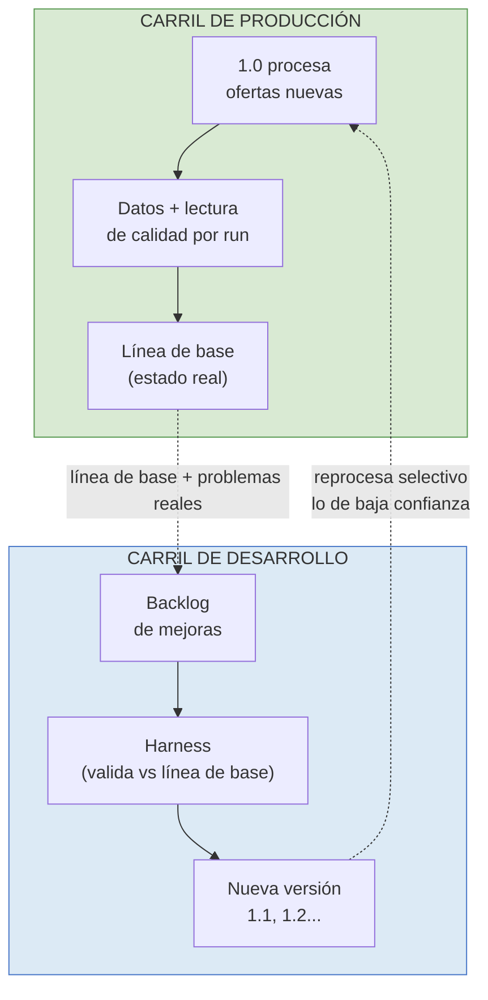
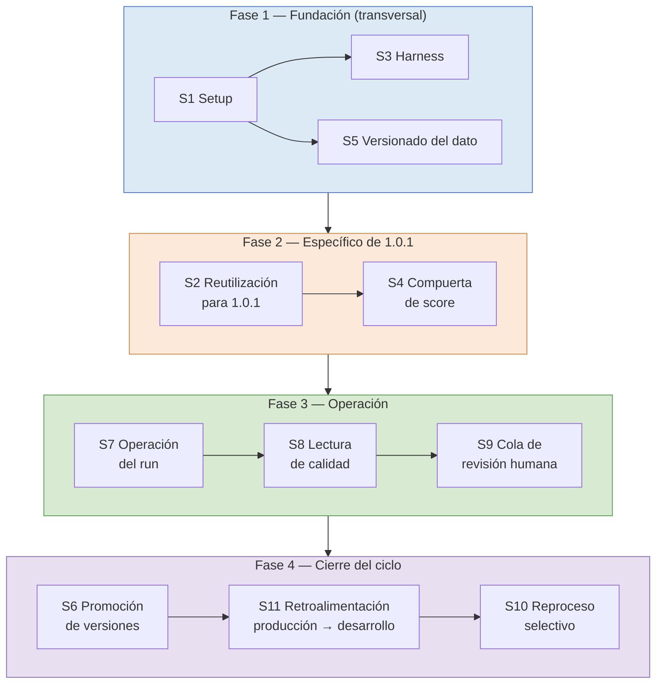

# MOL — Documento de planificación

> Versión 0.4 · 2026-06-03
> Documento operativo derivado del *Modelo conceptual del MOL* (master). Mientras el master define el horizonte y la teoría, este documento baja a tierra: objetivos, tareas concretas y decisiones a tomar, ordenados por sprint. Es el documento de trabajo; se actualiza a medida que se avanza, y su traducción a un seguimiento en el tiempo (días, hitos) se hace sobre la herramienta de gestión.
>
> *Cambios desde v0.3:* agregado al método de trabajo el principio "un spec es operativo o no es spec" (cada spec debe ser ejecutable y verificable sin inventar el cómo).

---

## Filosofía del MOL — el rector de todas las decisiones

Antes de planificar qué hacer, conviene fijar para qué se hace. Esta es la definición de qué es el MOL y qué principio resuelve sus tensiones. Toda tarea, todo sprint y toda decisión de este documento se mide contra esto: si algo no sirve a esta filosofía, no se hace, por más que técnicamente sea posible.

**El MOL es infraestructura de información sobre el trabajo argentino.** No es un observatorio, ni una herramienta para un único actor, ni un proyecto de vocabulario: es la capa de base que vuelve posibles las tres cosas a la vez —medir el mercado laboral real, dar herramientas concretas a quienes deciden (empresas, sindicatos, cámaras, Estado), y construir vocabulario propio del trabajo argentino—. No se elige un destinatario: la infraestructura los habilita a todos.

**Su valor es una combinación que ningún proveedor da junta:** captura lo argentino y lo emergente que las taxonomías globales no ven, con granularidad y calidad del dato ocupacional, y con independencia —dato propio, no alquilado a un proveedor externo—. Cada una de esas propiedades existe por separado en algún lado; las tres juntas, para el mercado argentino, no.

**Su principio rector ante el conflicto es la cobertura con honestidad.** Cuando hay tensión entre velocidad o cobertura y calidad del dato, el MOL clasifica todo, pero etiqueta el nivel de confianza de cada dato. No esconde lo que no sabe: lo marca. La honestidad no está en publicar solo lo perfecto, sino en publicar todo con su grado de certeza visible. De esto se desprende una exigencia que el sistema se impone a sí mismo: **la medición de confianza es parte del producto, no un accesorio.** Un dato del MOL no es "esta oferta es la ocupación X", sino "esta oferta es la ocupación X con esta confianza". Por eso los mecanismos que miden y etiquetan la certeza —la compuerta de score, los centinelas— no son mejoras opcionales sino requisitos del propósito.

**Su horizonte es la soberanía sobre el vocabulario del trabajo argentino.** Que el dato no dependa de una taxonomía prestada, sino que el propio mercado, a través del sistema, construya y mantenga vivo su vocabulario. Por eso el vocabulario vivo no es un adorno técnico del final del roadmap: es la expresión más pura de qué es el MOL.

---

## Cómo se usa este documento

El master da el rumbo; este documento dice qué hacer para recorrerlo. Cada sprint del master se desglosa acá en objetivos, tareas concretas y decisiones pendientes. El criterio rector es el mismo de toda la construcción del sistema: **medir antes de comprometerse, pasos chicos con efecto verificable, no construir la capa siguiente hasta que la anterior esté demostrada en el harness.**

El equipo real es acotado (desarrollo con asistencia de IA, validación humana puntual). Por eso la planificación prioriza lo de mayor retorno por menor esfuerzo y no pretende avanzar varios frentes en paralelo. El orden de los sprints no es una lista de deseos: es una secuencia donde cada paso habilita el siguiente.

---

## Método de trabajo: dos carriles y versiones incrementales

El sistema no se detiene para mejorarse, ni se deja de mejorar para producir. El trabajo avanza por **dos carriles en paralelo**, y las mejoras se entregan en **versiones incrementales** en lugar de en un único salto.

### Versionado del desarrollo

Lo que existe hoy, con todas sus limitaciones, es la **versión 1.0**: no se congela ni se descarta, se reconoce como un estado del sistema que ya produce. Las mejoras entran como versiones sucesivas —1.1, 1.2, y así—, cada una un incremento acotado y verificable, no un sprint entero de una vez. Lo que no entra en la versión en curso queda en **backlog**, ordenado para versiones futuras. Esto traduce los sprints (que son unidades conceptuales grandes) en entregas chicas: un sprint puede repartirse entre varias versiones, y una versión puede tomar pedazos de más de un sprint, según lo que sea verificable y de retorno en cada momento. Es la forma de que un equipo acotado avance sin comprometerse a bloques inabordables.

La nomenclatura, para evitar confusión: las versiones 1.x son la **maduración del cerebro actual** (capturar emergentes, conectar el perfil argentino, rutear por escenario, refundar las capacidades, abstraer los modelos). El salto a un sistema **agéntico** se reserva el nombre **MOL 2.0**, y es un horizonte posterior a que el 1.x esté maduro.

### Los dos carriles

**Carril de producción (el 1.0 sigue corriendo).** El sistema actual no se apaga: sigue procesando las ofertas nuevas y entregando datos. La diferencia respecto de hoy es que cada corrida (*run*) entrega también **una lectura de su propia calidad**: cuántas ofertas resolvió por cada vía, con qué distribución de confianza, cuántas quedaron en baja confianza. Esos datos de calidad por run cumplen el principio de "cobertura con honestidad" y, además, constituyen la **línea de base** contra la cual se demuestra que una versión nueva mejora. El carril de producción es el campo: donde se mide el estado real.

**Carril de desarrollo (se construye la próxima versión).** En paralelo, las mejoras se desarrollan y se validan en el **harness** —entorno aislado, sin tocar producción— contra el ground truth disponible. Solo cuando una mejora demuestra en el harness que supera la línea de base del carril de producción, se promueve a una nueva versión. El carril de desarrollo es el laboratorio: donde se prueba sin riesgo.

Los dos carriles se alimentan mutuamente: la producción entrega la línea de base y el backlog de problemas reales; el desarrollo entrega las versiones que mejoran la producción. Ninguno espera al otro.

### Qué pasa con los datos cuando entra una versión nueva

Cuando una versión nueva (por ejemplo 1.1) entra en producción, **no se reprocesa todo el histórico**: se reprocesa **selectivamente lo de baja confianza**, y solo cuando la versión nueva mejora justamente esa franja. La razón es de retorno: lo que el 1.0 resolvió con alta confianza probablemente ya estaba bien, y reprocesarlo rinde poco; lo de baja confianza es donde una versión nueva puede convertir un dato dudoso en uno firme. La banda de confianza —la misma que etiqueta cada dato— define así qué entra a la cola de reprocesamiento.

Para que esto sea posible sin engañarse sobre la calidad, **cada dato registra con qué versión del cerebro fue producido**. El dataset puede ser una mezcla de versiones, pero nunca una mezcla anónima: cada oferta sabe si fue procesada por 1.0, por 1.1, etc. Este versionado del dato es la extensión natural del versionado de modelos (ver el frente transversal de abstracción de modelos): no se versiona solo el modelo de IA, se versiona el cerebro entero.

### Cada spec carga su UI y su test end-to-end

El sistema tiene una capa de UI (las apps Gestión, Demanda, Orientación) con decenas de pantallas y funciones. Inventariar todo eso por anticipado sería un trabajo enorme que en su mayoría no se usaría para nada concreto. La regla, en cambio, es local y oportuna: **cada spec, en el momento en que se desarrolla, identifica qué UI ya existe relacionada con la función que va a tocar, y define el test end-to-end de esa función cuando corresponda.** No se hace un mapa de toda la UI; se hace el mapa de la UI relevante en el momento en que importa. Esto evita acumular trabajo de inventario que no se va a usar y, al mismo tiempo, garantiza que ningún spec quede flotando sin saber cómo se ve ni cómo se verifica que funciona.

### Verificación previa antes de planificar sobre supuestos

Cualquier afirmación del tipo "esto ya está hecho", "esto está al X% de avance" o "este spec cubre tal función" **se verifica en código antes de planificar sobre ella**. La memoria del proyecto y los headers de los specs son insumos útiles pero no fuentes confiables por sí mismas: los specs pueden estar marcados como implementados cuando no lo están, los porcentajes de avance pueden ser estimaciones sin base, y la coincidencia de nombres entre dos piezas no implica que estén conectadas. La práctica concreta es pedir verificaciones acotadas (lectura de código, conteo de filas, identificación de call sites) antes de tomar decisiones de planificación que dependan de esas afirmaciones. Cuesta más al principio y ahorra mucho más en el medio: una semana de implementación en la dirección equivocada cuesta más que tres pasadas de verificación.

### Un spec es operativo o no es spec

Cada spec del proyecto debe poder **leerse, ejecutarse y verificarse** sin que quien lo implemente tenga que inventar el cómo. La diferencia entre un documento de planificación y un spec operativo es la sección "Implementación", que detalla el paso-a-paso concreto: qué archivo, qué línea, qué comando. La sección "Validación", a su vez, debe declarar tests ejecutables (comandos con sus salidas esperadas) y no declaraciones abstractas. Si un spec describe qué se va a hacer pero no cómo hacerlo ni cómo verificarlo, no está terminado. Este principio aplica tanto a specs de código como a specs documentales.

---

## Decisiones a tomar

Algunas decisiones condicionan el diseño y conviene resolverlas en el momento correcto —ni antes (se decidiría sin información), ni después (se construiría sobre un supuesto)—. Se listan con su estado y el sprint donde se vuelven urgentes.

### Decididas

- **Métrica de éxito a nivel ESCO.** Toda medición de acierto se hace a nivel ESCO granular, no a nivel ISCO-4. La métrica a ISCO-4 sobreestima la calidad, porque acierta el grupo y oculta el error en la sub-ocupación, que es donde la validación humana opera. *Aplica a todos los sprints que midan calidad.*
- **Nivel de abstracción de modelos.** Objetivo nivel 2 como mínimo (intercambiabilidad de modelos por configuración + versionado de qué modelo produjo cada dato) y nivel 3 como ideal (evaluación comparativa de modelos en el harness). Queda por definir el *cuándo*, no el *qué*.

### Abiertas

- **Captura del Escenario D en origen** *(se vuelve urgente en Sprint 0).* Si se construye un parser de la sección de requisitos crudos de la oferta, o se confía en que el NLP vuelque las skills declaradas a sus listas (hoy lo hace de forma parcial). Define cuánto del Escenario D se captura realmente.
- **Tratamiento fino de los escenarios C y E** *(se vuelve urgente en Sprint 2).* Qué hacer con las tareas que no mapean bien a ESCO (C) y con las skills blandas (E), de modo que se registren sin contaminar la decisión de ocupación.
- **Forma de la identidad propia argentina** *(se vuelve urgente en Sprint 3).* Cómo se nombran y estructuran las skills institucionalizadas localmente, y cómo se gestiona la fusión cuando ESCO incorpora una equivalente más adelante.
- **Umbral y validación de promoción** *(se vuelve urgente en Sprint 3).* Qué frecuencia y qué validación humana disparan el paso de una skill de emergente a institucionalizada. En un eventual MOL 2.0, si esa decisión la toma un agente.

---

## Mapa de specs para llegar a 1.0.1

La versión 1.0.1 es la primera entrega del carril de desarrollo al de producción. Para llegar ahí no hay una sola tarea: hay un conjunto de **specs** —documentos técnicos cortos que definen qué se construye, cómo, y cómo se valida— que cubren tanto la mejora en sí como la operación que va a recibirla. Este mapa los lista, marca sus dependencias y propone un orden de ejecución, para que la estimación de tiempos pueda hacerse sobre algo concreto.

Una observación que conviene tener presente desde el inicio: de los 11 specs, **9 son transversales** —sirven para 1.0.1 y para todas las versiones siguientes—. Solo 2 son específicos de 1.0.1. Esto significa que **1.0.1 carga con un costo inicial alto porque sienta las bases del sistema entero**, pero las versiones que vengan después (1.1, 1.2…) se apoyan en lo construido y son mucho más baratas. El esfuerzo de armar este mapa no se gasta en una versión; se invierte en el camino.

### Specs del carril de desarrollo

Estos specs definen cómo se construye y se valida una versión nueva.

| # | Spec | Esfuerzo | Reutilizable | Depende de | Sirve a |
|---|---|---|---|---|---|
| **S1** | Setup del sistema actual | mediano | transversal | — | todos los sprints |
| **S2** | Reutilización para 1.0.1 | chico | transversal (práctica que se repite por versión) | S1 | 1.0.1; la práctica se repite por sprint |
| **S3** | Harness como infraestructura permanente | mediano | transversal | S1 | todos los sprints |
| **S4** | Compuerta de score | chico | sólo 1.0.1 | S1, S2 | Acción inmediata / 1.0.1 |
| **S5** | Versionado del dato | chico | transversal (todas las versiones lo heredan) | S1 | todos los sprints |
| **S6** | Promoción de versiones (validación y rollback) | chico | transversal | S3 | todos los sprints |

**S1 — Setup del sistema actual.** Inventario del estado: stack tecnológico, infraestructura, modelos en uso, datasets, ground truth disponible, herramientas, dependencias. No describe cómo funciona todo: define qué hay y dónde está. Es la base sobre la que se apoyan los demás specs y la que se actualiza con cada versión nueva.

**S2 — Reutilización para 1.0.1.** Aplica el ejercicio de "conservar, conectar, crear, descartar" del master a las capacidades concretas que la compuerta de score necesita. Decide, contra el setup, qué se reutiliza y qué se construye. Es la primera instancia de una práctica que se va a repetir versión a versión.

**S3 — Harness como infraestructura permanente.** Formaliza el entorno de prueba aislado que ya existe ad-hoc y lo convierte en infraestructura. Es donde se valida toda mejora antes de promoverla.

**S4 — Compuerta de score.** El cambio técnico en sí: cómo el matcher etiqueta cada resultado con su banda de confianza, qué reglas de clasificación aplica, cómo expone esa información.

**S5 — Versionado del dato.** Cómo cada oferta procesada registra con qué versión del cerebro fue producida. Habilita el reproceso selectivo y el dataset mixto pero nunca anónimo. Es una decisión estructural que conviene tomar antes de que haya datos de varias versiones.

**S6 — Promoción de versiones.** Define el criterio formal para que una versión pase del harness a producción: qué métricas tiene que superar de la línea de base, qué se hace si falla, cómo se revierte si algo sale mal después de promovida.

### Specs del carril de producción

Estos specs definen cómo opera el sistema una vez que la versión está en producción.

| # | Spec | Esfuerzo | Reutilizable | Depende de | Sirve a |
|---|---|---|---|---|---|
| **S7** | Operación del run productivo | mediano | transversal | S4, S5 | Acción inmediata + todas las versiones siguientes |
| **S8** | Lectura de calidad por run | chico | transversal | S4, S7 | Acción inmediata + todas las versiones siguientes |
| **S9** | Gestión de la cola de revisión humana | mediano | transversal | S4, S8 | Acción inmediata + todas las versiones siguientes |
| **S10** | Reproceso selectivo | mediano | transversal | S5, S7, S8 | se ejecuta al liberar cada versión nueva (desde 1.1 en adelante) |
| **S11** | Retroalimentación producción → desarrollo | chico | transversal (carril bisagra) | S8, S9 | todos los sprints (cierra el ciclo entre carriles) |

**S7 — Operación del run productivo.** Define cómo se ejecuta cada corrida del cerebro en producción con la compuerta activa: programación, monitoreo, manejo de errores, persistencia.

**S8 — Lectura de calidad por run.** Qué entrega cada corrida además de los datos: distribución de confianza, cantidad en cada banda, métricas que conforman la línea de base contra la cual se mide la próxima versión. Es lo que vuelve operativa la "honestidad" de la filosofía.

**S9 — Gestión de la cola de revisión humana.** Qué pasa con las ofertas que la compuerta marca como dudosas: dónde se las acumula, cómo se las prioriza, cómo se valida humanamente, cómo vuelve esa validación al sistema. **Parcialmente cubierto por SPEC W Etapa 1** (visualizador en `app/admin/validacion/page.tsx`, tabla `audit_actions` en `migrations/024_spec_w_audit_actions.sql`) **y SPEC T** (propagación de correcciones en `scripts/correcciones/propagate_correction.py`). **Gap verificado**: hoy la cola se selecciona manualmente (criterios como `datos_incompletos` o `score<0.5` en `024_1_spec_w_performance_filtros.sql`). Lo que falta es **la conexión con la compuerta de score** para que la cola se alimente automáticamente. Ese es el trabajo concreto que queda para S9.

**S10 — Reproceso selectivo.** Cuándo y cómo se reprocesa lo de baja confianza al liberar una versión nueva: qué franja entra al reproceso, cómo se decide si rinde, cómo se etiquetan los datos reprocesados. **Trabajo nuevo**: SPEC H (re-matching ESCO 31.974 ofertas, ejecutado) NO cubre S10, porque fue un reproceso masivo one-shot, no selectivo por banda de confianza. Adicionalmente, SPEC H dejó un **drift de labels** que conviene sanear antes o durante la implementación de S10, para que el reproceso selectivo no se monte sobre datos inconsistentes (ver `docs/diagnostico/2026-05-04_conteos_3_*` para el detalle del drift).

**S11 — Retroalimentación producción → desarrollo.** El spec bisagra: cómo los datos de calidad por run y la cola de revisión humana alimentan el backlog de mejoras del carril de desarrollo. Sin esto, los carriles existen pero no se realimentan. Es chico pero crítico —es el cable que evita repetir el patrón de "construido y desconectado"—. **Parcialmente cubierto por SPEC T** (Fase 1, helper de propagación de correcciones, verificada). Las Fases 2-5 de SPEC T (workflow completo, auditoría retrospectiva) no fueron verificadas en esta pasada y conviene confirmarlas antes de decidir cuánto de S11 sigue siendo trabajo nuevo.

### Orden de ejecución sugerido

El orden respeta las dependencias técnicas y agrupa por afinidad para facilitar el trabajo:

Cuatro observaciones sobre el orden:

La **Fase 1** es inversión pura: sin ella nada se apoya en algo conocido ni se valida en algo aislado. Es la fase con mayor rendimiento por unidad de esfuerzo a lo largo del tiempo, porque su producto sirve a todas las versiones.

La **Fase 2** es la única específica de 1.0.1. Es chica, y eso es deliberado: la primera versión nueva no quiere ser ambiciosa, quiere ser confiable.

La **Fase 3** es la operación que recibe 1.0.1. Sin ella, 1.0.1 estaría liberada pero la producción no sabría qué hacer con ella.

La **Fase 4** cierra el ciclo de los carriles. S10 (reproceso selectivo) se ejecuta recién cuando hay una versión nueva para usar, pero conviene tenerlo pensado antes para no improvisar cuando llegue ese momento.

### Vista inversa: qué specs materializa cada sprint

La tabla anterior muestra a qué sprint sirve cada spec; esta lo invierte para que se vea, sprint por sprint, qué documentos lo van a hacer realidad. Los específicos de cada sprint todavía no están escritos: cuando ese sprint entre al carril de desarrollo, habrá que escribirlos. Se nombran para que la planificación los anticipe, no para escribirlos hoy.

| Sprint | Specs ya en el mapa (compartidos) | Specs propios a escribir cuando el sprint entre |
|---|---|---|
| **Acción inmediata / 1.0.1** | S1, S2, S3, S4, S5, S6, S7, S8, S9, S11 | — (todo lo necesario ya está en el mapa) |
| **Sprint 0 — Captura de emergentes** | S1 actualizado, S2 (nueva instancia), S3, S5, S6, S10, S11 | Spec de captura de skills sin URI; spec de almacenamiento con identidad propia; spec de separación señal/ruido |
| **Sprint 1 — Conexión del perfil argentino** | S1 act., S2, S3, S5, S6, S10, S11 | Spec de conexión perfil argentino al matcher (overlay/peso); spec de calibración y medición de impacto |
| **Sprint 2 — Ruteo por escenario** | S1 act., S2, S3, S5, S6, S10, S11 | Spec del clasificador de ruteo; spec de los centinelas; spec de convergencia C2/D; spec del flujo nuevo (embudo → ruteo) |
| **Sprint 3 — Institucionalización progresiva** | S1 act., S2, S3, S5, S6, S10, S11 | Spec de identidad propia argentina (forma de la URI); spec del umbral y validación de promoción; spec del cierre de la cadena post-aprobación |
| **Sprint 4 — Autopropagación** | S1 act., S5 | Spec de la métrica de migración tarea/requisito entre cortes temporales |
| **Sprint 5+ — Soberanía del vocabulario** | — | Documento estratégico de decisión, no spec técnico |
| **Frente transversal — Abstracción de modelos** | S1, S3, S5 | Spec de interfaz unificada de modelos; spec de versionado de modelos; spec de evaluación comparativa en harness |

La lectura del cuadro confirma lo que ya intuíamos pero ahora con detalle: **el 1.0.1 carga con todos los specs base (10 de los 11 del mapa).** A partir de ahí, cada sprint solo necesita escribir sus specs propios (entre 1 y 4), apoyándose en la base ya construida. Por ejemplo, el Sprint 1 (perfil argentino) requiere solo un spec nuevo de calibración: todo lo demás —setup actualizado, harness, versionado, promoción, reproceso, retroalimentación— ya existe.

### Lo que este mapa habilita

Con los 11 specs identificados, sus dependencias claras y un orden de ejecución, el siguiente paso natural es **estimar el esfuerzo de cada spec en tiempo real** y elegir el ritmo de ejecución. Esa estimación se hace fuera de este documento, sobre la herramienta de gestión, porque depende de tu disponibilidad, del ritmo de validación humana, y de qué tan limpio salga cada spec a la primera. Este mapa es la entrada para esa planificación, no su sustituto.

---

## Objetivos y tareas por sprint

Cada sprint se expresa como un objetivo (qué se busca lograr), su estado de partida (esfuerzo relativo y avance previo, del master) y las tareas concretas para alcanzarlo. Las tareas son el material que después se traduce a la herramienta de seguimiento con tiempos reales.

Todos los sprints que siguen son de la **fábrica** —el *cerebro* del sistema: el monitoreo del mercado procesado con conocimiento argentino vivo—. Son lo que vuelve confiable el dato. Los servicios que consumen ese dato (Gestión, Demanda, Orientación) se tratan más abajo, en su propia sección, porque dependen de que el cerebro madure primero.

### Acción inmediata — Procesar el backlog midiendo calidad

No es un sprint del master, sino la necesidad operativa que originó toda la investigación: hay ofertas acumuladas sin procesar. La decisión es procesarlas **con una compuerta de score que etiquete la confianza de cada resultado**, de modo que se generen datos sabiendo cuáles son confiables y cuáles van a revisión, en lugar de procesar a ciegas o no procesar.

Tareas:
- Implementar la compuerta de score en el pipeline: clasificar cada oferta según su banda de confianza (alta / piso / baja).
- Separar en el tablero la cola auto-aceptable de la que requiere revisión.
- Procesar el backlog acumulado con la compuerta activa.
- Registrar la distribución resultante (cuántas ofertas en cada banda) como línea de base de calidad.

*Specs que lo materializan:* S1 (setup), S2 (reutilización), S3 (harness), **S4 (compuerta de score)**, S5 (versionado del dato), S6 (promoción), S7 (operación del run), S8 (lectura de calidad), S9 (cola de revisión), S11 (retroalimentación). Es la versión que **carga con toda la base** de los dos carriles.

### Sprint 0 — Captura: dejar de perder lo emergente *(fundacional · esfuerzo mediano · avance a determinar)*

Objetivo: que toda skill sin correspondencia ESCO quede registrada con identidad propia, separada del ruido, con texto, frecuencia y origen. Es la base del vocabulario vivo.

**Antes de redactar specs propios:** leer los specs adyacentes que ya tocan el tema, para no duplicar ni contradecir trabajo previo:
- **SPEC M-06** (`docs/SPEC_M06_SKILLS_FAILURES.md` y `docs/plan/SPEC_M06_SKILLS_FAILURES_V2.md`): registrar tareas fallidas (`skills_extraction_failures`). Es el spec del log, no el de la captura de skills sin URI.
- **SPEC M-13** (`docs/plan/09_ROADMAP.md:128`): captura de skills sin URI como entidad propia. Este es el spec más alineado con el objetivo del Sprint 0.

**Contradicción de estado a resolver antes de planificar las tareas**: SPEC M-06 está marcado como "No iniciado" en su header, pero el roadmap lo declara "Completado 2026-03-30" y la tabla `skills_extraction_failures` ya tiene 7.564 filas. Una de las tres fuentes es errónea o desactualizada. Resolver esta contradicción es la primera tarea del sprint, porque define qué parte está realmente hecha.

Tareas (tentativas, a ajustar según lectura previa):
- Resolver la contradicción de estado de M-06.
- Diseñar la estructura de almacenamiento de emergentes con identidad propia (no como descarte).
- Definir el criterio de separación señal/ruido (distinguir una emergente dura real de basura de parsing).
- Resolver la decisión abierta de captura del Escenario D (parser de requisitos vs confiar en el NLP).
- Conectar el registro al ciclo de vida (que las emergentes capturadas queden disponibles para las etapas siguientes).
- Criterio de éxito: poder listar las emergentes reales con su frecuencia, separadas del ruido.

*Specs que lo materializan:* compartidos S1 actualizado, S2 (nueva instancia), S3, S5, S6, S10, S11. Propios a escribir (alcance condicionado a lo que M-06 y M-13 cubran): spec de captura de skills sin URI, spec de almacenamiento con identidad propia, spec de separación señal/ruido.

### Sprint 1 — Conexión del perfil argentino a la decisión *(alto retorno · esfuerzo mediano · infraestructura presente pero desconectada)*

Objetivo: que las asociaciones skill→ocupación argentinas pesen en la decisión de ocupación, no solo en la presentación posterior. Es el sprint de mayor retorno proporcional a su esfuerzo, pero el tipo de trabajo es **refactor del matcher, no activación de un flag**. La verificación de junio 2026 confirmó que existe una RPC (`match_occupations_by_skills` con parámetro `prioritize_argentino`) pero **el matcher de producción no la llama**: hoy el perfil argentino entra al pipeline únicamente como un re-rank cosmético posterior de +0.05. Conectarlo a la decisión implica modificar el matcher para que consuma el perfil en la fase de selección de ocupación, no solo en el reordenamiento posterior. El avance real en *conexión perfil→decisión* es bajo.

Tareas:
- Refactorizar el matcher (`match_ofertas_v3.py`) para que consuma el perfil argentino en la decisión de ocupación. Esto puede hacerse adoptando la RPC ya existente o construyendo el camino equivalente directamente en el matcher (a decidir según costo y trazabilidad).
- Calibrar el peso del perfil frente a las asociaciones del canon europeo.
- Medir en el harness, sobre las ocupaciones cubiertas, cuántas pasan de fallar a acertar (a nivel ESCO).
- Criterio de éxito: mejora medible en las ocupaciones cubiertas, sin regresión en las demás.
- (La ampliación de la cobertura del perfil a más ocupaciones queda para después, no en este sprint. La cobertura actual del JSON es de 22 ocupaciones curadas con URI.)

*Specs que lo materializan:* compartidos S1 act., S2, S3, S5, S6, S10, S11. Propios a escribir: spec de conexión del perfil argentino al matcher (refactor con o sin RPC), spec de calibración y medición de impacto. Spec adyacente a leer antes de redactar: SPEC U-1 v3.1 (modernización del JSON, propaga URI) y SPEC J (migración de reglas a `esco_code`, deja el patrón pero no cubre el diccionario).

### Sprint 2 — Ruteo explícito por escenario *(estructural · esfuerzo grande · avance ~10%)*

Objetivo: reemplazar el embudo único por un clasificador que rutee cada skill a su escenario, con centinelas que hagan visibles las situaciones de frontera.

Tareas:
- Construir el clasificador de ruteo que combine las señales (origen, existencia de URI, similitud).
- Implementar las cinco rutas de tratamiento, con la convergencia de C2 y D en la capa de captura.
- Implementar los centinelas de frontera (mapeo dudoso, emergente perdida, declarada sin URI).
- Resolver la decisión abierta del tratamiento fino de C y E.
- Reorganizar el flujo del pipeline de embudo a ruteo, sin romper producción.
- Criterio de éxito: trazabilidad —para una muestra, justificar por qué cada skill fue a su escenario.
- Nota de tensión: es el sprint más grande, y la filosofía advierte que el equipo es acotado. Al llegar acá conviene partirlo en incrementos más chicos y verificables (primero el clasificador, después los centinelas, después la reorganización del flujo), en lugar de abordarlo como un bloque único.

*Specs que lo materializan:* compartidos S1 act., S2, S3, S5, S6, S10, S11. Propios a escribir: spec del clasificador de ruteo, spec de los centinelas, spec de la convergencia C2/D en la capa de captura, spec del flujo nuevo (embudo → ruteo). El propio del clasificador es el más grande; los demás se apoyan en él.

### Sprint 3 — Institucionalización progresiva *(horizonte · esfuerzo mediano · trabajo de cableado)*

Objetivo: que las emergentes capturadas que ganan frecuencia se promuevan a identidad propia y participen del matching.

**Estado verificado**: la detección de emergentes ya funciona (`recalcular_emergentes()` se auto-dispara en `scripts/exports/sync_to_supabase.py:2693`). La maquinaria SQL post-aprobación también existe (RPC `aprobar_emergente_con_triggers()` definida en `057_e24_downstream_triggers.sql:44-217`, con triggers para insertar a `esco_argentino`, generar training pair, invalidar caché y emitir alerta). **Lo que falta es el invocador en código: ningún Python/TS llama a esa RPC, por lo que la cadena queda cortada en el último cable.** Es trabajo de cableado, no de diseño desde cero.

Tareas:
- Resolver la decisión abierta de la forma de la identidad propia argentina.
- Resolver la decisión abierta del umbral y la validación de promoción.
- Construir el invocador en código de `aprobar_emergente_con_triggers()` que cierra la cadena.
- Construir el flujo de validación humana de promociones.
- Criterio de éxito: una emergente real promovida que efectivamente participa en el matching de ocupación.

*Specs que lo materializan:* compartidos S1 act., S2, S3, S5, S6, S10, S11. Propios a escribir: spec de identidad propia argentina (forma de la URI argentina), spec del umbral y validación humana de promoción, spec del invocador del cierre de cadena post-aprobación.

### Sprint 4 — Medición de la autopropagación *(horizonte · esfuerzo chico · avance 0%)*

Objetivo: confirmar empíricamente que las emergentes institucionalizadas empiezan a aparecer en las tareas de ofertas posteriores. Es medición, no construcción.

Tareas:
- Definir la métrica de migración de una skill entre "declarada en requisitos" y "presente en tareas".
- Establecer dos cortes temporales y medir la migración entre ellos.
- Criterio de éxito: una medición concluyente de si la migración ocurre o no. Si ocurre, confirma el ciclo de vida; si no ocurre, es un hallazgo igualmente válido que obliga a revisar el supuesto de la autopropagación. El éxito es medir bien, no confirmar la hipótesis.

*Specs que lo materializan:* compartidos S1 act., S5. Propio a escribir: spec de la métrica de migración tarea/requisito entre cortes temporales. No requiere desarrollo del cerebro, solo instrumentación de medición.

### Sprint 5+ — Soberanía del vocabulario *(punto de llegada del MOL 1.x · esfuerzo indeterminado)*

Objetivo: alcanzar el grado de independencia del vocabulario argentino respecto de ESCO que la filosofía del MOL define como horizonte —dato propio, no prestado—, manteniendo la compatibilidad con ESCO como capa de interoperabilidad. No es un sprint opcional ni decorativo: es la expresión más pura del propósito del sistema, hacia el cual los sprints anteriores construyen. Su viabilidad se acumula sola si los sprints previos capturan, institucionalizan y propagan vocabulario argentino con identidad propia. Las decisiones estratégicas concretas (hasta dónde llevar la desvinculación) se toman cuando el vocabulario acumulado lo permita; se nombra desde ahora para que ninguna decisión temprana bloquee el camino.

*Specs que lo materializan:* documento estratégico de decisión sobre el grado de desvinculación; el aparato técnico (versionado, mapeo de compatibilidad) ya está cubierto por S5 y los propios de los sprints previos.

---

## La fábrica y los servicios: dónde encajan los productos

Los sprints anteriores son todos de la **fábrica** —lo que en el equipo se llama *el cerebro*: el monitoreo permanente del mercado laboral argentino, procesado con conocimiento argentino vivo—. Pero la filosofía define al MOL como infraestructura para tres usos, y el tercero —dar herramientas a quienes deciden— se materializa en **tres servicios que consumen el cerebro**. Conviene dejarlos explícitos en la planificación, aunque su construcción a fondo sea una fase posterior a la maduración del cerebro, porque son la razón por la que la fábrica importa.

Los tres servicios son vistas distintas del mismo monitoreo, adaptadas a quién las consume, y comparten el cerebro:

| Servicio | Destinatario | Estado actual | Dependencia del cerebro |
|---|---|---|---|
| **MOL Gestión** | Oficinas de Empleo | el más maduro: cuatro módulos funcionales, interfaz pulida, en prueba con un usuario inversor | alta |
| **MOL Demanda** | Empresas | esquemático: pantallas con datos mayormente simulados, sin flujo end-to-end | muy alta |
| **MOL Orientación** | Trabajadores | demo navegable: la interfaz existe pero nada persiste | alta |

La relación entre fábrica y servicios es de dependencia directa: **cada servicio mejora automáticamente cuando mejora el cerebro.** Una recomendación de MOL Gestión a un gestor, un reporte de compatibilidad de MOL Demanda a una empresa, una orientación de MOL Orientación a un trabajador: las tres se sostienen en la lectura del mercado. Si el matching mejora (Sprints 0-3), las tres mejoran sin tocar su código. Por eso la secuencia es deliberada —primero el cerebro, después los servicios—: construir servicios sobre un cerebro que clasifica mal sería entregar recomendaciones equivocadas con buena interfaz.

Esto tiene una implicación de gestión que conviene tener presente: **MOL Gestión está lo bastante maduro como para endurecerse para uso productivo real en paralelo a la mejora del cerebro** (su deuda más urgente son los endpoints sin protección de autenticación, un bloqueante regulatorio porque maneja datos personales sensibles). MOL Demanda y MOL Orientación, en cambio, son esquemáticos y su construcción a fondo conviene que espere a que el cerebro esté maduro, para no construir sobre datos que van a cambiar. La planificación detallada de los tres servicios es un frente propio, que se abre cuando el cerebro alcance la calidad que la filosofía exige.

---

No es un sprint con un momento único, sino un trabajo que conviene empezar temprano. Más allá de su valor de ingeniería, **es una expresión del principio de independencia de la filosofía**: así como el MOL no quiere depender de una taxonomía prestada (ESCO), tampoco debe quedar atado a un proveedor de modelos de IA. Que el cerebro pueda cambiar de modelo por configuración —y no por reescritura— es la misma soberanía aplicada a la infraestructura de cómputo. El objetivo de nivel 2 (intercambiabilidad + versionado) puede abordarse en paralelo a los sprints de skills, y el nivel 3 (evaluación comparativa) se apoya en el harness.

Tareas iniciales (a planificar):
- Aislar las llamadas a los modelos (NLP, embeddings) detrás de una interfaz, de modo que cambiar de modelo sea configuración y no reescritura.
- Registrar, por cada dato producido, con qué modelo y versión se generó (versionado).
- Integrar al harness la capacidad de correr dos modelos sobre el mismo conjunto y comparar (nivel 3).

*Specs que lo materializan:* compartidos S1 (lo registra en el setup), S3 (la evaluación comparativa vive en el harness), S5 (el versionado del dato hereda el versionado del modelo). Propios a escribir: spec de la interfaz unificada de modelos, spec del versionado de modelos, spec de evaluación comparativa en harness.

---

## Próxima pasada de este documento

Este documento de planificación se sigue trabajando a partir de acá: priorizar el orden real de ejecución, resolver las decisiones abiertas a medida que sus sprints se acercan, y traducir las tareas a un seguimiento con tiempos. El master conceptual queda fijo como referencia; este se mueve con el trabajo.
