# Plan: Dashboard MOL con Vistas Diferenciadas (Admin vs Usuario)

**Fecha:** 2026-01-19
**Estado:** Primera versión

## Resumen

Implementar dos vistas en el dashboard:
1. **Admin (platform_admin)**: Ver estado de las 3 fases del pipeline + analytics
2. **Usuario (analista/lector)**: Ver ofertas validadas + guardar búsquedas

## Diagrama de Flujo de Datos

```mermaid
flowchart TB
    subgraph LOCAL["Servidor Local"]
        SQLITE["SQLite<br/>bumeran_scraping.db"]
        SYNC_SCRIPT["sync_learnings.py"]
    end

    subgraph SUPABASE["Supabase (Nube)"]
        OFERTAS["ofertas_dashboard<br/>(120 ofertas)"]
        ESTADO["sistema_estado<br/>(métricas 3 fases)"]
        HISTORIAL["historial_metricas_diarias"]
        USUARIOS["usuarios + RLS"]
    end

    subgraph DASHBOARD["Dashboard (Vercel)"]
        ADMIN["Vista Admin"]
        USER["Vista Usuario"]
    end

    SQLITE --> SYNC_SCRIPT
    SYNC_SCRIPT --> OFERTAS
    SYNC_SCRIPT --> ESTADO
    SYNC_SCRIPT --> HISTORIAL

    OFERTAS --> USER
    ESTADO --> ADMIN
    HISTORIAL --> ADMIN
    USUARIOS --> ADMIN
    USUARIOS --> USER
```



## Archivos Críticos a Modificar

| Archivo | Cambio |
|---------|--------|
| `scripts/sync_learnings.py` | Agregar sync de historial diario |
| `fase3_dashboard/sql/003_admin_views.sql` | Nueva vista + tabla historial |
| `mol-dashboard/src/lib/supabase.ts` | Funciones auth + admin API |
| `mol-dashboard/src/app/layout.tsx` | AuthProvider + nav condicional |
| `mol-dashboard/src/app/admin/page.tsx` | Nueva página admin (crear) |
| `mol-dashboard/src/components/admin/` | Componentes vista admin (crear) |

## Plan de Implementación

### Fase A: Documentación de Datos (DICCIONARIO_DATOS_DASHBOARD.md)

**Archivo a crear:** `docs/DICCIONARIO_DATOS_DASHBOARD.md`

**Estructura propuesta:**

```markdown
# Diccionario de Datos - Dashboard MOL

## 1. Diagrama Relacional (Mermaid)
   erDiagram de las 3 tablas + flujo de datos

## 2. Tabla: ofertas (49 campos)
   - Metadatos scraping
   - Información básica (titulo, empresa, descripcion)
   - URLs y fechas

## 3. Tabla: ofertas_nlp (161 campos)
   3.1 Experiencia (10): experiencia_min/max_anios, experiencia_area, etc.
   3.2 Educación (10): nivel_educativo, carrera_especifica, etc.
   3.3 Idiomas (6): idioma_principal, nivel_idioma_principal, etc.
   3.4 Skills (9): skills_tecnicas_list, soft_skills_list, herramientas_list
   3.5 Certificaciones (6): certificaciones_list, certificaciones_tecnicas_list
   3.6 Salario (12): salario_min/max, moneda, tiene_comisiones
   3.7 Beneficios (16): obra_social, prepaga, tiene_capacitacion
   3.8 Jornada/Horario (12): jornada_laboral, horario_flexible, dias_trabajo_list
   3.9 Ubicación (6): provincia, localidad, zonas_cobertura_list
   3.10 Modalidad/Viajes (7): modalidad, requiere_viajar, frecuencia_viaje
   3.11 Licencias (7): licencia_conducir, matricula_profesional
   3.12 Rol/Funciones (12): tareas_explicitas, area_funcional, nivel_seniority
   3.13 Empresa (10): sector_empresa, empresa_tamanio, es_tercerizado
   3.14 CLAE/Sector (5): clae_code, clae_grupo, clae_seccion
   3.15 Condiciones físicas (10): trabajo_en_altura, carga_peso_kg
   3.16 Discriminación (9): tiene_requisitos_discriminatorios, requisito_edad
   3.17 Calidad/Metadata (14): nlp_version, nlp_confidence_score, pasa_a_matching

## 4. Tabla: ofertas_esco_matching (35 campos)
   4.1 Códigos ESCO/ISCO (niveles 1-4)
   4.2 Labels ocupación
   4.3 Scores y método de matching
   4.4 Estado validación

## 5. Vista: ofertas_dashboard (Supabase) - 23 campos actuales
   - Mapeo SQLite → Supabase
   - Campos usados en visualizaciones actuales

## 6. Campos por Visualización
   - Panorama General: usa X campos
   - Requerimientos: usa Y campos
   - Ofertas: usa Z campos
```

**Formato de cada campo:**
| Campo | Tipo | Origen | Completitud | Descripción |
|-------|------|--------|-------------|-------------|

**Documentación existente a integrar:**
- `Visual--/docs/VARIABLES_BASE_DATOS.md` (91 vars, Oct 2025)
- `docs/PIPELINE_DATOS_DASHBOARD.md` (flujo, Nov 2025)

### Fase B: Infraestructura Supabase

- [ ] Crear tabla `historial_metricas_diarias` en Supabase
- [ ] Crear vista `v_admin_dashboard`
- [ ] Extender `sync_learnings.py` para poblar historial
- [ ] Configurar cron para sync automático (cada 2 horas)

### Fase C: Autenticación

**Prerequisito:** Ejecutar `fase3_dashboard/sql/001_usuarios_multitenant.sql` en Supabase

**Roles del sistema:**
| Rol | Permisos |
|-----|----------|
| `platform_admin` | Todo + analytics + vista admin |
| `admin` | Gestiona su organización |
| `analista` | Dashboard completo, crea búsquedas/alertas |
| `lector` | Solo lectura de datos agregados |

**Archivos a crear:**

1. **`lib/auth.ts`** - Funciones helper
   - `signIn(email, password)`
   - `signOut()`
   - `getCurrentUser()` → user + profile con rol

2. **`components/auth/AuthProvider.tsx`** - Contexto React
   - Estado: user, profile, session, loading
   - Escucha `onAuthStateChange`
   - Carga perfil desde tabla `usuarios`
   - Expone: `useAuth()` hook

3. **`components/auth/RoleGuard.tsx`** - Proteger rutas
   - Props: `allowedRoles`, `fallbackUrl`
   - Redirect si no tiene permiso
   - Muestra loading mientras verifica

4. **`app/login/page.tsx`** - Página de login
   - Formulario email + password
   - Manejo de errores
   - Redirect post-login según rol

5. **`app/admin/layout.tsx`** - Wrapper admin
   - Envuelve con `<RoleGuard allowedRoles={['platform_admin']}>`

**Integración en layout.tsx:**
```tsx
<AuthProvider>
  {children}
</AuthProvider>
```

**Crear primer platform_admin:**
```sql
-- En Supabase SQL Editor (después de que el usuario se registre)
UPDATE usuarios
SET rol = 'platform_admin',
    organizacion_id = '00000000-0000-0000-0000-000000000001'
WHERE email = 'admin@oede.gob.ar';
```

**Navegación condicional:**
```tsx
{profile?.rol === 'platform_admin' && (
  <Link href="/admin">Admin</Link>
)}
```

### Fase D: Vista Admin

- [ ] Crear `lib/admin-api.ts` con queries para métricas
- [ ] Crear `PhaseStatusCard.tsx` - card con estado de cada fase
- [ ] Crear `MetricsTrendChart.tsx` - gráfico de tendencias
- [ ] Crear `/admin/page.tsx` - dashboard principal admin
- [ ] Agregar link "Admin" en navegación (solo si platform_admin)

### Fase E: Vista Usuario Mejorada

**Funcionalidades existentes (mantener):**
- Sidebar con filtros (territorio, período, ocupación, modalidad, seniority)
- Panorama General (KPIs + gráficos)
- Tabla de Ofertas con paginación
- Requerimientos (skills demandadas)

**Nuevas funcionalidades:**

1. **Guardar búsqueda**
   - Botón "⭐ Guardar búsqueda" en Sidebar
   - Modal para nombrar la búsqueda
   - Guarda filtros actuales en Supabase

2. **Mis búsquedas guardadas**
   - Sección en Sidebar debajo de filtros
   - Lista de búsquedas con nombre y count
   - Click para aplicar filtros guardados
   - Opción eliminar

**Componentes a crear:**
- `components/SaveSearchButton.tsx` - Botón guardar
- `components/SaveSearchModal.tsx` - Modal con nombre
- `components/SavedSearchesList.tsx` - Lista en sidebar

**Tabla Supabase:**
```sql
CREATE TABLE busquedas_guardadas (
    id UUID DEFAULT uuid_generate_v4() PRIMARY KEY,
    user_id UUID REFERENCES auth.users(id),
    nombre TEXT NOT NULL,
    filtros JSONB NOT NULL,
    ofertas_count INTEGER,
    created_at TIMESTAMPTZ DEFAULT NOW(),
    last_used_at TIMESTAMPTZ
);

-- RLS: usuarios solo ven sus búsquedas
ALTER TABLE busquedas_guardadas ENABLE ROW LEVEL SECURITY;
CREATE POLICY "users_own_searches" ON busquedas_guardadas
    FOR ALL USING (auth.uid() = user_id);
```

## Estructura de Componentes Admin

```
mol-dashboard/src/
├── app/
│   ├── admin/
│   │   ├── layout.tsx        # RoleGuard para admin
│   │   └── page.tsx          # Dashboard 3 fases
│   └── login/
│       └── page.tsx          # Formulario login
├── components/
│   ├── admin/
│   │   ├── PhaseStatusCard.tsx
│   │   └── MetricsTrendChart.tsx
│   └── auth/
│       ├── AuthProvider.tsx
│       └── RoleGuard.tsx
└── lib/
    ├── auth.ts
    └── admin-api.ts
```

## Vista Admin: Contenido por Fase

### Fase 1 (Scraping)

**Resumen General (KPI Cards):**
- Total ofertas scrapeadas (13,170)
- Ofertas activas (12,313)
- Ofertas dadas de baja (857)
- Fuentes activas (2/5)
- Días desde último scraping

**Por Fuente (Tabla expandible):**
| Fuente | Total | Activas | Bajas | Prom. días pub. | Estado |
|--------|-------|---------|-------|-----------------|--------|
| bumeran | COUNT | COUNT | COUNT | AVG(dias_publicada) | 🟢 Operativa |
| zonajobs | ... | ... | ... | ... | 🟢 Operativa |
| computrabajo | - | - | - | - | 🔴 No operativa |
| indeed | - | - | - | - | 🔴 No operativa |
| linkedin | - | - | - | - | 🔴 No operativa |

**Permanencia (Gráfico barras apiladas):**
- Categorías: alta / media / baja
- Agrupado por fuente

**Campos BD usados:**
- ofertas.portal
- ofertas.estado_oferta
- ofertas.scrapeado_en
- ofertas.fecha_baja
- ofertas.dias_publicada
- ofertas.categoria_permanencia

### Fase 2 (Procesamiento)

**Sub-fase 2.1: NLP (KPI Cards)**
- Ofertas con NLP / sin NLP (220 / 12,950)
- Porcentaje procesado (1.7%)
- Versión NLP activa (11.3.0)

**Sub-fase 2.2: Matching (KPI Cards + Gráfico)**
- Ofertas con matching (120)
- Score promedio (0.94)
- Por método de matching (gráfico pie):
  - Reglas negocio: 82%
  - Semántico (skills): 14%
  - Diccionario argentino: 3%
  - Corrección humana: 1%

**Sub-fase 2.3: Validación (KPI Cards)**
- Ofertas validadas (120)
- Pendientes validación (0)
- Tasa validación (100% de matching)

**Sub-fase 2.4: Errores (Tabla + Alertas)**
- Total errores detectados (149)
- Resueltos automáticamente (92)
- Pendientes (57)
- Escalados a Claude (2) ← Alerta si > 0
- Por tipo (tabla):
  | Tipo | Severidad | Cantidad |
  |------|-----------|----------|
  | revision_sector_empresa | info/warning | 48 |
  | error_nlp_seniority | bajo | 3 |
  | error_nlp_skills | medio | 3 |
  | error_nlp_tareas | alto | 3 |

**Campos BD usados:**
- ofertas_nlp.nlp_version
- ofertas_esco_matching.occupation_match_method
- ofertas_esco_matching.occupation_match_score
- ofertas_esco_matching.estado_validacion
- validation_errors.error_tipo, severidad, resuelto, escalado_claude

### Fase 3 (Presentación)

**Sub-fase 3.1: Sincronización (KPI Cards)**
- Ofertas validadas en SQLite (120)
- Ofertas en Supabase (120)
- Pendientes de sync (0) ← Alerta si > 0
- Última sincronización (timestamp)
- Botón "Sincronizar ahora" (ejecuta sync_to_supabase.py)

**Sub-fase 3.2: Contenido Dashboard (resumen)**
- Total ofertas publicadas
- Distribución por provincia (gráfico barras)
- Distribución por modalidad (gráfico pie)
- Top 10 ocupaciones ESCO

**Sub-fase 3.3: Métricas de Uso (requiere auth implementado)**
- Usuarios registrados
- Usuarios activos (hoy/semana/mes)
- Búsquedas realizadas
- Filtros más usados
- Búsquedas guardadas

**Campos/Tablas usados:**
- Supabase: ofertas_dashboard (count, distribuciones)
- SQLite: ofertas_esco_matching.estado_validacion
- Futuro: Supabase auth.users, búsquedas_guardadas

## SQL a Ejecutar en Supabase

```sql
-- 1. Tabla historial diario
CREATE TABLE historial_metricas_diarias (
    fecha DATE PRIMARY KEY,
    ofertas_scrapeadas INTEGER,
    ofertas_con_nlp INTEGER,
    ofertas_validadas INTEGER,
    errores_detectados INTEGER,
    usuarios_activos INTEGER,
    created_at TIMESTAMPTZ DEFAULT NOW()
);

-- 2. RLS solo admin
ALTER TABLE historial_metricas_diarias ENABLE ROW LEVEL SECURITY;
CREATE POLICY "solo_admin" ON historial_metricas_diarias
    FOR SELECT USING (is_platform_admin());
```

## Orden de Ejecución Recomendado

1. **Fase A** - Documentación (no bloquea nada)
2. **Fase B** - Infraestructura (necesaria para C y D)
3. **Fase C** - Auth (necesaria para D)
4. **Fase D** - Vista Admin
5. **Fase E** - Mejoras Usuario (paralelo a D)
