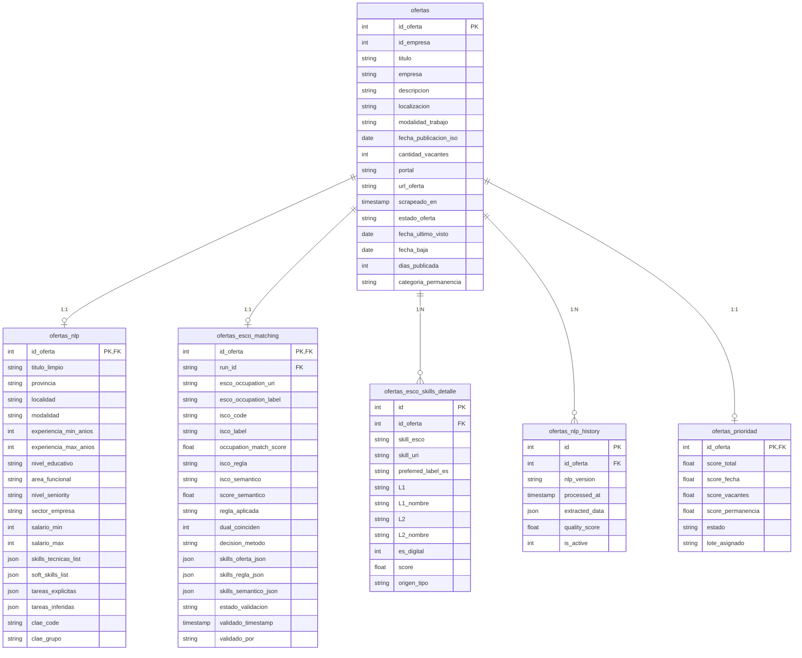
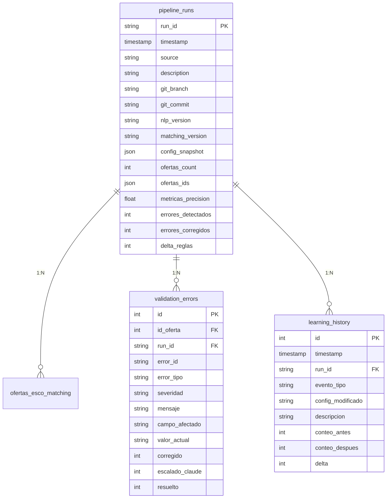
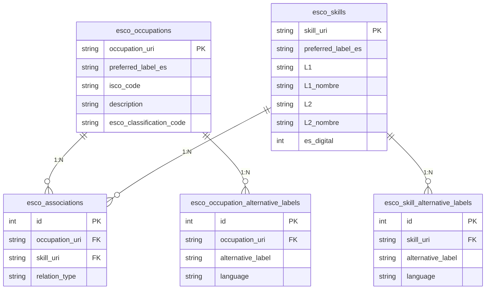
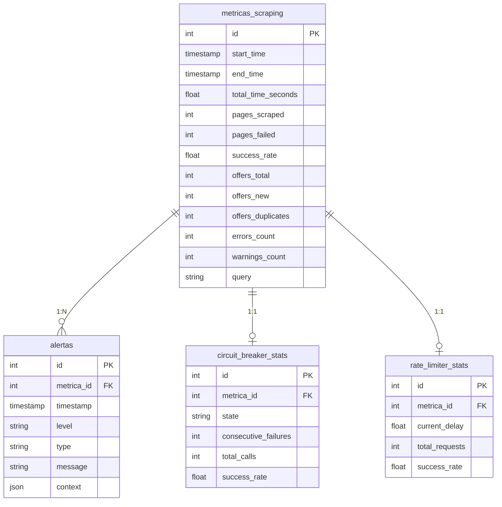
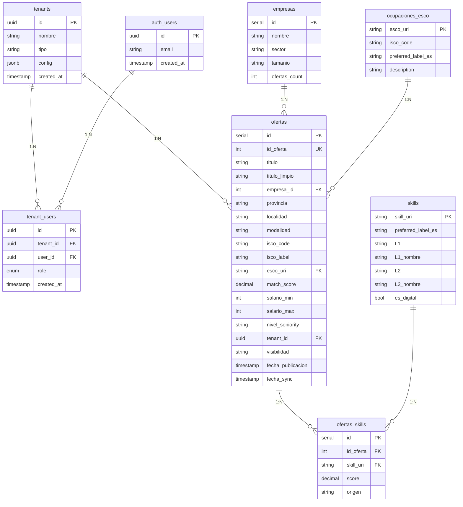
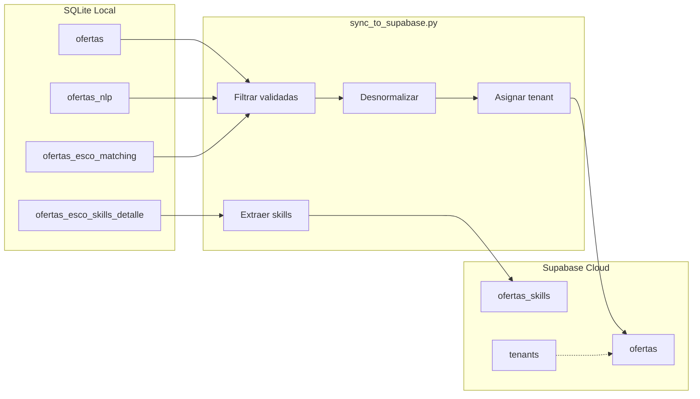

# Diagrama Entidad-Relación - MOL

## Arquitectura Dual

El proyecto MOL usa dos bases de datos con propósitos distintos:

| BD | Motor | Propósito | Datos |
|----|-------|-----------|-------|
| **Local** | SQLite | Procesamiento (scraping, NLP, matching) | 13K+ ofertas, todo el historial |
| **Cloud** | Supabase (PostgreSQL) | Presentación (dashboard multi-tenant) | ~1K ofertas validadas |

---

## SQLite Local - Schema Actual

### Diagrama Principal (Tablas Core)



### Diagrama Tracking y Validación



### Diagrama Catálogos ESCO



### Diagrama Scraping y Métricas



---

## Supabase Cloud - Schema Propuesto (Multi-Tenant)

### Diagrama Multi-Tenant



---

## Flujo de Datos: SQLite → Supabase



---

## Resumen de Tablas

### SQLite Local (32 tablas)

| Capa | Tablas | Propósito |
|------|--------|-----------|
| **Scraping** | ofertas, metricas_scraping, alertas, circuit_breaker_stats, rate_limiter_stats | Datos crudos y métricas |
| **NLP** | ofertas_nlp, ofertas_nlp_history | Extracción semántica |
| **Matching** | ofertas_esco_matching, ofertas_esco_skills_detalle | Clasificación ESCO |
| **ESCO** | esco_occupations, esco_skills, esco_associations, *_alternative_labels | Catálogos de referencia |
| **Tracking** | pipeline_runs, validation_errors, learning_history, validacion_historial | Auditoría y aprendizaje |
| **Priorización** | ofertas_prioridad | Cola de procesamiento |
| **A/B Testing** | ab_snapshot_*, ab_experiments | Experimentación |

### Supabase Cloud (8 tablas propuestas)

| Capa | Tablas | Propósito |
|------|--------|-----------|
| **Core** | ofertas, empresas, ocupaciones_esco | Datos desnormalizados para dashboard |
| **Skills** | skills, ofertas_skills | Skills normalizados y queryables |
| **Multi-tenant** | tenants, tenant_users | Aislamiento por organización |
| **Issues** | issues | Feedback de usuarios |

---

## Índices Principales

### SQLite

| Tabla | Índice | Columnas |
|-------|--------|----------|
| ofertas | idx_ofertas_fecha_pub_iso | fecha_publicacion_iso |
| ofertas | idx_ofertas_estado | estado_oferta |
| ofertas_nlp | idx_ofertas_nlp_area | area_funcional |
| ofertas_nlp | idx_ofertas_nlp_seniority | nivel_seniority |
| ofertas_esco_matching | idx_matching_estado | estado_validacion |
| ofertas_esco_matching | idx_dual_coinciden | dual_coinciden |
| ofertas_prioridad | idx_prioridad_estado_score | estado, score_total |
| validation_errors | idx_errors_no_resuelto | resuelto, severidad |

### Supabase

| Tabla | Índice | Columnas |
|-------|--------|----------|
| ofertas | idx_ofertas_tenant | tenant_id |
| ofertas | idx_ofertas_visibilidad | visibilidad |
| ofertas | idx_ofertas_isco | isco_code |
| ofertas_skills | idx_skills_oferta | id_oferta |
| ofertas_skills | idx_skills_uri | skill_uri |

---

## Row Level Security (Supabase)

```sql
-- Política principal: cada tenant ve solo sus datos + públicos
CREATE POLICY "tenant_isolation" ON ofertas
    FOR SELECT USING (
        tenant_id = auth.uid()
        OR visibilidad = 'publico'
        OR EXISTS (
            SELECT 1 FROM tenants t
            WHERE t.id = auth.uid() AND t.tipo = 'oede'
        )
    );
```

---

## Changelog

| Fecha | Cambio |
|-------|--------|
| 2026-02-03 | Versión inicial con arquitectura dual |
