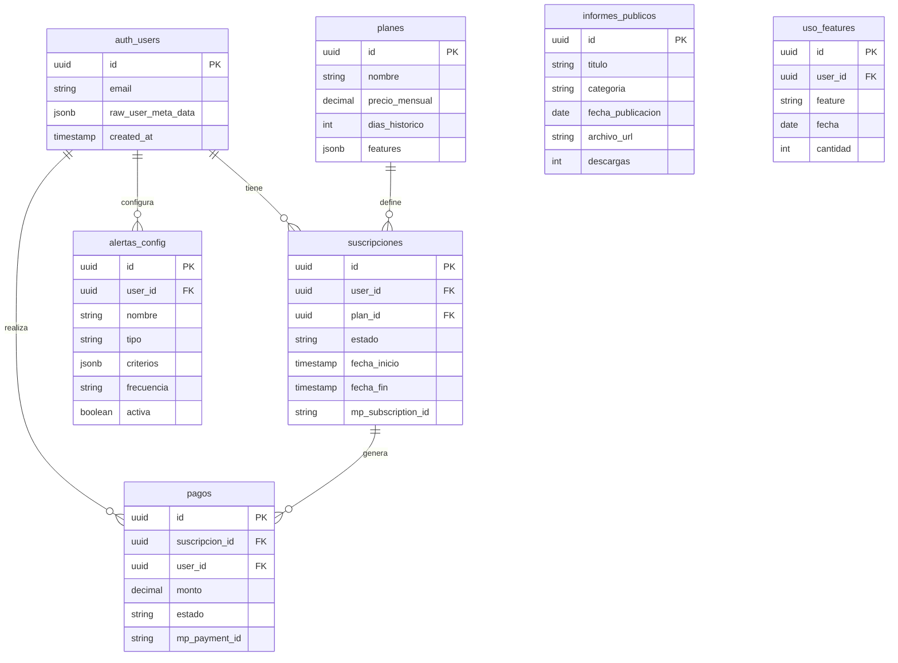

# 4. Modelo de Datos

> Última actualización: 2026-02-05

## Referencias

| Documento | Relación |
|-----------|----------|
| [01_MODELO_NEGOCIO](./01_MODELO_NEGOCIO.md) | Define planes (T-planes) |
| [02_ARQUITECTURA_PANTALLAS](./02_ARQUITECTURA_PANTALLAS.md) | Pantallas que usan cada tabla |
| [06_SEGURIDAD](./06_SEGURIDAD.md) | Políticas RLS por tabla |

## Matriz de Impacto

| Si cambia... | Actualizar... |
|--------------|---------------|
| Estructura de tabla | 06_SEGURIDAD (RLS), código de APIs |
| Añadir columna | Pantallas que la usan |
| Políticas RLS | 06_SEGURIDAD |

---

## Diagrama ER



---

## Tablas Nuevas

### T-planes

Definición de planes de suscripción.

```sql
CREATE TABLE planes (
  id UUID PRIMARY KEY DEFAULT gen_random_uuid(),
  nombre VARCHAR(50) NOT NULL,           -- 'free', 'pro', 'enterprise'
  nombre_display VARCHAR(100) NOT NULL,  -- 'Free', 'Pro', 'Enterprise'
  precio_mensual DECIMAL(10,2),          -- NULL para free y enterprise
  precio_anual DECIMAL(10,2),
  moneda VARCHAR(3) DEFAULT 'ARS',
  dias_historico INTEGER,                -- 7 para free, NULL para ilimitado
  features JSONB,                        -- Array de features incluidas
  limite_exports INTEGER,                -- NULL = ilimitado
  limite_alertas INTEGER,
  tiene_api BOOLEAN DEFAULT FALSE,
  activo BOOLEAN DEFAULT TRUE,
  created_at TIMESTAMPTZ DEFAULT NOW()
);

-- Datos iniciales
INSERT INTO planes (nombre, nombre_display, precio_mensual, dias_historico, features, limite_alertas) VALUES
('free', 'Free', 0, 7, '["dashboard", "skills_basico"]', 0),
('pro', 'Pro', 15000, NULL, '["dashboard", "skills_full", "exports", "alertas", "empresas"]', 10),
('enterprise', 'Enterprise', NULL, NULL, '["todo", "api", "soporte_dedicado"]', NULL);
```

**Pantallas que usan:** [P-02](./02_ARQUITECTURA_PANTALLAS.md#p-02), [P-06](./02_ARQUITECTURA_PANTALLAS.md#p-06), [P-15](./02_ARQUITECTURA_PANTALLAS.md#p-15)

---

### T-suscripciones

Suscripciones activas de usuarios.

```sql
CREATE TABLE suscripciones (
  id UUID PRIMARY KEY DEFAULT gen_random_uuid(),
  user_id UUID REFERENCES auth.users(id) ON DELETE CASCADE,
  plan_id UUID REFERENCES planes(id),
  estado VARCHAR(20) NOT NULL,           -- 'activa', 'cancelada', 'vencida', 'trial'
  fecha_inicio TIMESTAMPTZ NOT NULL,
  fecha_fin TIMESTAMPTZ,                 -- NULL = indefinida (free)
  fecha_proximo_cobro TIMESTAMPTZ,
  mp_subscription_id VARCHAR(100),       -- ID de MercadoPago
  mp_payer_id VARCHAR(100),
  metadata JSONB,
  created_at TIMESTAMPTZ DEFAULT NOW(),
  updated_at TIMESTAMPTZ DEFAULT NOW(),

  UNIQUE(user_id)                        -- Un usuario = una suscripción activa
);

-- Índices
CREATE INDEX idx_suscripciones_user ON suscripciones(user_id);
CREATE INDEX idx_suscripciones_estado ON suscripciones(estado);
CREATE INDEX idx_suscripciones_mp ON suscripciones(mp_subscription_id);
```

**Pantallas que usan:** [P-15](./02_ARQUITECTURA_PANTALLAS.md#p-15), [P-18](./02_ARQUITECTURA_PANTALLAS.md#p-18)

---

### T-pagos

Historial de pagos.

```sql
CREATE TABLE pagos (
  id UUID PRIMARY KEY DEFAULT gen_random_uuid(),
  suscripcion_id UUID REFERENCES suscripciones(id),
  user_id UUID REFERENCES auth.users(id),
  monto DECIMAL(10,2) NOT NULL,
  moneda VARCHAR(3) DEFAULT 'ARS',
  estado VARCHAR(20) NOT NULL,           -- 'pendiente', 'aprobado', 'rechazado', 'reembolsado'
  mp_payment_id VARCHAR(100),
  mp_status VARCHAR(50),
  mp_status_detail VARCHAR(100),
  metodo_pago VARCHAR(50),               -- 'credit_card', 'debit_card', 'bank_transfer'
  fecha_pago TIMESTAMPTZ,
  metadata JSONB,
  created_at TIMESTAMPTZ DEFAULT NOW()
);

-- Índices
CREATE INDEX idx_pagos_user ON pagos(user_id);
CREATE INDEX idx_pagos_suscripcion ON pagos(suscripcion_id);
CREATE INDEX idx_pagos_mp ON pagos(mp_payment_id);
```

**Pantallas que usan:** [P-16](./02_ARQUITECTURA_PANTALLAS.md#p-16)

---

### T-alertas_config

Configuración de alertas por usuario.

```sql
CREATE TABLE alertas_config (
  id UUID PRIMARY KEY DEFAULT gen_random_uuid(),
  user_id UUID REFERENCES auth.users(id) ON DELETE CASCADE,
  nombre VARCHAR(100) NOT NULL,
  tipo VARCHAR(50) NOT NULL,             -- 'ocupacion', 'skill', 'empresa', 'provincia'
  criterios JSONB NOT NULL,              -- {ocupacion_id: 'xxx', umbral: 10}
  frecuencia VARCHAR(20) DEFAULT 'diaria', -- 'inmediata', 'diaria', 'semanal'
  activa BOOLEAN DEFAULT TRUE,
  ultima_ejecucion TIMESTAMPTZ,
  created_at TIMESTAMPTZ DEFAULT NOW()
);

-- Índices
CREATE INDEX idx_alertas_user ON alertas_config(user_id);
CREATE INDEX idx_alertas_activa ON alertas_config(activa) WHERE activa = true;
```

**Pantallas que usan:** [P-13](./02_ARQUITECTURA_PANTALLAS.md#p-13)

---

### T-informes_publicos

Informes PDF publicados.

```sql
CREATE TABLE informes_publicos (
  id UUID PRIMARY KEY DEFAULT gen_random_uuid(),
  titulo VARCHAR(200) NOT NULL,
  descripcion TEXT,
  categoria VARCHAR(50),                 -- 'mensual', 'trimestral', 'especial'
  fecha_publicacion DATE NOT NULL,
  archivo_url TEXT NOT NULL,             -- URL del PDF en storage
  miniatura_url TEXT,
  descargas INTEGER DEFAULT 0,
  activo BOOLEAN DEFAULT TRUE,
  metadata JSONB,
  created_at TIMESTAMPTZ DEFAULT NOW()
);

-- Índices
CREATE INDEX idx_informes_fecha ON informes_publicos(fecha_publicacion DESC);
CREATE INDEX idx_informes_categoria ON informes_publicos(categoria);
```

**Pantallas que usan:** [P-03](./02_ARQUITECTURA_PANTALLAS.md#p-03)

---

### T-uso_features

Tracking de uso para límites.

```sql
CREATE TABLE uso_features (
  id UUID PRIMARY KEY DEFAULT gen_random_uuid(),
  user_id UUID REFERENCES auth.users(id),
  feature VARCHAR(50) NOT NULL,          -- 'export', 'alerta', 'api_call'
  fecha DATE DEFAULT CURRENT_DATE,
  cantidad INTEGER DEFAULT 1,
  metadata JSONB,

  UNIQUE(user_id, feature, fecha)
);

-- Índices
CREATE INDEX idx_uso_user_feature ON uso_features(user_id, feature);
```

---

## Vistas SQL

### v_usuarios_con_plan

```sql
CREATE VIEW v_usuarios_con_plan AS
SELECT
  u.id as user_id,
  u.email,
  u.raw_user_meta_data->>'nombre' as nombre,
  u.raw_user_meta_data->>'empresa' as empresa,
  COALESCE(p.nombre, 'free') as plan,
  s.estado as estado_suscripcion,
  s.fecha_fin,
  p.dias_historico
FROM auth.users u
LEFT JOIN suscripciones s ON u.id = s.user_id AND s.estado = 'activa'
LEFT JOIN planes p ON s.plan_id = p.id;
```

---

### vw_insights_kpis (PENDIENTE)

> Referencia: [12_INSIGHTS_SISTEMA](./12_INSIGHTS_SISTEMA.md)

```sql
CREATE OR REPLACE VIEW vw_insights_kpis AS
SELECT
  COUNT(*) as total_ofertas,
  COUNT(DISTINCT isco_code) as ocupaciones_distintas,
  COUNT(DISTINCT empresa) as empresas_activas,
  COUNT(DISTINCT provincia) as provincias
FROM ofertas_dashboard;
```

---

### vw_insights_tendencia (PENDIENTE)

```sql
CREATE OR REPLACE VIEW vw_insights_tendencia AS
SELECT
  DATE_TRUNC('month', fecha_publicacion::date) as mes,
  COUNT(*) as ofertas,
  COUNT(DISTINCT empresa) as empresas,
  COUNT(DISTINCT isco_code) as ocupaciones
FROM ofertas_dashboard
GROUP BY DATE_TRUNC('month', fecha_publicacion::date)
ORDER BY mes DESC
LIMIT 12;
```

---

### vw_insights_isco_grupos (PENDIENTE)

```sql
CREATE OR REPLACE VIEW vw_insights_isco_grupos AS
SELECT
  LEFT(isco_code, 1) as grupo,
  COUNT(*) as total,
  ROUND(COUNT(*) * 100.0 / SUM(COUNT(*)) OVER (), 1) as porcentaje
FROM ofertas_dashboard
WHERE isco_code IS NOT NULL
GROUP BY LEFT(isco_code, 1)
ORDER BY total DESC;
```

---

## Funciones

### check_feature_limit

Verifica si un usuario puede usar una feature según su plan.

```sql
CREATE OR REPLACE FUNCTION check_feature_limit(
  p_user_id UUID,
  p_feature VARCHAR,
  p_limite INTEGER
) RETURNS BOOLEAN AS $$
DECLARE
  v_usado INTEGER;
BEGIN
  IF p_limite IS NULL THEN RETURN TRUE; END IF;

  SELECT COALESCE(SUM(cantidad), 0) INTO v_usado
  FROM uso_features
  WHERE user_id = p_user_id
    AND feature = p_feature
    AND fecha >= DATE_TRUNC('month', CURRENT_DATE);

  RETURN v_usado < p_limite;
END;
$$ LANGUAGE plpgsql;
```

---

### get_insights (PENDIENTE)

> Referencia: [12_INSIGHTS_SISTEMA](./12_INSIGHTS_SISTEMA.md) - Resuelve E-16

Función RPC que devuelve todos los insights pre-calculados en una sola llamada.

```sql
CREATE OR REPLACE FUNCTION get_insights(
  p_provincia text DEFAULT NULL,
  p_fecha_desde date DEFAULT NULL,
  p_fecha_hasta date DEFAULT NULL
)
RETURNS json AS $$
  SELECT json_build_object(
    'kpis', (SELECT row_to_json(k) FROM vw_insights_kpis k),
    'top_ocupaciones', (
      SELECT json_agg(o)
      FROM (SELECT * FROM vw_insights_isco_grupos LIMIT 5) o
    ),
    'tendencia', (SELECT json_agg(t) FROM vw_insights_tendencia t),
    'concentracion_top3', (
      SELECT ROUND(SUM(porcentaje), 1)
      FROM (SELECT porcentaje FROM vw_insights_isco_grupos LIMIT 3) sub
    )
  )
$$ LANGUAGE sql STABLE;
```

**Uso desde cliente:**
```typescript
const { data } = await supabase.rpc('get_insights', {
  p_provincia: 'Buenos Aires'
})
```

---

## Tablas Existentes (referencia)

Estas tablas ya existen y son usadas por el dashboard:

| Tabla | Descripción | Documentación |
|-------|-------------|---------------|
| `ofertas` | Ofertas de empleo scrapeadas | - |
| `ofertas_nlp` | Datos NLP extraídos | - |
| `ofertas_esco_matching` | Matching ISCO/ESCO | - |
| `skills_detalle` | Skills por oferta | - |
| `issues` | Feedback/errores reportados | - |

---

## Políticas RLS

Ver [06_SEGURIDAD](./06_SEGURIDAD.md#rls) para políticas de seguridad a nivel de fila.

**Resumen:**

| Tabla | SELECT | INSERT | UPDATE | DELETE |
|-------|--------|--------|--------|--------|
| planes | Todos | Solo admin | Solo admin | Solo admin |
| suscripciones | Solo propia | Sistema | Sistema | Sistema |
| pagos | Solo propios | Sistema | Sistema | No |
| alertas_config | Solo propias | Propias | Propias | Propias |
| informes_publicos | Todos | Solo admin | Solo admin | Solo admin |
| uso_features | Solo propios | Sistema | Sistema | No |
