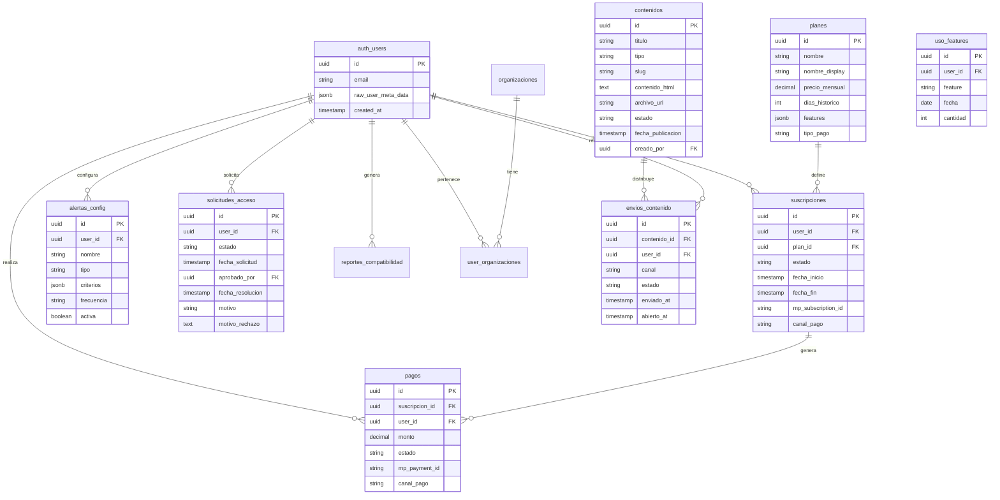

# 4. Modelo de Datos

> Última actualización: 2026-02-11
> Versión: 2.2 — Modelo híbrido + schema ofertas_dashboard + tensión de demanda

## Referencias

| Documento | Relación |
|-----------|----------|
| [01_MODELO_NEGOCIO](./01_MODELO_NEGOCIO.md) | Define niveles y planes (T-planes) |
| [02_ARQUITECTURA_PANTALLAS](./02_ARQUITECTURA_PANTALLAS.md) | Pantallas que usan cada tabla |
| [06_SEGURIDAD](./06_SEGURIDAD.md) | Políticas RLS por tabla |

## Matriz de Impacto

| Si cambia... | Actualizar... |
|--------------|---------------|
| Estructura de tabla | 06_SEGURIDAD (RLS), código de APIs |
| Añadir columna | Pantallas que la usan |
| Políticas RLS | 06_SEGURIDAD |

---

## Diagrama ER



---

## Tablas Nuevas

### T-planes

Definición de niveles de acceso.

```sql
CREATE TABLE planes (
  id UUID PRIMARY KEY DEFAULT gen_random_uuid(),
  nombre VARCHAR(50) NOT NULL,           -- 'registrado', 'trial', 'suscriptor', 'institucional'
  nombre_display VARCHAR(100) NOT NULL,  -- 'Registrado', 'Trial', 'Suscriptor', 'Institucional'
  precio_mensual DECIMAL(10,2),          -- NULL para registrado/trial, TBD para suscriptor
  precio_anual DECIMAL(10,2),
  moneda VARCHAR(3) DEFAULT 'ARS',
  dias_historico INTEGER,                -- NULL para registrado (sin tablero), 7 para trial, NULL para ilimitado
  features JSONB,                        -- Array de features incluidas
  limite_exports INTEGER,                -- NULL = ilimitado
  limite_alertas INTEGER,
  tiene_api BOOLEAN DEFAULT FALSE,
  tipo_pago VARCHAR(30),                 -- 'mercadopago', 'institucional', NULL (gratuito)
  activo BOOLEAN DEFAULT TRUE,
  created_at TIMESTAMPTZ DEFAULT NOW()
);

-- Datos iniciales
INSERT INTO planes (nombre, nombre_display, precio_mensual, dias_historico, features, limite_alertas, tipo_pago) VALUES
('registrado', 'Registrado', 0, NULL, '["contenido", "informes"]', 0, NULL),
('trial', 'Trial', 0, 7, '["contenido", "dashboard", "skills_basico"]', 0, NULL),
('suscriptor', 'Suscriptor', NULL, NULL, '["contenido", "dashboard", "skills_full", "exports", "alertas", "empresas"]', 10, 'mercadopago'),
('institucional', 'Institucional', NULL, NULL, '["todo", "api", "soporte_dedicado", "docs_demanda"]', NULL, 'institucional');
```

**Pantallas que usan:** [P-02](./02_ARQUITECTURA_PANTALLAS.md), [P-06](./02_ARQUITECTURA_PANTALLAS.md), [P-15](./02_ARQUITECTURA_PANTALLAS.md)

---

### T-suscripciones

Suscripciones activas de usuarios.

```sql
CREATE TABLE suscripciones (
  id UUID PRIMARY KEY DEFAULT gen_random_uuid(),
  user_id UUID REFERENCES auth.users(id) ON DELETE CASCADE,
  plan_id UUID REFERENCES planes(id),
  estado VARCHAR(30) NOT NULL,           -- 'registrado', 'pendiente_aprobacion', 'trial',
                                         -- 'activa', 'cancelada', 'vencida'
  fecha_inicio TIMESTAMPTZ NOT NULL,
  fecha_fin TIMESTAMPTZ,                 -- NULL = indefinida
  fecha_proximo_cobro TIMESTAMPTZ,
  canal_pago VARCHAR(30),                -- 'mercadopago', 'institucional', NULL
  mp_subscription_id VARCHAR(100),       -- ID de MercadoPago (si aplica)
  mp_payer_id VARCHAR(100),
  referencia_institucional VARCHAR(200), -- N° orden de compra / expediente (si aplica)
  metadata JSONB,
  created_at TIMESTAMPTZ DEFAULT NOW(),
  updated_at TIMESTAMPTZ DEFAULT NOW(),

  UNIQUE(user_id)                        -- Un usuario = una suscripción activa
);

-- Índices
CREATE INDEX idx_suscripciones_user ON suscripciones(user_id);
CREATE INDEX idx_suscripciones_estado ON suscripciones(estado);
CREATE INDEX idx_suscripciones_mp ON suscripciones(mp_subscription_id);
```

**Pantallas que usan:** [P-15](./02_ARQUITECTURA_PANTALLAS.md), [P-18](./02_ARQUITECTURA_PANTALLAS.md), [P-29](./02_ARQUITECTURA_PANTALLAS.md)

---

### T-solicitudes_acceso (NUEVA)

Solicitudes de acceso al tablero interactivo.

```sql
CREATE TABLE solicitudes_acceso (
  id UUID PRIMARY KEY DEFAULT gen_random_uuid(),
  user_id UUID REFERENCES auth.users(id) ON DELETE CASCADE,
  estado VARCHAR(30) NOT NULL DEFAULT 'pendiente',  -- 'pendiente', 'aprobada', 'rechazada'
  fecha_solicitud TIMESTAMPTZ DEFAULT NOW(),
  aprobado_por UUID REFERENCES auth.users(id),       -- Admin que resolvió
  fecha_resolucion TIMESTAMPTZ,
  motivo TEXT,                                        -- Por qué quiere acceso (lo llena el usuario)
  motivo_rechazo TEXT,                                -- Si se rechaza, por qué (lo llena admin)
  perfil_usuario VARCHAR(50),                         -- Perfil del usuario al momento de solicitar
  empresa_usuario VARCHAR(200),                       -- Empresa/org al momento de solicitar
  metadata JSONB,
  created_at TIMESTAMPTZ DEFAULT NOW()
);

-- Índices
CREATE INDEX idx_solicitudes_user ON solicitudes_acceso(user_id);
CREATE INDEX idx_solicitudes_estado ON solicitudes_acceso(estado);
CREATE INDEX idx_solicitudes_pendientes ON solicitudes_acceso(estado) WHERE estado = 'pendiente';
```

**Pantallas que usan:** [P-28](./02_ARQUITECTURA_PANTALLAS.md) (usuario solicita), [P-29](./02_ARQUITECTURA_PANTALLAS.md) (admin gestiona)

**Flujo:**
1. U-REGISTRADO envía solicitud (P-28) → estado `pendiente`
2. U-ADMIN ve en P-29 → aprueba o rechaza
3. Si aprobada → sistema crea suscripción con estado `trial` (7 días)
4. Si rechazada → usuario recibe email con motivo

---

### T-pagos

Historial de pagos (dual: MercadoPago + institucional).

```sql
CREATE TABLE pagos (
  id UUID PRIMARY KEY DEFAULT gen_random_uuid(),
  suscripcion_id UUID REFERENCES suscripciones(id),
  user_id UUID REFERENCES auth.users(id),
  monto DECIMAL(10,2) NOT NULL,
  moneda VARCHAR(3) DEFAULT 'ARS',
  estado VARCHAR(20) NOT NULL,           -- 'pendiente', 'aprobado', 'rechazado', 'reembolsado'
  canal_pago VARCHAR(30) NOT NULL,       -- 'mercadopago', 'institucional'
  mp_payment_id VARCHAR(100),            -- Solo para canal mercadopago
  mp_status VARCHAR(50),
  mp_status_detail VARCHAR(100),
  metodo_pago VARCHAR(50),               -- 'credit_card', 'debit_card', 'bank_transfer', 'orden_compra'
  referencia_institucional VARCHAR(200), -- N° factura / orden de compra
  fecha_pago TIMESTAMPTZ,
  metadata JSONB,
  created_at TIMESTAMPTZ DEFAULT NOW()
);

-- Índices
CREATE INDEX idx_pagos_user ON pagos(user_id);
CREATE INDEX idx_pagos_suscripcion ON pagos(suscripcion_id);
CREATE INDEX idx_pagos_mp ON pagos(mp_payment_id);
CREATE INDEX idx_pagos_canal ON pagos(canal_pago);
```

**Pantallas que usan:** [P-16](./02_ARQUITECTURA_PANTALLAS.md)

---

### T-contenidos (NUEVA — reemplaza T-informes_publicos)

Contenidos publicados via CMS (informes, notas, análisis).

```sql
CREATE TABLE contenidos (
  id UUID PRIMARY KEY DEFAULT gen_random_uuid(),
  titulo VARCHAR(200) NOT NULL,
  slug VARCHAR(200) NOT NULL UNIQUE,     -- URL-friendly: "informe-mensual-enero-2026"
  tipo VARCHAR(50) NOT NULL,             -- 'informe', 'nota', 'analisis', 'especial'
  descripcion TEXT,
  contenido_html TEXT,                   -- Contenido renderizable (para ver en web)
  archivo_url TEXT,                      -- URL del PDF en storage (para descarga)
  miniatura_url TEXT,
  categoria VARCHAR(50),                 -- 'mensual', 'trimestral', 'especial', 'sector'
  tags JSONB,                            -- ["tecnología", "salarios", "CABA"]
  estado VARCHAR(20) NOT NULL DEFAULT 'borrador',  -- 'borrador', 'publicado', 'archivado'
  fecha_publicacion TIMESTAMPTZ,
  requiere_registro BOOLEAN DEFAULT TRUE,  -- Si false, visible para visitantes
  creado_por UUID REFERENCES auth.users(id),
  descargas INTEGER DEFAULT 0,
  vistas INTEGER DEFAULT 0,
  metadata JSONB,
  created_at TIMESTAMPTZ DEFAULT NOW(),
  updated_at TIMESTAMPTZ DEFAULT NOW()
);

-- Índices
CREATE INDEX idx_contenidos_slug ON contenidos(slug);
CREATE INDEX idx_contenidos_estado ON contenidos(estado);
CREATE INDEX idx_contenidos_fecha ON contenidos(fecha_publicacion DESC);
CREATE INDEX idx_contenidos_tipo ON contenidos(tipo);
CREATE INDEX idx_contenidos_publicados ON contenidos(estado, fecha_publicacion DESC)
  WHERE estado = 'publicado';
```

**Pantallas que usan:** [P-03](./02_ARQUITECTURA_PANTALLAS.md) (preview), [P-26](./02_ARQUITECTURA_PANTALLAS.md) (lista), [P-27](./02_ARQUITECTURA_PANTALLAS.md) (detalle), [P-30](./02_ARQUITECTURA_PANTALLAS.md) (admin CMS)

---

### T-envios_contenido (NUEVA)

Tracking de distribución de contenido por email.

```sql
CREATE TABLE envios_contenido (
  id UUID PRIMARY KEY DEFAULT gen_random_uuid(),
  contenido_id UUID REFERENCES contenidos(id) ON DELETE CASCADE,
  user_id UUID REFERENCES auth.users(id) ON DELETE CASCADE,
  canal VARCHAR(20) NOT NULL DEFAULT 'email',  -- 'email', 'notificacion'
  estado VARCHAR(20) NOT NULL DEFAULT 'pendiente',  -- 'pendiente', 'enviado', 'fallido', 'abierto'
  enviado_at TIMESTAMPTZ,
  abierto_at TIMESTAMPTZ,                     -- Tracking de apertura
  click_at TIMESTAMPTZ,                        -- Tracking de click
  metadata JSONB,
  created_at TIMESTAMPTZ DEFAULT NOW()
);

-- Índices
CREATE INDEX idx_envios_contenido ON envios_contenido(contenido_id);
CREATE INDEX idx_envios_user ON envios_contenido(user_id);
CREATE INDEX idx_envios_estado ON envios_contenido(estado);
```

**Pantallas que usan:** [P-30](./02_ARQUITECTURA_PANTALLAS.md) (admin ve métricas de envío)

---

### T-alertas_config

Configuración de alertas por usuario.

```sql
CREATE TABLE alertas_config (
  id UUID PRIMARY KEY DEFAULT gen_random_uuid(),
  user_id UUID REFERENCES auth.users(id) ON DELETE CASCADE,
  nombre VARCHAR(100) NOT NULL,
  tipo VARCHAR(50) NOT NULL,             -- 'ocupacion', 'skill', 'empresa', 'provincia'
  criterios JSONB NOT NULL,              -- {ocupacion_id: 'xxx', umbral: 10}
  frecuencia VARCHAR(20) DEFAULT 'diaria', -- 'inmediata', 'diaria', 'semanal'
  activa BOOLEAN DEFAULT TRUE,
  ultima_ejecucion TIMESTAMPTZ,
  created_at TIMESTAMPTZ DEFAULT NOW()
);

-- Índices
CREATE INDEX idx_alertas_user ON alertas_config(user_id);
CREATE INDEX idx_alertas_activa ON alertas_config(activa) WHERE activa = true;
```

**Pantallas que usan:** [P-13](./02_ARQUITECTURA_PANTALLAS.md)

---

### T-uso_features

Tracking de uso para límites.

```sql
CREATE TABLE uso_features (
  id UUID PRIMARY KEY DEFAULT gen_random_uuid(),
  user_id UUID REFERENCES auth.users(id),
  feature VARCHAR(50) NOT NULL,          -- 'export', 'alerta', 'api_call'
  fecha DATE DEFAULT CURRENT_DATE,
  cantidad INTEGER DEFAULT 1,
  metadata JSONB,

  UNIQUE(user_id, feature, fecha)
);

-- Índices
CREATE INDEX idx_uso_user_feature ON uso_features(user_id, feature);
```

---

## Vistas SQL

### v_usuarios_con_plan

```sql
CREATE VIEW v_usuarios_con_plan AS
SELECT
  u.id as user_id,
  u.email,
  u.raw_user_meta_data->>'nombre' as nombre,
  u.raw_user_meta_data->>'empresa' as empresa,
  u.raw_user_meta_data->>'perfil' as perfil,
  COALESCE(p.nombre, 'registrado') as nivel,
  s.estado as estado_suscripcion,
  s.fecha_fin,
  s.canal_pago,
  p.dias_historico
FROM auth.users u
LEFT JOIN suscripciones s ON u.id = s.user_id AND s.estado IN ('registrado', 'trial', 'activa')
LEFT JOIN planes p ON s.plan_id = p.id;
```

---

### v_solicitudes_pendientes (NUEVA)

```sql
CREATE VIEW v_solicitudes_pendientes AS
SELECT
  sa.id,
  sa.user_id,
  u.email,
  u.raw_user_meta_data->>'nombre' as nombre,
  u.raw_user_meta_data->>'empresa' as empresa,
  u.raw_user_meta_data->>'perfil' as perfil,
  sa.motivo,
  sa.fecha_solicitud,
  sa.estado
FROM solicitudes_acceso sa
JOIN auth.users u ON sa.user_id = u.id
WHERE sa.estado = 'pendiente'
ORDER BY sa.fecha_solicitud ASC;
```

---

### v_metricas_contenido (NUEVA)

```sql
CREATE VIEW v_metricas_contenido AS
SELECT
  c.id,
  c.titulo,
  c.tipo,
  c.fecha_publicacion,
  c.descargas,
  c.vistas,
  COUNT(ec.id) as total_envios,
  COUNT(ec.id) FILTER (WHERE ec.estado = 'enviado') as enviados,
  COUNT(ec.id) FILTER (WHERE ec.abierto_at IS NOT NULL) as abiertos,
  CASE
    WHEN COUNT(ec.id) FILTER (WHERE ec.estado = 'enviado') > 0
    THEN ROUND(
      COUNT(ec.id) FILTER (WHERE ec.abierto_at IS NOT NULL)::numeric /
      COUNT(ec.id) FILTER (WHERE ec.estado = 'enviado') * 100, 1
    )
    ELSE 0
  END as tasa_apertura
FROM contenidos c
LEFT JOIN envios_contenido ec ON c.id = ec.contenido_id
GROUP BY c.id, c.titulo, c.tipo, c.fecha_publicacion, c.descargas, c.vistas;
```

---

### vw_insights_kpis (PENDIENTE)

> Referencia: [12_INSIGHTS_SISTEMA](./12_INSIGHTS_SISTEMA.md)

```sql
CREATE OR REPLACE VIEW vw_insights_kpis AS
SELECT
  COUNT(*) as total_ofertas,
  COUNT(DISTINCT isco_code) as ocupaciones_distintas,
  COUNT(DISTINCT empresa) as empresas_activas,
  COUNT(DISTINCT provincia) as provincias
FROM ofertas_dashboard;
```

---

### vw_insights_tendencia (PENDIENTE)

```sql
CREATE OR REPLACE VIEW vw_insights_tendencia AS
SELECT
  DATE_TRUNC('month', fecha_publicacion::date) as mes,
  COUNT(*) as ofertas,
  COUNT(DISTINCT empresa) as empresas,
  COUNT(DISTINCT isco_code) as ocupaciones
FROM ofertas_dashboard
GROUP BY DATE_TRUNC('month', fecha_publicacion::date)
ORDER BY mes DESC
LIMIT 12;
```

---

### vw_insights_isco_grupos (PENDIENTE)

```sql
CREATE OR REPLACE VIEW vw_insights_isco_grupos AS
SELECT
  LEFT(isco_code, 1) as grupo,
  COUNT(*) as total,
  ROUND(COUNT(*) * 100.0 / SUM(COUNT(*)) OVER (), 1) as porcentaje
FROM ofertas_dashboard
WHERE isco_code IS NOT NULL
GROUP BY LEFT(isco_code, 1)
ORDER BY total DESC;
```

---

## Funciones

### check_feature_limit

Verifica si un usuario puede usar una feature según su plan.

```sql
CREATE OR REPLACE FUNCTION check_feature_limit(
  p_user_id UUID,
  p_feature VARCHAR,
  p_limite INTEGER
) RETURNS BOOLEAN AS $$
DECLARE
  v_usado INTEGER;
BEGIN
  IF p_limite IS NULL THEN RETURN TRUE; END IF;

  SELECT COALESCE(SUM(cantidad), 0) INTO v_usado
  FROM uso_features
  WHERE user_id = p_user_id
    AND feature = p_feature
    AND fecha >= DATE_TRUNC('month', CURRENT_DATE);

  RETURN v_usado < p_limite;
END;
$$ LANGUAGE plpgsql;
```

---

### aprobar_solicitud_acceso (NUEVA)

Aprueba una solicitud y crea la suscripción trial automáticamente.

```sql
CREATE OR REPLACE FUNCTION aprobar_solicitud_acceso(
  p_solicitud_id UUID,
  p_admin_id UUID
) RETURNS void AS $$
DECLARE
  v_user_id UUID;
  v_plan_trial_id UUID;
BEGIN
  -- Obtener user_id de la solicitud
  SELECT user_id INTO v_user_id
  FROM solicitudes_acceso
  WHERE id = p_solicitud_id AND estado = 'pendiente';

  IF v_user_id IS NULL THEN
    RAISE EXCEPTION 'Solicitud no encontrada o ya resuelta';
  END IF;

  -- Obtener plan trial
  SELECT id INTO v_plan_trial_id FROM planes WHERE nombre = 'trial';

  -- Aprobar solicitud
  UPDATE solicitudes_acceso
  SET estado = 'aprobada',
      aprobado_por = p_admin_id,
      fecha_resolucion = NOW()
  WHERE id = p_solicitud_id;

  -- Crear/actualizar suscripción como trial
  INSERT INTO suscripciones (user_id, plan_id, estado, fecha_inicio, fecha_fin)
  VALUES (v_user_id, v_plan_trial_id, 'trial', NOW(), NOW() + INTERVAL '7 days')
  ON CONFLICT (user_id) DO UPDATE
  SET plan_id = v_plan_trial_id,
      estado = 'trial',
      fecha_inicio = NOW(),
      fecha_fin = NOW() + INTERVAL '7 days',
      updated_at = NOW();
END;
$$ LANGUAGE plpgsql;
```

---

### get_insights (PENDIENTE)

> Referencia: [12_INSIGHTS_SISTEMA](./12_INSIGHTS_SISTEMA.md) - Resuelve E-16

Función RPC que devuelve todos los insights pre-calculados en una sola llamada.

```sql
CREATE OR REPLACE FUNCTION get_insights(
  p_provincia text DEFAULT NULL,
  p_fecha_desde date DEFAULT NULL,
  p_fecha_hasta date DEFAULT NULL
)
RETURNS json AS $$
  SELECT json_build_object(
    'kpis', (SELECT row_to_json(k) FROM vw_insights_kpis k),
    'top_ocupaciones', (
      SELECT json_agg(o)
      FROM (SELECT * FROM vw_insights_isco_grupos LIMIT 5) o
    ),
    'tendencia', (SELECT json_agg(t) FROM vw_insights_tendencia t),
    'concentracion_top3', (
      SELECT ROUND(SUM(porcentaje), 1)
      FROM (SELECT porcentaje FROM vw_insights_isco_grupos LIMIT 3) sub
    )
  )
$$ LANGUAGE sql STABLE;
```

**Uso desde cliente:**
```typescript
const { data } = await supabase.rpc('get_insights', {
  p_provincia: 'Buenos Aires'
})
```

---

### T-reportes_compatibilidad (NUEVA — V-17 Reporte Compatibilidad Laboral)

Reportes de compatibilidad generados desde "Mis Skills" para entregar a reclutadores.

```sql
CREATE TABLE reportes_compatibilidad (
  id UUID PRIMARY KEY DEFAULT gen_random_uuid(),
  token VARCHAR(64) NOT NULL UNIQUE,          -- Token público para URL del reporte (UUID sin guiones)
  perfil_id UUID REFERENCES perfiles_trabajadores(id) ON DELETE SET NULL,
  created_by UUID REFERENCES auth.users(id),  -- Gestor o trabajador que generó el reporte
  origen VARCHAR(20) NOT NULL DEFAULT 'trabajador',  -- 'trabajador' o 'oficina_empleo'

  -- Datos del candidato (snapshot al momento de generar)
  candidato_nombre VARCHAR(200) NOT NULL,
  candidato_dni VARCHAR(20),

  -- Ocupación/vacante analizada
  ocupacion_uri TEXT NOT NULL,                -- URI ESCO de la ocupación
  ocupacion_label VARCHAR(200) NOT NULL,      -- Label de la ocupación
  ocupacion_isco VARCHAR(10),                 -- Código ISCO
  oferta_id BIGINT,                           -- ID oferta específica (opcional, si se vincula a oferta real)
  oferta_titulo VARCHAR(300),                 -- Título de la vacante (si aplica)

  -- Snapshot del matching (para que el reporte sea estable en el tiempo)
  perfil_consolidado_version INTEGER,         -- Versión del perfil argentino usado (reproducibilidad)
  skills_candidato JSONB NOT NULL,            -- Array de skill URIs del candidato al momento
  skills_requeridas JSONB NOT NULL,           -- Skills del perfil consolidado argentino (ESCO + emergentes)
  match_score NUMERIC(5,2) NOT NULL,          -- % compatibilidad al generar
  skills_cubiertas JSONB NOT NULL,            -- Skills que matchearon (con source: esco_common|argentina_approved)
  skills_gap JSONB NOT NULL,                  -- Skills faltantes (brecha)

  -- Control
  estado VARCHAR(20) DEFAULT 'activo',        -- 'activo', 'expirado', 'revocado'
  expira_at TIMESTAMPTZ NOT NULL,             -- Fecha de expiración (default +60 días)
  vistas INTEGER DEFAULT 0,                   -- Cuántas veces se accedió al reporte
  ultima_vista_at TIMESTAMPTZ,
  pdf_generado BOOLEAN DEFAULT FALSE,         -- Si se descargó el PDF

  created_at TIMESTAMPTZ DEFAULT NOW(),
  updated_at TIMESTAMPTZ DEFAULT NOW()
);

-- Índices
CREATE INDEX idx_reportes_token ON reportes_compatibilidad(token);
CREATE INDEX idx_reportes_perfil ON reportes_compatibilidad(perfil_id);
CREATE INDEX idx_reportes_estado ON reportes_compatibilidad(estado) WHERE estado = 'activo';
CREATE INDEX idx_reportes_expira ON reportes_compatibilidad(expira_at) WHERE estado = 'activo';
```

**Pantallas que usan:** [P-10](./02_ARQUITECTURA_PANTALLAS.md) (genera reporte), [P-35](./02_ARQUITECTURA_PANTALLAS.md) (visualiza reporte público)

**Campos clave:**
- `origen`: distingue si lo generó el trabajador ('trabajador') o un gestor ('oficina_empleo'). Útil para métricas de adopción por canal.
- `perfil_consolidado_version`: registra qué versión del perfil argentino se usó. Garantiza reproducibilidad (si el perfil evoluciona, reportes viejos siguen siendo válidos).
- `skills_requeridas`: incluye tanto skills ESCO estándar como emergentes argentinas aprobadas, cada una con indicador de source.

**Flujo:**
1. Trabajador o gestor genera reporte desde "Mis Skills" (P-10, paso 3) → INSERT con token + snapshot del perfil consolidado argentino
2. Se genera PDF con QR apuntando a `/reporte/{token}`
3. Reclutador escanea QR → P-35 carga datos del reporte por token
4. Reclutador puede editar skills requeridas → recalcula en frontend (no persiste)
5. Expiración automática: cron o check en tiempo de acceso

**RLS:**
- SELECT con token: público (cualquiera con el token puede ver, si no expiró)
- SELECT sin token: solo created_by o admin
- INSERT: solo usuarios autenticados
- UPDATE: solo created_by o admin (para revocar)

---

### T-organizaciones (NUEVA — Skills Intelligence multi-tenancy)

Organizaciones (OEs y empresas) para aislamiento de datos por tenant.

```sql
CREATE TABLE organizaciones (
  id UUID PRIMARY KEY DEFAULT gen_random_uuid(),
  nombre VARCHAR(200) NOT NULL,
  tipo VARCHAR(30) NOT NULL,              -- 'oficina_empleo', 'empresa'
  jurisdiccion VARCHAR(100),              -- provincia/municipio (para OE)
  sector VARCHAR(100),                    -- sector económico (para empresa)
  activa BOOLEAN DEFAULT TRUE,
  metadata JSONB,                         -- datos adicionales flexibles
  created_at TIMESTAMPTZ DEFAULT NOW(),
  updated_at TIMESTAMPTZ DEFAULT NOW()
);

CREATE INDEX idx_org_tipo ON organizaciones(tipo);
CREATE INDEX idx_org_jurisdiccion ON organizaciones(jurisdiccion) WHERE tipo = 'oficina_empleo';
```

**Pantallas que usan:** S2 (todas), S3-registrado (todas)

---

### T-user_organizaciones (NUEVA — relación usuario-organización)

Relaciona usuarios con organizaciones y define su rol dentro de la org.

```sql
CREATE TABLE user_organizaciones (
  user_id UUID REFERENCES auth.users(id) ON DELETE CASCADE,
  organizacion_id UUID REFERENCES organizaciones(id) ON DELETE CASCADE,
  rol_en_org VARCHAR(30) NOT NULL,        -- 'tecnico', 'coordinador', 'rrhh', 'gerente'
  activo BOOLEAN DEFAULT TRUE,
  created_at TIMESTAMPTZ DEFAULT NOW(),
  PRIMARY KEY (user_id, organizacion_id)
);

CREATE INDEX idx_user_org_user ON user_organizaciones(user_id);
CREATE INDEX idx_user_org_org ON user_organizaciones(organizacion_id);
```

**Uso en RLS:** Todas las políticas de S2 y S3-registrado consultan esta tabla para determinar a qué organización pertenece el usuario y filtrar datos.

---

### T-perfil_argentino_versiones (NUEVA — versionado global del Perfil Consolidado)

Snapshots del Perfil Consolidado Argentino. Solo una versión activa a la vez. Todo el sistema (matching, búsqueda, reportes) apunta a la versión activa.

```sql
CREATE TABLE perfil_argentino_versiones (
  id UUID PRIMARY KEY DEFAULT gen_random_uuid(),
  version VARCHAR(20) NOT NULL UNIQUE,      -- 'v1.0', 'v2.1', etc.
  snapshot JSONB NOT NULL,                   -- Snapshot completo: {ocupaciones: {uri: {skills_consolidadas: [...]}}}
  total_skills INTEGER NOT NULL,             -- Total skills en esta versión
  total_emergentes_aprobadas INTEGER NOT NULL, -- Cuántas emergentes incluye
  total_ocupaciones INTEGER NOT NULL,         -- Ocupaciones con perfil
  nota TEXT,                                  -- Nota del analista al crear el corte
  creado_por UUID REFERENCES auth.users(id),
  activa BOOLEAN DEFAULT FALSE,              -- Solo UNA puede ser TRUE
  created_at TIMESTAMPTZ DEFAULT NOW()
);

-- Constraint: solo una versión activa
CREATE UNIQUE INDEX idx_perfil_version_activa ON perfil_argentino_versiones(activa) WHERE activa = TRUE;
CREATE INDEX idx_perfil_version ON perfil_argentino_versiones(version);
```

**Pantallas que usan:** P-36 (gestión versiones admin), PCA-5 (matching lee versión activa)

**Lógica:**
1. Al crear corte → INSERT con activa=FALSE → UPDATE activa=TRUE (desactiva anterior)
2. Matching, búsqueda y reportes consultan: `WHERE activa = TRUE`
3. Reportes guardan `perfil_consolidado_version` del snapshot usado (inmutable)
4. Rollback: UPDATE activa en la versión deseada

---

### T-emergentes_pendientes (NUEVA — Bloque 9° curación automática)

Skills emergentes detectadas automáticamente post-sync que requieren revisión del analista.

```sql
CREATE TABLE IF NOT EXISTS emergentes_pendientes (
  id UUID PRIMARY KEY DEFAULT gen_random_uuid(),
  skill_label TEXT NOT NULL,
  skill_label_normalized TEXT NOT NULL,
  skill_uri TEXT,                              -- URI ESCO si existe
  isco_code TEXT NOT NULL,                     -- Ocupación donde se detectó
  ocupacion_label TEXT NOT NULL,
  frecuencia_pct NUMERIC(5,2) NOT NULL,        -- % de ofertas que la mencionan
  ofertas_count INTEGER NOT NULL,              -- Cantidad absoluta de ofertas
  estado VARCHAR(20) DEFAULT 'pendiente',      -- 'pendiente', 'aprobada', 'rechazada'
  fecha_deteccion TIMESTAMPTZ DEFAULT NOW(),
  fecha_resolucion TIMESTAMPTZ,
  resuelta_por UUID REFERENCES auth.users(id),
  created_at TIMESTAMPTZ DEFAULT NOW(),

  UNIQUE(skill_label_normalized, isco_code)    -- No duplicar misma skill+ocupación
);

CREATE INDEX IF NOT EXISTS idx_emergentes_estado ON emergentes_pendientes(estado);
CREATE INDEX IF NOT EXISTS idx_emergentes_isco ON emergentes_pendientes(isco_code);
CREATE INDEX IF NOT EXISTS idx_emergentes_freq ON emergentes_pendientes(frecuencia_pct DESC);
```

**Pantallas que usan:** P-36 (badge con count pendientes), panel Consolidado (revisar/aprobar)

**Flujo:**
1. `sync_to_supabase.py` termina de subir ofertas → llama `supabase.rpc('recalcular_emergentes')`
2. La función cruza `ofertas_skills` × `esco_argentino` por ISCO
3. Skills con frecuencia ≥30% que no están en el perfil consolidado → INSERT en esta tabla
4. Analista ve badge en P-36 → va al panel Consolidado → aprueba o rechaza
5. Al aprobar: se agrega a `esco_argentino`, se marca `estado='aprobada'` acá
6. Al hacer corte de versión → las aprobadas quedan en el snapshot

**RLS:**
- SELECT: todos autenticados (analistas necesitan ver)
- INSERT/UPDATE: solo sistema (función RPC SECURITY DEFINER) y admin

---

### T-reporte_accesos (NUEVA — audit log de accesos a reportes)

Registro de cada acceso a un reporte de compatibilidad por QR/URL.

```sql
CREATE TABLE reporte_accesos (
  id UUID PRIMARY KEY DEFAULT gen_random_uuid(),
  reporte_token VARCHAR(64) NOT NULL,
  ip_address VARCHAR(45),
  user_agent TEXT,
  created_at TIMESTAMPTZ DEFAULT NOW()
);

CREATE INDEX idx_reporte_accesos_token ON reporte_accesos(reporte_token);
CREATE INDEX idx_reporte_accesos_fecha ON reporte_accesos(created_at);
```

**Pantallas que usan:** S3-1 (acceso QR), admin (métricas de reportes)

---

## Tablas Existentes — Supabase (Dashboard)

Tablas en Supabase que alimentan el dashboard Next.js. Sincronizadas desde SQLite local via `sync_to_supabase.py`.

| Tabla | Descripción | ~Registros |
|-------|-------------|------------|
| `ofertas_dashboard` | Ofertas validadas desnormalizadas (~55 campos) | 2089 |
| `ofertas_skills` | Skills por oferta (1:N) con clasificación ESCO | 35277 |
| `ocupaciones_esco` | Catálogo ESCO ocupaciones (subset) | 471 |
| `skills` | Catálogo ESCO skills (subset) | 5228 |
| `issues` | Feedback/errores reportados por usuarios | - |
| `tension_ocupaciones` | Tensión de demanda pre-calculada por ocupación | ~100 |
| `sistema_estado` | Estado del sistema (última sincronización) | 1 |

### Columnas de `ofertas_dashboard`

| Grupo | Campos clave |
|-------|-------------|
| **PK** | `id_oferta` |
| **Scraping** | titulo, empresa, descripcion, localizacion, url_oferta, portal, fecha_publicacion_iso, scrapeado_en, provincia_normalizada, localidad_normalizada, estado_oferta, fecha_ultimo_visto, dias_publicada |
| **NLP** | titulo_limpio, tareas_explicitas, mision_rol, area_funcional, nivel_seniority, sector_empresa, tipo_oferta, tipo_contrato, provincia, localidad, modalidad, jornada_laboral, nivel_educativo, titulo_requerido, experiencia_min_anios, tiene_gente_cargo, requiere_movilidad_propia, skills_tecnicas_list, soft_skills_list, tecnologias_list, herramientas_list |
| **Matching** | esco_occupation_uri, esco_occupation_label, isco_code, isco_label, occupation_match_score, occupation_match_method, skills_oferta_json, skills_matched_essential, skills_demandados_total, skills_matcheados_esco, run_id, estado_validacion, validado_timestamp, validado_por |
| **Indicadores** | `categoria_permanencia` (baja/media/alta), `es_republicacion` (bool), `numero_republicacion` (int), `grupo_republicacion` (text), `ventana_dias` (int) |
| **Meta** | estado, fecha_sync, created_at, updated_at |

> **Schema SQL completo:** `scripts/exports/supabase_schema.sql`
> **Guía de sincronización:** `docs/guides/SUPABASE_SYNC.md`

### Definición de Campos de Indicadores

| Campo | Tipo | Cálculo | Origen |
|-------|------|---------|--------|
| `categoria_permanencia` | text | `baja` (<7d), `media` (7-29d), `alta` (>=30d) | Derivado de `dias_publicada` en sync |
| `es_republicacion` | boolean | `true` si misma URL aparece en distinta fecha | Detección en sync por `url_oferta` |
| `numero_republicacion` | integer | N° de versión dentro del grupo de republicaciones | Orden cronológico dentro del grupo |
| `grupo_republicacion` | text | Hash que agrupa publicaciones de la misma oferta | Hash de `url_oferta` normalizada |
| `ventana_dias` | integer | `MAX(dias_publicada)` del grupo de republicaciones | Calculado sobre el grupo completo |

### T-tension_ocupaciones (NUEVA — Indicador Tensión de Demanda)

Tabla pre-calculada con indicadores de tensión por ocupación ISCO. Se recalcula en cada sincronización.

```sql
CREATE TABLE IF NOT EXISTS tension_ocupaciones (
  isco_code TEXT PRIMARY KEY,
  isco_label TEXT,
  total_posiciones INTEGER NOT NULL,
  total_ofertas INTEGER NOT NULL,
  persistencia NUMERIC(5,2) NOT NULL,  -- % posiciones con ventana > 45d
  insistencia NUMERIC(5,2) NOT NULL,   -- % posiciones republicadas
  cuadrante TEXT NOT NULL,             -- CRITICO/URGENTE/PASIVO/FLUIDO
  calculado_en TIMESTAMPTZ DEFAULT NOW(),
  created_at TIMESTAMPTZ DEFAULT NOW(),
  updated_at TIMESTAMPTZ DEFAULT NOW()
);
```

**Cuadrantes de tensión:**

| Cuadrante | Persistencia | Insistencia | Interpretación |
|-----------|-------------|-------------|----------------|
| CRÍTICO | >= 50% | >= 50% | Difícil de cubrir, empleadores insisten |
| PASIVO | >= 50% | < 50% | Duran mucho pero sin urgencia |
| URGENTE | < 50% | >= 50% | Se cubren rápido pero alta rotación |
| FLUIDO | < 50% | < 50% | Mercado sano |

**Pantallas que usan:** [P-09](./02_ARQUITECTURA_PANTALLAS.md) (scatter plot + filtro sidebar)

**Referencia:** [12_INSIGHTS_SISTEMA](./12_INSIGHTS_SISTEMA.md#grupo-5-tensión-de-demanda) — SQL de cálculo completo

---

### T-config_overrides (NUEVA — Bloque I2: edición de diccionarios desde UI)

Overrides de configuración editados desde la UI admin. El pipeline lee primero el override, si no existe usa el JSON local.

```sql
CREATE TABLE IF NOT EXISTS config_overrides (
  id UUID PRIMARY KEY DEFAULT gen_random_uuid(),
  config_key VARCHAR(100) NOT NULL UNIQUE,   -- 'matching_rules_business', 'sinonimos_argentinos', etc.
  json_value JSONB NOT NULL,                  -- Contenido completo del config
  version INTEGER DEFAULT 1,                  -- Se incrementa con cada edición
  updated_by UUID REFERENCES auth.users(id),
  changelog JSONB,                            -- [{fecha, campo, antes, despues, por}]
  created_at TIMESTAMPTZ DEFAULT NOW(),
  updated_at TIMESTAMPTZ DEFAULT NOW()
);
```

**Flujo:** Admin edita regla → preview impacto → confirma → INSERT/UPDATE en esta tabla → pipeline lee de acá → fallback al JSON si no existe override.

**RLS:** Solo admin puede leer y escribir.

**Configs soportadas:** matching_rules_business, sinonimos_argentinos_esco, nlp_inference_rules, skills_rules, oficios_arg, nlp_titulo_limpieza

---

### T-scraping_commands (NUEVA — Bloque H2: control remoto VPS)

Cola de comandos para controlar el scraping del VPS desde el admin.

```sql
CREATE TABLE IF NOT EXISTS scraping_commands (
  id UUID PRIMARY KEY DEFAULT gen_random_uuid(),
  comando VARCHAR(50) NOT NULL,             -- 'lanzar_portal', 'lanzar_todos', 'pausar', 'reanudar', 'sync_vps_local', 'sync_local_supabase'
  params JSONB,                              -- {portal: "bumeran"}, {full: true}, etc.
  estado VARCHAR(20) DEFAULT 'pendiente',    -- 'pendiente', 'ejecutando', 'completado', 'error', 'cancelado'
  resultado JSONB,                           -- {ofertas: 391, errores: 0, duracion_seg: 3600}
  log TEXT,                                  -- Progreso y output del comando
  created_by UUID REFERENCES auth.users(id),
  ejecutado_at TIMESTAMPTZ,
  completado_at TIMESTAMPTZ,
  created_at TIMESTAMPTZ DEFAULT NOW()
);

CREATE INDEX IF NOT EXISTS idx_scraping_cmd_estado ON scraping_commands(estado);
CREATE INDEX IF NOT EXISTS idx_scraping_cmd_fecha ON scraping_commands(created_at DESC);
```

**Flujo:** Admin crea comando (estado pendiente) → VPS poller lee cada 1 min → ejecuta → actualiza estado y resultado.
**RLS:** Solo admin puede INSERT. Lectura autenticados. UPDATE solo sistema (poller con service_role).
**Pantallas que usan:** Admin scraping (P-21 ampliado)

---

### T-catalogo_mol_skills (NUEVA — Bloque G: taxonomía propia)

Skills del mercado argentino que no están en ESCO. Ficha completa con definición, categoría y relaciones.

```sql
CREATE TABLE IF NOT EXISTS catalogo_mol_skills (
  id UUID PRIMARY KEY DEFAULT gen_random_uuid(),
  label VARCHAR(300) NOT NULL,
  label_normalized VARCHAR(300) NOT NULL,
  definicion TEXT NOT NULL,                    -- Definición propia MOL
  tipo VARCHAR(20) NOT NULL,                   -- 'skill', 'knowledge', 'transversal'
  categoria_L1 VARCHAR(10),                    -- Alineada a ESCO si existe (S1, K, T)
  categoria_L2 VARCHAR(10),
  esco_parent_uri TEXT,                        -- Skill ESCO más cercana (si existe)
  relaciones JSONB,                            -- [{skill: "...", tipo: "related|prerequisite|broader"}]
  frecuencia_mercado NUMERIC(5,2),             -- % de ofertas que la mencionan
  primera_deteccion TIMESTAMPTZ,
  estado VARCHAR(20) DEFAULT 'catalogada',     -- 'detectada', 'en_revision', 'catalogada', 'descartada'
  aprobada_por UUID REFERENCES auth.users(id),
  version_catalogo VARCHAR(20),                -- Versión del catálogo donde se incluyó
  created_at TIMESTAMPTZ DEFAULT NOW(),
  updated_at TIMESTAMPTZ DEFAULT NOW(),

  UNIQUE(label_normalized)
);

CREATE INDEX IF NOT EXISTS idx_mol_skills_estado ON catalogo_mol_skills(estado);
CREATE INDEX IF NOT EXISTS idx_mol_skills_tipo ON catalogo_mol_skills(tipo);
CREATE INDEX IF NOT EXISTS idx_mol_skills_freq ON catalogo_mol_skills(frecuencia_mercado DESC);
```

**Pantallas que usan:** Panel admin "No clasificados" (G5), editor ficha MOL (G6), búsqueda skills (A-D1)

---

### T-catalogo_mol_ocupaciones (NUEVA — Bloque G: ocupaciones propias)

Ocupaciones del mercado argentino que no están en ESCO. Con skills esenciales/opcionales propias.

```sql
CREATE TABLE IF NOT EXISTS catalogo_mol_ocupaciones (
  id UUID PRIMARY KEY DEFAULT gen_random_uuid(),
  label VARCHAR(300) NOT NULL,
  label_normalized VARCHAR(300) NOT NULL,
  definicion TEXT NOT NULL,
  isco_parent VARCHAR(10),                     -- ISCO más cercano
  esco_parent_uri TEXT,                        -- Ocupación ESCO más cercana
  skills_esenciales JSONB NOT NULL DEFAULT '[]',  -- Array de skill labels
  skills_opcionales JSONB DEFAULT '[]',
  frecuencia_mercado NUMERIC(5,2),
  primera_deteccion TIMESTAMPTZ,
  estado VARCHAR(20) DEFAULT 'catalogada',
  aprobada_por UUID REFERENCES auth.users(id),
  version_catalogo VARCHAR(20),
  created_at TIMESTAMPTZ DEFAULT NOW(),
  updated_at TIMESTAMPTZ DEFAULT NOW(),

  UNIQUE(label_normalized)
);

CREATE INDEX IF NOT EXISTS idx_mol_occ_estado ON catalogo_mol_ocupaciones(estado);
CREATE INDEX IF NOT EXISTS idx_mol_occ_isco ON catalogo_mol_ocupaciones(isco_parent);
```

**Pantallas que usan:** Panel admin "No clasificados" (G5), matching de ofertas

**RLS para ambas tablas:**
- Lectura: todos (es catálogo público)
- Escritura: solo admin/autenticados

---

### Campos adicionales en perfiles_trabajadores (Integración S1↔S2)

Campos para vinculación por DNI, opt-in y multi-OE:

```sql
-- Campos ya existentes: nombre, created_by, organizacion_id, nota_tecnico

-- Campos nuevos para integración S1↔S2:
ALTER TABLE perfiles_trabajadores ADD COLUMN IF NOT EXISTS dni VARCHAR(20);
ALTER TABLE perfiles_trabajadores ADD COLUMN IF NOT EXISTS opt_in_pool BOOLEAN DEFAULT FALSE;
ALTER TABLE perfiles_trabajadores ADD COLUMN IF NOT EXISTS opt_in_alcance VARCHAR(20);  -- 'provincial', 'nacional', NULL
ALTER TABLE perfiles_trabajadores ADD COLUMN IF NOT EXISTS opt_in_at TIMESTAMPTZ;
ALTER TABLE perfiles_trabajadores ADD COLUMN IF NOT EXISTS opt_in_provincia VARCHAR(100);

-- Índice para búsqueda por DNI (vinculación)
CREATE UNIQUE INDEX IF NOT EXISTS idx_perfiles_dni ON perfiles_trabajadores(dni) WHERE dni IS NOT NULL;

-- Índice para búsqueda de pool (opt-in)
CREATE INDEX IF NOT EXISTS idx_perfiles_optin ON perfiles_trabajadores(opt_in_pool, opt_in_alcance, opt_in_provincia)
  WHERE opt_in_pool = TRUE;
```

**Vinculación:** El DNI es el vinculador universal. Un perfil puede tener `organizacion_id` (vinculado a OE) y seguir siendo accesible por el trabajador via `created_by` o `dni`. Un perfil puede estar vinculado a más de una OE (tabla intermedia `perfiles_oe` si necesario en el futuro).

**Opt-in:** Default FALSE. El trabajador elige alcance (provincial/nacional). En búsquedas del pool aparece anonimizado. Revocable en cualquier momento.

---

### T-cursos_oe (NUEVA — Bloque 8° catálogo de cursos de cada OE)

Catálogo de cursos de cada Oficina de Empleo, mapeados a skills ESCO.

```sql
CREATE TABLE IF NOT EXISTS cursos_oe (
  id UUID PRIMARY KEY DEFAULT gen_random_uuid(),
  organizacion_id UUID REFERENCES organizaciones(id) ON DELETE CASCADE,
  nombre VARCHAR(300) NOT NULL,
  descripcion TEXT,
  duracion VARCHAR(100),
  modalidad VARCHAR(50),
  certificacion VARCHAR(100),
  institucion VARCHAR(200),
  skills_mapeadas JSONB,                     -- Array de skill labels ESCO mapeadas
  skills_mapeadas_count INTEGER DEFAULT 0,
  activo BOOLEAN DEFAULT TRUE,
  created_at TIMESTAMPTZ DEFAULT NOW(),
  updated_at TIMESTAMPTZ DEFAULT NOW()
);

CREATE INDEX IF NOT EXISTS idx_cursos_oe_org ON cursos_oe(organizacion_id);
```

**Pantallas que usan:** S2-8 (formación), S2-1 (importar cursos)
**RLS:** Técnico OE solo ve cursos de su organización. Admin ve todos.

---

### T-personas (NUEVA — Capa de gestión S1/S2/S3, 2026-03-25)

Persona física registrada en el sistema. Puede entrar por S1 (trabajador directo), S2 (OE lo registra) o importación CSV.

```sql
CREATE TABLE IF NOT EXISTS personas (
  id              UUID PRIMARY KEY DEFAULT gen_random_uuid(),
  nombre          TEXT NOT NULL,
  dni             TEXT,
  edad            INTEGER,
  nivel_educativo TEXT,
  ubicacion       TEXT,
  telefono        TEXT,
  email           TEXT,
  opt_in          BOOLEAN DEFAULT FALSE,
  origen          TEXT CHECK (origen IN ('S1','S2')),
  created_at      TIMESTAMPTZ DEFAULT NOW()
);

CREATE INDEX IF NOT EXISTS idx_personas_dni ON personas(dni) WHERE dni IS NOT NULL;
```

**Reemplaza:** `worker_profiles` (tabla improvisada con skills en JSONB). `personas` + `perfiles` + `perfil_skills` normalizan lo que antes era una sola tabla plana.

---

### T-perfiles (NUEVA — Perfil de skills de una persona)

Un perfil agrupa las skills capturadas de una persona. Una persona puede tener múltiples perfiles (uno por servicio/momento).

```sql
CREATE TABLE IF NOT EXISTS perfiles (
  id              UUID PRIMARY KEY DEFAULT gen_random_uuid(),
  persona_id      UUID REFERENCES personas(id) ON DELETE CASCADE,
  origen          TEXT CHECK (origen IN ('S1','S2')),
  completitud     INTEGER DEFAULT 0,
  nivel_confianza DECIMAL DEFAULT 0,
  updated_at      TIMESTAMPTZ DEFAULT NOW()
);
```

---

### T-perfil_skills (NUEVA — Skills individuales dentro de un perfil)

Cada skill es una fila con estado, vía de captura, y confianza. Permite tracking granular.

```sql
CREATE TABLE IF NOT EXISTS perfil_skills (
  id                   UUID PRIMARY KEY DEFAULT gen_random_uuid(),
  perfil_id            UUID REFERENCES perfiles(id) ON DELETE CASCADE,
  skill_uri            TEXT NOT NULL,
  skill_label          TEXT NOT NULL,
  via_captura          TEXT CHECK (via_captura IN ('ocupacion','tarea','texto','formacion')),
  estado               TEXT CHECK (estado IN ('confirmada','sugerida','descartada')) DEFAULT 'sugerida',
  confianza            DECIMAL DEFAULT 0.5,
  validado_por_tecnico BOOLEAN DEFAULT FALSE,
  created_at           TIMESTAMPTZ DEFAULT NOW()
);

CREATE INDEX IF NOT EXISTS idx_perfil_skills_perfil ON perfil_skills(perfil_id, estado);
```

**Pantallas que usan:** S1-3 (captura), S1-4 (validar), S2-5 (vista caso), todas las APIs de matching.
**Ventaja vs JSONB:** se puede consultar por skill, por estado, por vía; se puede auditar cambios individuales.

---

### T-casos (NUEVA — Gestión de casos OE)

Relación entre una persona y una OE. Tiene máquina de estados.

```sql
CREATE TABLE IF NOT EXISTS casos (
  id              UUID PRIMARY KEY DEFAULT gen_random_uuid(),
  persona_id      UUID REFERENCES personas(id),
  organizacion_id UUID,
  estado          TEXT CHECK (estado IN (
                    'nuevo','en_diagnostico','perfil_completo',
                    'derivado_vacante','derivado_curso',
                    'en_seguimiento','insertado','cerrado'
                  )) DEFAULT 'nuevo',
  objetivo        TEXT CHECK (objetivo IN ('empleo','formacion')),
  prioridad       TEXT CHECK (prioridad IN ('normal','urgente')) DEFAULT 'normal',
  nota_tecnico    TEXT,
  checkboxes_tecnico JSONB DEFAULT '{}',
  created_at      TIMESTAMPTZ DEFAULT NOW(),
  updated_at      TIMESTAMPTZ DEFAULT NOW()
);

CREATE INDEX IF NOT EXISTS idx_casos_org_estado ON casos(organizacion_id, estado);
CREATE INDEX IF NOT EXISTS idx_casos_persona ON casos(persona_id);
```

**Transiciones de estado:**
nuevo → en_diagnostico → perfil_completo → derivado_vacante/derivado_curso → en_seguimiento → insertado/cerrado

---

### T-derivaciones (NUEVA — Envíos de personas a vacantes/cursos)

```sql
CREATE TABLE IF NOT EXISTS derivaciones (
  id               UUID PRIMARY KEY DEFAULT gen_random_uuid(),
  caso_id          UUID REFERENCES casos(id) ON DELETE CASCADE,
  tipo             TEXT CHECK (tipo IN ('vacante','curso')),
  destino_id       UUID,
  estado           TEXT CHECK (estado IN (
                     'derivado','entrevistado','no_se_presento','rechazado','aceptado'
                   )) DEFAULT 'derivado',
  motivo           TEXT,
  fecha_derivacion TIMESTAMPTZ DEFAULT NOW(),
  fecha_resultado  TIMESTAMPTZ
);

CREATE INDEX IF NOT EXISTS idx_derivaciones_caso ON derivaciones(caso_id);
```

---

### T-eventos_caso (NUEVA — Log de auditoría)

```sql
CREATE TABLE IF NOT EXISTS eventos_caso (
  id          UUID PRIMARY KEY DEFAULT gen_random_uuid(),
  entidad     TEXT CHECK (entidad IN ('caso','perfil','vacante','derivacion')),
  entidad_id  UUID NOT NULL,
  tipo        TEXT NOT NULL,
  usuario_id  UUID,
  payload     JSONB DEFAULT '{}',
  timestamp   TIMESTAMPTZ DEFAULT NOW()
);

CREATE INDEX IF NOT EXISTS idx_eventos_entidad ON eventos_caso(entidad_id);
```

**Pantallas que usan:** S2-5 (vista caso — timeline de eventos).

---

### T-vacantes_oe (NUEVA — Pool propio de vacantes de la OE)

```sql
CREATE TABLE IF NOT EXISTS vacantes_oe (
  id               UUID PRIMARY KEY DEFAULT gen_random_uuid(),
  organizacion_id  UUID NOT NULL,
  titulo           TEXT NOT NULL,
  empresa          TEXT,
  descripcion      TEXT,
  skills_requeridas JSONB DEFAULT '[]',
  ubicacion        TEXT,
  estado           TEXT CHECK (estado IN ('activa','en_proceso','cubierta','cerrada')) DEFAULT 'activa',
  created_at       TIMESTAMPTZ DEFAULT NOW()
);
```

**Diferencia con `vacantes_empresa`:** `vacantes_oe` son las que la OE carga de empresas que le piden candidatos. `vacantes_empresa` son las que la empresa publica directamente con cuenta propia (S3).

---

### Deprecaciones (2026-03-25)

| Tabla | Estado | Motivo |
|-------|--------|--------|
| `worker_profiles` | **Deprecada** — 0 rows, nadie usa en prod | Reemplazada por `personas` + `perfiles` + `perfil_skills` |
| `perfiles_puesto` | **Se mantiene** — 2 rows | Compatible con el nuevo schema, se puede conectar a `vacantes_oe` |

---

### T-vacantes_empresa (NUEVA — Bloque 11° vacantes de empresas registradas)

Vacantes publicadas por empresas con cuenta registrada (S3 nivel registrado).

```sql
CREATE TABLE IF NOT EXISTS vacantes_empresa (
  id UUID PRIMARY KEY DEFAULT gen_random_uuid(),
  empresa_id UUID REFERENCES organizaciones(id) ON DELETE CASCADE,
  titulo VARCHAR(300) NOT NULL,
  descripcion TEXT,
  skills_requeridas JSONB,                   -- Skills ESCO derivadas (auto o manual)
  skills_requeridas_count INTEGER DEFAULT 0,
  isco_code VARCHAR(10),                     -- Ocupación ESCO asignada
  esco_occupation_label VARCHAR(200),
  ubicacion VARCHAR(200),
  modalidad VARCHAR(50),
  estado VARCHAR(30) DEFAULT 'activa',       -- 'activa', 'pausada', 'cerrada'
  contacto VARCHAR(200),
  candidatos_preseleccionados JSONB,         -- Array de perfil_ids preseleccionados
  created_by UUID REFERENCES auth.users(id),
  created_at TIMESTAMPTZ DEFAULT NOW(),
  updated_at TIMESTAMPTZ DEFAULT NOW()
);

CREATE INDEX IF NOT EXISTS idx_vacantes_empresa ON vacantes_empresa(empresa_id);
CREATE INDEX IF NOT EXISTS idx_vacantes_isco ON vacantes_empresa(isco_code);
CREATE INDEX IF NOT EXISTS idx_vacantes_estado ON vacantes_empresa(estado);
```

**Pantallas que usan:** S3-5 (dashboard empresa), S3-6 (perfil puesto), S3-10 (buscar pool)
**RLS:** Empresa solo ve sus vacantes. OE puede leer vacantes de su jurisdicción (pool amplio). Admin ve todas.

---

### T-resoluciones_formacion (NUEVA — Bloque 12° Vía 4 títulos → skills)

Base de resoluciones oficiales de carreras argentinas mapeadas a skills ESCO.

```sql
CREATE TABLE IF NOT EXISTS resoluciones_formacion (
  id UUID PRIMARY KEY DEFAULT gen_random_uuid(),
  titulo_formacion VARCHAR(300) NOT NULL,     -- "Tecnicatura Superior en Redes"
  tipo VARCHAR(50) NOT NULL,                  -- 'pregrado', 'grado', 'posgrado', 'curso', 'certificacion'
  institucion VARCHAR(300),                   -- "UTN", "UBA", etc.
  resolucion_oficial VARCHAR(200),            -- "Res. ME 1234/2024"
  skills_mapeadas JSONB NOT NULL,             -- Array de skill labels ESCO derivadas
  skills_count INTEGER DEFAULT 0,
  nivel_cobertura VARCHAR(20),                -- 'basico', 'intermedio', 'avanzado'
  fuente VARCHAR(100),                        -- 'resolucion_ministerial', 'catalogo_academia', 'manual'
  verificado BOOLEAN DEFAULT FALSE,           -- TRUE si fue verificado contra resolución oficial
  created_at TIMESTAMPTZ DEFAULT NOW(),
  updated_at TIMESTAMPTZ DEFAULT NOW()
);

CREATE INDEX IF NOT EXISTS idx_resoluciones_titulo ON resoluciones_formacion
  USING gin(to_tsvector('spanish', titulo_formacion));
CREATE INDEX IF NOT EXISTS idx_resoluciones_tipo ON resoluciones_formacion(tipo);
```

**Pantallas que usan:** S1-3 y S2-4 (Vía 4 captura por formación/título)
**RLS:** Lectura pública (es catálogo). Escritura solo admin/sistema.

---

### Funciones RPC — Inteligencia Local (Bloque 10°)

Funciones para calcular brechas de la jurisdicción de una OE.

```sql
-- Función: skills más demandadas en la jurisdicción de la OE
CREATE OR REPLACE FUNCTION get_brechas_jurisdiccion(p_jurisdiccion TEXT)
RETURNS TABLE (
  skill_label TEXT,
  demanda_pct NUMERIC,
  disponible_pct NUMERIC,
  gap_pct NUMERIC,
  cursos_disponibles INTEGER
) AS $$
  -- Cruza ofertas_dashboard (filtro jurisdicción) × perfiles cartera OE × cursos_oe
  -- Retorna: skill, % ofertas que la piden, % cartera que la tiene, gap, cursos locales
  SELECT
    s.skill_label,
    s.demanda_pct,
    COALESCE(c.disponible_pct, 0),
    s.demanda_pct - COALESCE(c.disponible_pct, 0),
    COALESCE(cur.count, 0)
  FROM (
    -- Skills demandadas en ofertas de la jurisdicción
    SELECT skill_label, COUNT(*)::numeric / NULLIF(total, 0) * 100 AS demanda_pct
    FROM ofertas_skills os
    JOIN ofertas_dashboard od ON os.id_oferta = od.id_oferta
    CROSS JOIN (SELECT COUNT(DISTINCT id_oferta) AS total FROM ofertas_dashboard WHERE provincia = p_jurisdiccion) t
    WHERE od.provincia = p_jurisdiccion
    GROUP BY skill_label, total
  ) s
  LEFT JOIN (
    -- Skills disponibles en la cartera de la OE
    -- TODO: implementar cuando perfiles_trabajadores tenga skills indexadas
    SELECT NULL::text AS skill_label, 0::numeric AS disponible_pct WHERE FALSE
  ) c ON s.skill_label = c.skill_label
  LEFT JOIN (
    -- Cursos disponibles que cubren esa skill
    SELECT unnest(skills_mapeadas)::text AS skill_label, COUNT(*) AS count
    FROM cursos_oe
    GROUP BY 1
  ) cur ON s.skill_label = cur.skill_label
  ORDER BY gap_pct DESC
  LIMIT 20;
$$ LANGUAGE sql STABLE;
```

**Nota:** Esta función es un esqueleto. Se refinará cuando haya datos reales de perfiles con skills indexadas por OE.

---

## Tablas Existentes — SQLite Local (Pipeline)

Tablas en SQLite local usadas por el pipeline de procesamiento.

| Tabla | Descripción | Documentación |
|-------|-------------|---------------|
| `ofertas` | Ofertas de empleo scrapeadas | - |
| `ofertas_nlp` | Datos NLP extraídos | - |
| `ofertas_esco_matching` | Matching ISCO/ESCO | - |
| `skills_detalle` | Skills por oferta | - |
| `validation_errors` | Errores de validación automática | - |
| `ofertas_prioridad` | Cola de priorización | - |

---

## Políticas RLS

Ver [06_SEGURIDAD](./06_SEGURIDAD.md#rls) para políticas de seguridad a nivel de fila.

**Resumen:**

| Tabla | SELECT | INSERT | UPDATE | DELETE |
|-------|--------|--------|--------|--------|
| planes | Todos | Solo admin | Solo admin | Solo admin |
| suscripciones | Solo propia | Sistema | Sistema | Sistema |
| solicitudes_acceso | Solo propia + admin todas | Propia | Solo admin | No |
| pagos | Solo propios | Sistema | Sistema | No |
| alertas_config | Solo propias | Propias | Propias | Propias |
| contenidos | Publicados: todos registrados. Borrador: solo admin | Solo admin | Solo admin | Solo admin |
| envios_contenido | Solo propios + admin todos | Sistema | Sistema | No |
| tension_ocupaciones | Todos | Solo admin/sistema | Solo admin/sistema | Solo admin |
| uso_features | Solo propios | Sistema | Sistema | No |
| reportes_compatibilidad | Por token (público si activo) + propios + admin | Autenticados | Solo creador/admin | No |
| cursos_oe | Técnico: su org. Admin: todos | Técnico su org | Técnico su org | Técnico su org |
| vacantes_empresa | Empresa: sus vacantes. OE: lectura jurisdicción | Empresa su org | Empresa su org | Empresa su org |
| resoluciones_formacion | Todos (catálogo público) | Solo admin/sistema | Solo admin | No |
| emergentes_pendientes | Autenticados | Solo sistema (RPC) | Admin | No |

---

## Historial de Cambios

| Fecha | Versión | Cambio |
|-------|---------|--------|
| 2026-02-05 | 1.0 | Modelo SaaS (planes free/pro/enterprise, informes_publicos) |
| 2026-02-07 | 2.0 | Modelo híbrido: T-solicitudes_acceso, T-contenidos (reemplaza informes_publicos), T-envios_contenido, pago dual en T-pagos y T-suscripciones, nuevas vistas y funciones |
| 2026-02-11 | 2.1 | Documentar ofertas_dashboard completa (Supabase vs SQLite), agregar campos indicadores: categoria_permanencia, es_republicacion, numero_republicacion |
| 2026-02-11 | 2.2 | T-tension_ocupaciones (indicador tensión de demanda por ISCO), campos grupo_republicacion y ventana_dias en indicadores, definición formal de campos |
| 2026-03-18 | 2.3 | T-reportes_compatibilidad (V-17: Reporte de Compatibilidad Laboral), RLS con acceso público por token |
| 2026-03-20 | 2.4 | Skills Intelligence v5: T-organizaciones (multi-tenancy OE/empresa), T-user_organizaciones (relación usuario-org), T-reporte_accesos (audit log QR). Campos origen + perfil_consolidado_version en reportes |
| 2026-03-21 | 2.5 | T-emergentes_pendientes (Bloque 9°: curación automática del perfil argentino). Función RPC recalcular_emergentes() post-sync |
| 2026-03-21 | 2.6 | T-cursos_oe (Bloque 8°), T-vacantes_empresa (Bloque 11°), T-resoluciones_formacion (Bloque 12°). RLS ampliado |
| 2026-03-21 | 2.7 | Campos DNI + opt-in en perfiles_trabajadores (integración S1↔S2). RPC get_brechas_jurisdiccion (Bloque 10°) |
