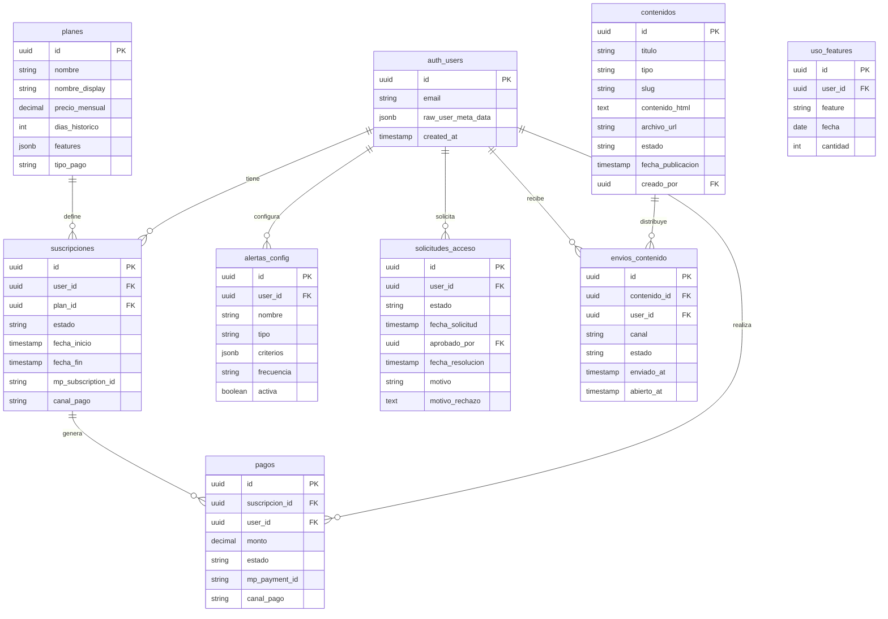

# 4. Modelo de Datos

> Última actualización: 2026-02-11
> Versión: 2.2 — Modelo híbrido + schema ofertas_dashboard + tensión de demanda

## Referencias

| Documento | Relación |
|-----------|----------|
| [01_MODELO_NEGOCIO](./01_MODELO_NEGOCIO.md) | Define niveles y planes (T-planes) |
| [02_ARQUITECTURA_PANTALLAS](./02_ARQUITECTURA_PANTALLAS.md) | Pantallas que usan cada tabla |
| [06_SEGURIDAD](./06_SEGURIDAD.md) | Políticas RLS por tabla |

## Matriz de Impacto

| Si cambia... | Actualizar... |
|--------------|---------------|
| Estructura de tabla | 06_SEGURIDAD (RLS), código de APIs |
| Añadir columna | Pantallas que la usan |
| Políticas RLS | 06_SEGURIDAD |

---

## Diagrama ER



---

## Tablas Nuevas

### T-planes

Definición de niveles de acceso.

```sql
CREATE TABLE planes (
  id UUID PRIMARY KEY DEFAULT gen_random_uuid(),
  nombre VARCHAR(50) NOT NULL,           -- 'registrado', 'trial', 'suscriptor', 'institucional'
  nombre_display VARCHAR(100) NOT NULL,  -- 'Registrado', 'Trial', 'Suscriptor', 'Institucional'
  precio_mensual DECIMAL(10,2),          -- NULL para registrado/trial, TBD para suscriptor
  precio_anual DECIMAL(10,2),
  moneda VARCHAR(3) DEFAULT 'ARS',
  dias_historico INTEGER,                -- NULL para registrado (sin tablero), 7 para trial, NULL para ilimitado
  features JSONB,                        -- Array de features incluidas
  limite_exports INTEGER,                -- NULL = ilimitado
  limite_alertas INTEGER,
  tiene_api BOOLEAN DEFAULT FALSE,
  tipo_pago VARCHAR(30),                 -- 'mercadopago', 'institucional', NULL (gratuito)
  activo BOOLEAN DEFAULT TRUE,
  created_at TIMESTAMPTZ DEFAULT NOW()
);

-- Datos iniciales
INSERT INTO planes (nombre, nombre_display, precio_mensual, dias_historico, features, limite_alertas, tipo_pago) VALUES
('registrado', 'Registrado', 0, NULL, '["contenido", "informes"]', 0, NULL),
('trial', 'Trial', 0, 7, '["contenido", "dashboard", "skills_basico"]', 0, NULL),
('suscriptor', 'Suscriptor', NULL, NULL, '["contenido", "dashboard", "skills_full", "exports", "alertas", "empresas"]', 10, 'mercadopago'),
('institucional', 'Institucional', NULL, NULL, '["todo", "api", "soporte_dedicado", "docs_demanda"]', NULL, 'institucional');
```

**Pantallas que usan:** [P-02](./02_ARQUITECTURA_PANTALLAS.md), [P-06](./02_ARQUITECTURA_PANTALLAS.md), [P-15](./02_ARQUITECTURA_PANTALLAS.md)

---

### T-suscripciones

Suscripciones activas de usuarios.

```sql
CREATE TABLE suscripciones (
  id UUID PRIMARY KEY DEFAULT gen_random_uuid(),
  user_id UUID REFERENCES auth.users(id) ON DELETE CASCADE,
  plan_id UUID REFERENCES planes(id),
  estado VARCHAR(30) NOT NULL,           -- 'registrado', 'pendiente_aprobacion', 'trial',
                                         -- 'activa', 'cancelada', 'vencida'
  fecha_inicio TIMESTAMPTZ NOT NULL,
  fecha_fin TIMESTAMPTZ,                 -- NULL = indefinida
  fecha_proximo_cobro TIMESTAMPTZ,
  canal_pago VARCHAR(30),                -- 'mercadopago', 'institucional', NULL
  mp_subscription_id VARCHAR(100),       -- ID de MercadoPago (si aplica)
  mp_payer_id VARCHAR(100),
  referencia_institucional VARCHAR(200), -- N° orden de compra / expediente (si aplica)
  metadata JSONB,
  created_at TIMESTAMPTZ DEFAULT NOW(),
  updated_at TIMESTAMPTZ DEFAULT NOW(),

  UNIQUE(user_id)                        -- Un usuario = una suscripción activa
);

-- Índices
CREATE INDEX idx_suscripciones_user ON suscripciones(user_id);
CREATE INDEX idx_suscripciones_estado ON suscripciones(estado);
CREATE INDEX idx_suscripciones_mp ON suscripciones(mp_subscription_id);
```

**Pantallas que usan:** [P-15](./02_ARQUITECTURA_PANTALLAS.md), [P-18](./02_ARQUITECTURA_PANTALLAS.md), [P-29](./02_ARQUITECTURA_PANTALLAS.md)

---

### T-solicitudes_acceso (NUEVA)

Solicitudes de acceso al tablero interactivo.

```sql
CREATE TABLE solicitudes_acceso (
  id UUID PRIMARY KEY DEFAULT gen_random_uuid(),
  user_id UUID REFERENCES auth.users(id) ON DELETE CASCADE,
  estado VARCHAR(30) NOT NULL DEFAULT 'pendiente',  -- 'pendiente', 'aprobada', 'rechazada'
  fecha_solicitud TIMESTAMPTZ DEFAULT NOW(),
  aprobado_por UUID REFERENCES auth.users(id),       -- Admin que resolvió
  fecha_resolucion TIMESTAMPTZ,
  motivo TEXT,                                        -- Por qué quiere acceso (lo llena el usuario)
  motivo_rechazo TEXT,                                -- Si se rechaza, por qué (lo llena admin)
  perfil_usuario VARCHAR(50),                         -- Perfil del usuario al momento de solicitar
  empresa_usuario VARCHAR(200),                       -- Empresa/org al momento de solicitar
  metadata JSONB,
  created_at TIMESTAMPTZ DEFAULT NOW()
);

-- Índices
CREATE INDEX idx_solicitudes_user ON solicitudes_acceso(user_id);
CREATE INDEX idx_solicitudes_estado ON solicitudes_acceso(estado);
CREATE INDEX idx_solicitudes_pendientes ON solicitudes_acceso(estado) WHERE estado = 'pendiente';
```

**Pantallas que usan:** [P-28](./02_ARQUITECTURA_PANTALLAS.md) (usuario solicita), [P-29](./02_ARQUITECTURA_PANTALLAS.md) (admin gestiona)

**Flujo:**
1. U-REGISTRADO envía solicitud (P-28) → estado `pendiente`
2. U-ADMIN ve en P-29 → aprueba o rechaza
3. Si aprobada → sistema crea suscripción con estado `trial` (7 días)
4. Si rechazada → usuario recibe email con motivo

---

### T-pagos

Historial de pagos (dual: MercadoPago + institucional).

```sql
CREATE TABLE pagos (
  id UUID PRIMARY KEY DEFAULT gen_random_uuid(),
  suscripcion_id UUID REFERENCES suscripciones(id),
  user_id UUID REFERENCES auth.users(id),
  monto DECIMAL(10,2) NOT NULL,
  moneda VARCHAR(3) DEFAULT 'ARS',
  estado VARCHAR(20) NOT NULL,           -- 'pendiente', 'aprobado', 'rechazado', 'reembolsado'
  canal_pago VARCHAR(30) NOT NULL,       -- 'mercadopago', 'institucional'
  mp_payment_id VARCHAR(100),            -- Solo para canal mercadopago
  mp_status VARCHAR(50),
  mp_status_detail VARCHAR(100),
  metodo_pago VARCHAR(50),               -- 'credit_card', 'debit_card', 'bank_transfer', 'orden_compra'
  referencia_institucional VARCHAR(200), -- N° factura / orden de compra
  fecha_pago TIMESTAMPTZ,
  metadata JSONB,
  created_at TIMESTAMPTZ DEFAULT NOW()
);

-- Índices
CREATE INDEX idx_pagos_user ON pagos(user_id);
CREATE INDEX idx_pagos_suscripcion ON pagos(suscripcion_id);
CREATE INDEX idx_pagos_mp ON pagos(mp_payment_id);
CREATE INDEX idx_pagos_canal ON pagos(canal_pago);
```

**Pantallas que usan:** [P-16](./02_ARQUITECTURA_PANTALLAS.md)

---

### T-contenidos (NUEVA — reemplaza T-informes_publicos)

Contenidos publicados via CMS (informes, notas, análisis).

```sql
CREATE TABLE contenidos (
  id UUID PRIMARY KEY DEFAULT gen_random_uuid(),
  titulo VARCHAR(200) NOT NULL,
  slug VARCHAR(200) NOT NULL UNIQUE,     -- URL-friendly: "informe-mensual-enero-2026"
  tipo VARCHAR(50) NOT NULL,             -- 'informe', 'nota', 'analisis', 'especial'
  descripcion TEXT,
  contenido_html TEXT,                   -- Contenido renderizable (para ver en web)
  archivo_url TEXT,                      -- URL del PDF en storage (para descarga)
  miniatura_url TEXT,
  categoria VARCHAR(50),                 -- 'mensual', 'trimestral', 'especial', 'sector'
  tags JSONB,                            -- ["tecnología", "salarios", "CABA"]
  estado VARCHAR(20) NOT NULL DEFAULT 'borrador',  -- 'borrador', 'publicado', 'archivado'
  fecha_publicacion TIMESTAMPTZ,
  requiere_registro BOOLEAN DEFAULT TRUE,  -- Si false, visible para visitantes
  creado_por UUID REFERENCES auth.users(id),
  descargas INTEGER DEFAULT 0,
  vistas INTEGER DEFAULT 0,
  metadata JSONB,
  created_at TIMESTAMPTZ DEFAULT NOW(),
  updated_at TIMESTAMPTZ DEFAULT NOW()
);

-- Índices
CREATE INDEX idx_contenidos_slug ON contenidos(slug);
CREATE INDEX idx_contenidos_estado ON contenidos(estado);
CREATE INDEX idx_contenidos_fecha ON contenidos(fecha_publicacion DESC);
CREATE INDEX idx_contenidos_tipo ON contenidos(tipo);
CREATE INDEX idx_contenidos_publicados ON contenidos(estado, fecha_publicacion DESC)
  WHERE estado = 'publicado';
```

**Pantallas que usan:** [P-03](./02_ARQUITECTURA_PANTALLAS.md) (preview), [P-26](./02_ARQUITECTURA_PANTALLAS.md) (lista), [P-27](./02_ARQUITECTURA_PANTALLAS.md) (detalle), [P-30](./02_ARQUITECTURA_PANTALLAS.md) (admin CMS)

---

### T-envios_contenido (NUEVA)

Tracking de distribución de contenido por email.

```sql
CREATE TABLE envios_contenido (
  id UUID PRIMARY KEY DEFAULT gen_random_uuid(),
  contenido_id UUID REFERENCES contenidos(id) ON DELETE CASCADE,
  user_id UUID REFERENCES auth.users(id) ON DELETE CASCADE,
  canal VARCHAR(20) NOT NULL DEFAULT 'email',  -- 'email', 'notificacion'
  estado VARCHAR(20) NOT NULL DEFAULT 'pendiente',  -- 'pendiente', 'enviado', 'fallido', 'abierto'
  enviado_at TIMESTAMPTZ,
  abierto_at TIMESTAMPTZ,                     -- Tracking de apertura
  click_at TIMESTAMPTZ,                        -- Tracking de click
  metadata JSONB,
  created_at TIMESTAMPTZ DEFAULT NOW()
);

-- Índices
CREATE INDEX idx_envios_contenido ON envios_contenido(contenido_id);
CREATE INDEX idx_envios_user ON envios_contenido(user_id);
CREATE INDEX idx_envios_estado ON envios_contenido(estado);
```

**Pantallas que usan:** [P-30](./02_ARQUITECTURA_PANTALLAS.md) (admin ve métricas de envío)

---

### T-alertas_config

Configuración de alertas por usuario.

```sql
CREATE TABLE alertas_config (
  id UUID PRIMARY KEY DEFAULT gen_random_uuid(),
  user_id UUID REFERENCES auth.users(id) ON DELETE CASCADE,
  nombre VARCHAR(100) NOT NULL,
  tipo VARCHAR(50) NOT NULL,             -- 'ocupacion', 'skill', 'empresa', 'provincia'
  criterios JSONB NOT NULL,              -- {ocupacion_id: 'xxx', umbral: 10}
  frecuencia VARCHAR(20) DEFAULT 'diaria', -- 'inmediata', 'diaria', 'semanal'
  activa BOOLEAN DEFAULT TRUE,
  ultima_ejecucion TIMESTAMPTZ,
  created_at TIMESTAMPTZ DEFAULT NOW()
);

-- Índices
CREATE INDEX idx_alertas_user ON alertas_config(user_id);
CREATE INDEX idx_alertas_activa ON alertas_config(activa) WHERE activa = true;
```

**Pantallas que usan:** [P-13](./02_ARQUITECTURA_PANTALLAS.md)

---

### T-uso_features

Tracking de uso para límites.

```sql
CREATE TABLE uso_features (
  id UUID PRIMARY KEY DEFAULT gen_random_uuid(),
  user_id UUID REFERENCES auth.users(id),
  feature VARCHAR(50) NOT NULL,          -- 'export', 'alerta', 'api_call'
  fecha DATE DEFAULT CURRENT_DATE,
  cantidad INTEGER DEFAULT 1,
  metadata JSONB,

  UNIQUE(user_id, feature, fecha)
);

-- Índices
CREATE INDEX idx_uso_user_feature ON uso_features(user_id, feature);
```

---

## Vistas SQL

### v_usuarios_con_plan

```sql
CREATE VIEW v_usuarios_con_plan AS
SELECT
  u.id as user_id,
  u.email,
  u.raw_user_meta_data->>'nombre' as nombre,
  u.raw_user_meta_data->>'empresa' as empresa,
  u.raw_user_meta_data->>'perfil' as perfil,
  COALESCE(p.nombre, 'registrado') as nivel,
  s.estado as estado_suscripcion,
  s.fecha_fin,
  s.canal_pago,
  p.dias_historico
FROM auth.users u
LEFT JOIN suscripciones s ON u.id = s.user_id AND s.estado IN ('registrado', 'trial', 'activa')
LEFT JOIN planes p ON s.plan_id = p.id;
```

---

### v_solicitudes_pendientes (NUEVA)

```sql
CREATE VIEW v_solicitudes_pendientes AS
SELECT
  sa.id,
  sa.user_id,
  u.email,
  u.raw_user_meta_data->>'nombre' as nombre,
  u.raw_user_meta_data->>'empresa' as empresa,
  u.raw_user_meta_data->>'perfil' as perfil,
  sa.motivo,
  sa.fecha_solicitud,
  sa.estado
FROM solicitudes_acceso sa
JOIN auth.users u ON sa.user_id = u.id
WHERE sa.estado = 'pendiente'
ORDER BY sa.fecha_solicitud ASC;
```

---

### v_metricas_contenido (NUEVA)

```sql
CREATE VIEW v_metricas_contenido AS
SELECT
  c.id,
  c.titulo,
  c.tipo,
  c.fecha_publicacion,
  c.descargas,
  c.vistas,
  COUNT(ec.id) as total_envios,
  COUNT(ec.id) FILTER (WHERE ec.estado = 'enviado') as enviados,
  COUNT(ec.id) FILTER (WHERE ec.abierto_at IS NOT NULL) as abiertos,
  CASE
    WHEN COUNT(ec.id) FILTER (WHERE ec.estado = 'enviado') > 0
    THEN ROUND(
      COUNT(ec.id) FILTER (WHERE ec.abierto_at IS NOT NULL)::numeric /
      COUNT(ec.id) FILTER (WHERE ec.estado = 'enviado') * 100, 1
    )
    ELSE 0
  END as tasa_apertura
FROM contenidos c
LEFT JOIN envios_contenido ec ON c.id = ec.contenido_id
GROUP BY c.id, c.titulo, c.tipo, c.fecha_publicacion, c.descargas, c.vistas;
```

---

### vw_insights_kpis (PENDIENTE)

> Referencia: [12_INSIGHTS_SISTEMA](./12_INSIGHTS_SISTEMA.md)

```sql
CREATE OR REPLACE VIEW vw_insights_kpis AS
SELECT
  COUNT(*) as total_ofertas,
  COUNT(DISTINCT isco_code) as ocupaciones_distintas,
  COUNT(DISTINCT empresa) as empresas_activas,
  COUNT(DISTINCT provincia) as provincias
FROM ofertas_dashboard;
```

---

### vw_insights_tendencia (PENDIENTE)

```sql
CREATE OR REPLACE VIEW vw_insights_tendencia AS
SELECT
  DATE_TRUNC('month', fecha_publicacion::date) as mes,
  COUNT(*) as ofertas,
  COUNT(DISTINCT empresa) as empresas,
  COUNT(DISTINCT isco_code) as ocupaciones
FROM ofertas_dashboard
GROUP BY DATE_TRUNC('month', fecha_publicacion::date)
ORDER BY mes DESC
LIMIT 12;
```

---

### vw_insights_isco_grupos (PENDIENTE)

```sql
CREATE OR REPLACE VIEW vw_insights_isco_grupos AS
SELECT
  LEFT(isco_code, 1) as grupo,
  COUNT(*) as total,
  ROUND(COUNT(*) * 100.0 / SUM(COUNT(*)) OVER (), 1) as porcentaje
FROM ofertas_dashboard
WHERE isco_code IS NOT NULL
GROUP BY LEFT(isco_code, 1)
ORDER BY total DESC;
```

---

## Funciones

### check_feature_limit

Verifica si un usuario puede usar una feature según su plan.

```sql
CREATE OR REPLACE FUNCTION check_feature_limit(
  p_user_id UUID,
  p_feature VARCHAR,
  p_limite INTEGER
) RETURNS BOOLEAN AS $$
DECLARE
  v_usado INTEGER;
BEGIN
  IF p_limite IS NULL THEN RETURN TRUE; END IF;

  SELECT COALESCE(SUM(cantidad), 0) INTO v_usado
  FROM uso_features
  WHERE user_id = p_user_id
    AND feature = p_feature
    AND fecha >= DATE_TRUNC('month', CURRENT_DATE);

  RETURN v_usado < p_limite;
END;
$$ LANGUAGE plpgsql;
```

---

### aprobar_solicitud_acceso (NUEVA)

Aprueba una solicitud y crea la suscripción trial automáticamente.

```sql
CREATE OR REPLACE FUNCTION aprobar_solicitud_acceso(
  p_solicitud_id UUID,
  p_admin_id UUID
) RETURNS void AS $$
DECLARE
  v_user_id UUID;
  v_plan_trial_id UUID;
BEGIN
  -- Obtener user_id de la solicitud
  SELECT user_id INTO v_user_id
  FROM solicitudes_acceso
  WHERE id = p_solicitud_id AND estado = 'pendiente';

  IF v_user_id IS NULL THEN
    RAISE EXCEPTION 'Solicitud no encontrada o ya resuelta';
  END IF;

  -- Obtener plan trial
  SELECT id INTO v_plan_trial_id FROM planes WHERE nombre = 'trial';

  -- Aprobar solicitud
  UPDATE solicitudes_acceso
  SET estado = 'aprobada',
      aprobado_por = p_admin_id,
      fecha_resolucion = NOW()
  WHERE id = p_solicitud_id;

  -- Crear/actualizar suscripción como trial
  INSERT INTO suscripciones (user_id, plan_id, estado, fecha_inicio, fecha_fin)
  VALUES (v_user_id, v_plan_trial_id, 'trial', NOW(), NOW() + INTERVAL '7 days')
  ON CONFLICT (user_id) DO UPDATE
  SET plan_id = v_plan_trial_id,
      estado = 'trial',
      fecha_inicio = NOW(),
      fecha_fin = NOW() + INTERVAL '7 days',
      updated_at = NOW();
END;
$$ LANGUAGE plpgsql;
```

---

### get_insights (PENDIENTE)

> Referencia: [12_INSIGHTS_SISTEMA](./12_INSIGHTS_SISTEMA.md) - Resuelve E-16

Función RPC que devuelve todos los insights pre-calculados en una sola llamada.

```sql
CREATE OR REPLACE FUNCTION get_insights(
  p_provincia text DEFAULT NULL,
  p_fecha_desde date DEFAULT NULL,
  p_fecha_hasta date DEFAULT NULL
)
RETURNS json AS $$
  SELECT json_build_object(
    'kpis', (SELECT row_to_json(k) FROM vw_insights_kpis k),
    'top_ocupaciones', (
      SELECT json_agg(o)
      FROM (SELECT * FROM vw_insights_isco_grupos LIMIT 5) o
    ),
    'tendencia', (SELECT json_agg(t) FROM vw_insights_tendencia t),
    'concentracion_top3', (
      SELECT ROUND(SUM(porcentaje), 1)
      FROM (SELECT porcentaje FROM vw_insights_isco_grupos LIMIT 3) sub
    )
  )
$$ LANGUAGE sql STABLE;
```

**Uso desde cliente:**
```typescript
const { data } = await supabase.rpc('get_insights', {
  p_provincia: 'Buenos Aires'
})
```

---

## Tablas Existentes — Supabase (Dashboard)

Tablas en Supabase que alimentan el dashboard Next.js. Sincronizadas desde SQLite local via `sync_to_supabase.py`.

| Tabla | Descripción | ~Registros |
|-------|-------------|------------|
| `ofertas_dashboard` | Ofertas validadas desnormalizadas (~55 campos) | 2089 |
| `ofertas_skills` | Skills por oferta (1:N) con clasificación ESCO | 35277 |
| `ocupaciones_esco` | Catálogo ESCO ocupaciones (subset) | 471 |
| `skills` | Catálogo ESCO skills (subset) | 5228 |
| `issues` | Feedback/errores reportados por usuarios | - |
| `tension_ocupaciones` | Tensión de demanda pre-calculada por ocupación | ~100 |
| `sistema_estado` | Estado del sistema (última sincronización) | 1 |

### Columnas de `ofertas_dashboard`

| Grupo | Campos clave |
|-------|-------------|
| **PK** | `id_oferta` |
| **Scraping** | titulo, empresa, descripcion, localizacion, url_oferta, portal, fecha_publicacion_iso, scrapeado_en, provincia_normalizada, localidad_normalizada, estado_oferta, fecha_ultimo_visto, dias_publicada |
| **NLP** | titulo_limpio, tareas_explicitas, mision_rol, area_funcional, nivel_seniority, sector_empresa, tipo_oferta, tipo_contrato, provincia, localidad, modalidad, jornada_laboral, nivel_educativo, titulo_requerido, experiencia_min_anios, tiene_gente_cargo, requiere_movilidad_propia, skills_tecnicas_list, soft_skills_list, tecnologias_list, herramientas_list |
| **Matching** | esco_occupation_uri, esco_occupation_label, isco_code, isco_label, occupation_match_score, occupation_match_method, skills_oferta_json, skills_matched_essential, skills_demandados_total, skills_matcheados_esco, run_id, estado_validacion, validado_timestamp, validado_por |
| **Indicadores** | `categoria_permanencia` (baja/media/alta), `es_republicacion` (bool), `numero_republicacion` (int), `grupo_republicacion` (text), `ventana_dias` (int) |
| **Meta** | estado, fecha_sync, created_at, updated_at |

> **Schema SQL completo:** `scripts/exports/supabase_schema.sql`
> **Guía de sincronización:** `docs/guides/SUPABASE_SYNC.md`

### Definición de Campos de Indicadores

| Campo | Tipo | Cálculo | Origen |
|-------|------|---------|--------|
| `categoria_permanencia` | text | `baja` (<7d), `media` (7-29d), `alta` (>=30d) | Derivado de `dias_publicada` en sync |
| `es_republicacion` | boolean | `true` si misma URL aparece en distinta fecha | Detección en sync por `url_oferta` |
| `numero_republicacion` | integer | N° de versión dentro del grupo de republicaciones | Orden cronológico dentro del grupo |
| `grupo_republicacion` | text | Hash que agrupa publicaciones de la misma oferta | Hash de `url_oferta` normalizada |
| `ventana_dias` | integer | `MAX(dias_publicada)` del grupo de republicaciones | Calculado sobre el grupo completo |

### T-tension_ocupaciones (NUEVA — Indicador Tensión de Demanda)

Tabla pre-calculada con indicadores de tensión por ocupación ISCO. Se recalcula en cada sincronización.

```sql
CREATE TABLE IF NOT EXISTS tension_ocupaciones (
  isco_code TEXT PRIMARY KEY,
  isco_label TEXT,
  total_posiciones INTEGER NOT NULL,
  total_ofertas INTEGER NOT NULL,
  persistencia NUMERIC(5,2) NOT NULL,  -- % posiciones con ventana > 45d
  insistencia NUMERIC(5,2) NOT NULL,   -- % posiciones republicadas
  cuadrante TEXT NOT NULL,             -- CRITICO/URGENTE/PASIVO/FLUIDO
  calculado_en TIMESTAMPTZ DEFAULT NOW(),
  created_at TIMESTAMPTZ DEFAULT NOW(),
  updated_at TIMESTAMPTZ DEFAULT NOW()
);
```

**Cuadrantes de tensión:**

| Cuadrante | Persistencia | Insistencia | Interpretación |
|-----------|-------------|-------------|----------------|
| CRÍTICO | >= 50% | >= 50% | Difícil de cubrir, empleadores insisten |
| PASIVO | >= 50% | < 50% | Duran mucho pero sin urgencia |
| URGENTE | < 50% | >= 50% | Se cubren rápido pero alta rotación |
| FLUIDO | < 50% | < 50% | Mercado sano |

**Pantallas que usan:** [P-09](./02_ARQUITECTURA_PANTALLAS.md) (scatter plot + filtro sidebar)

**Referencia:** [12_INSIGHTS_SISTEMA](./12_INSIGHTS_SISTEMA.md#grupo-5-tensión-de-demanda) — SQL de cálculo completo

---

## Tablas Existentes — SQLite Local (Pipeline)

Tablas en SQLite local usadas por el pipeline de procesamiento.

| Tabla | Descripción | Documentación |
|-------|-------------|---------------|
| `ofertas` | Ofertas de empleo scrapeadas | - |
| `ofertas_nlp` | Datos NLP extraídos | - |
| `ofertas_esco_matching` | Matching ISCO/ESCO | - |
| `skills_detalle` | Skills por oferta | - |
| `validation_errors` | Errores de validación automática | - |
| `ofertas_prioridad` | Cola de priorización | - |

---

## Políticas RLS

Ver [06_SEGURIDAD](./06_SEGURIDAD.md#rls) para políticas de seguridad a nivel de fila.

**Resumen:**

| Tabla | SELECT | INSERT | UPDATE | DELETE |
|-------|--------|--------|--------|--------|
| planes | Todos | Solo admin | Solo admin | Solo admin |
| suscripciones | Solo propia | Sistema | Sistema | Sistema |
| solicitudes_acceso | Solo propia + admin todas | Propia | Solo admin | No |
| pagos | Solo propios | Sistema | Sistema | No |
| alertas_config | Solo propias | Propias | Propias | Propias |
| contenidos | Publicados: todos registrados. Borrador: solo admin | Solo admin | Solo admin | Solo admin |
| envios_contenido | Solo propios + admin todos | Sistema | Sistema | No |
| tension_ocupaciones | Todos | Solo admin/sistema | Solo admin/sistema | Solo admin |
| uso_features | Solo propios | Sistema | Sistema | No |

---

## Historial de Cambios

| Fecha | Versión | Cambio |
|-------|---------|--------|
| 2026-02-05 | 1.0 | Modelo SaaS (planes free/pro/enterprise, informes_publicos) |
| 2026-02-07 | 2.0 | Modelo híbrido: T-solicitudes_acceso, T-contenidos (reemplaza informes_publicos), T-envios_contenido, pago dual en T-pagos y T-suscripciones, nuevas vistas y funciones |
| 2026-02-11 | 2.1 | Documentar ofertas_dashboard completa (Supabase vs SQLite), agregar campos indicadores: categoria_permanencia, es_republicacion, numero_republicacion |
| 2026-02-11 | 2.2 | T-tension_ocupaciones (indicador tensión de demanda por ISCO), campos grupo_republicacion y ventana_dias en indicadores, definición formal de campos |
