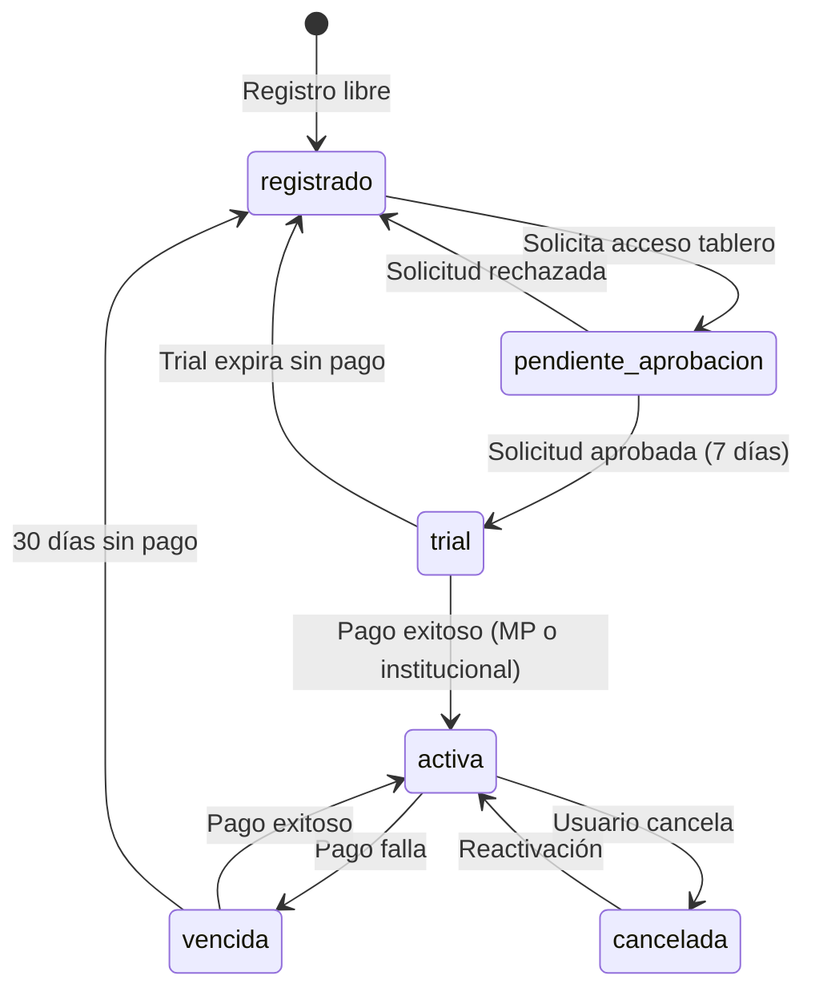

# 5. Flujos de Usuario

> Última actualización: 2026-02-07
> Versión: 2.0 — Modelo híbrido (registro libre + acceso gated + CMS)

## Referencias

| Documento | Relación |
|-----------|----------|
| [01_MODELO_NEGOCIO](./01_MODELO_NEGOCIO.md) | Define tipos de usuario y flujo de acceso |
| [02_ARQUITECTURA_PANTALLAS](./02_ARQUITECTURA_PANTALLAS.md) | Pantallas involucradas |
| [04_MODELO_DATOS](./04_MODELO_DATOS.md) | Tablas afectadas |

## Matriz de Impacto

| Si cambia... | Actualizar... |
|--------------|---------------|
| Flujo de checkout | 04_MODELO_DATOS (pagos), 03_WIREFRAMES/checkout.md |
| Estados de suscripción | 04_MODELO_DATOS (suscripciones) |
| Flujo de acceso gated | 04_MODELO_DATOS (solicitudes_acceso) |
| CMS | 04_MODELO_DATOS (contenidos, envios_contenido) |

---

## F-01: Visitante → Registrado

Registro libre sin selección de plan. Da acceso a contenido (informes, notas, análisis).

```
┌─────────────────────────────────────────────────────────────────────────┐
│                                                                          │
│  1. DESCUBRIMIENTO                                                       │
│     ┌─────────┐                                                          │
│     │ Landing │ ──→ Ve narrativa OEDE, funcionalidades, números         │
│     └────┬────┘                                                          │
│          │                                                               │
│          ▼                                                               │
│  2. REGISTRO LIBRE                                                       │
│     ┌─────────┐     ┌─────────┐     ┌─────────┐                         │
│     │ Click   │ ──→ │ Form    │ ──→ │ Email   │                         │
│     │"Regist."│     │ nombre, │     │ confirm │                         │
│     └─────────┘     │ email,  │     └────┬────┘                         │
│                     │ empresa,│          │                               │
│                     │ perfil  │          │                               │
│                     └─────────┘          │                               │
│                                          ▼                               │
│  3. ACCESO A CONTENIDO                                                   │
│     ┌──────────────┐     ┌──────────────┐                                │
│     │ Welcome      │ ──→ │ /contenido   │                                │
│     │ "Bienvenido, │     │ Informes y   │                                │
│     │ ya podés     │     │ notas        │                                │
│     │ acceder a    │     │ disponibles" │                                │
│     │ informes"    │     └──────────────┘                                │
│     └──────────────┘                                                     │
│                                                                          │
│  Nota: NO tiene acceso al dashboard.                                     │
│  Para el tablero → F-02                                                  │
│                                                                          │
└─────────────────────────────────────────────────────────────────────────┘
```

### Pasos Detallados

| Paso | Pantalla | Acción | Siguiente |
|------|----------|--------|-----------|
| 1 | [P-01](./03_WIREFRAMES/publicas.md#p-01-landing-page) | Click "Registrarse gratis" | P-05 |
| 2 | [P-05](./03_WIREFRAMES/publicas.md#p-05-registro) | Completar form (sin plan) | Email |
| 3 | Email | Click "Verificar" | P-26 |
| 4 | [P-26](./02_ARQUITECTURA_PANTALLAS.md) | Navega contenido | Uso normal |

### Tablas Afectadas

- `auth.users` — Nuevo registro
- `suscripciones` — Estado `registrado` automático

---

## F-02: Registrado → Solicita Acceso al Tablero

Flujo gated: el usuario solicita, MOL/OEDE aprueba, se activa trial de 7 días.

```
┌─────────────────────────────────────────────────────────────────────────┐
│                                                                          │
│  1. TRIGGER (cualquiera de estos)                                        │
│     ┌─────────────┐  ┌─────────────┐  ┌─────────────┐                   │
│     │ Banner en   │  │ CTA en      │  │ CTA en      │                   │
│     │ /contenido  │  │ landing     │  │ /precios    │                   │
│     │ "Accedé al  │  │ "Solicitar  │  │ "Solicitar  │                   │
│     │  tablero"   │  │  acceso"    │  │  acceso"    │                   │
│     └──────┬──────┘  └──────┬──────┘  └──────┬──────┘                   │
│            │                │                │                           │
│            └────────────────┼────────────────┘                           │
│                             ▼                                            │
│  2. FORMULARIO DE SOLICITUD                                              │
│     ┌──────────────────────────────────────┐                             │
│     │  P-28: /solicitar-acceso             │                             │
│     │                                      │                             │
│     │  ¿Por qué querés acceder             │                             │
│     │  al tablero?                         │                             │
│     │  ┌──────────────────────────────┐    │                             │
│     │  │ (motivo libre)               │    │                             │
│     │  └──────────────────────────────┘    │                             │
│     │                                      │                             │
│     │  [Enviar solicitud]                  │                             │
│     └──────────────────┬───────────────────┘                             │
│                        │                                                 │
│                        ▼                                                 │
│  3. ESPERA APROBACIÓN                                                    │
│     ┌──────────────────────────────────────┐                             │
│     │  "Tu solicitud fue enviada.          │                             │
│     │   Te notificaremos por email         │                             │
│     │   cuando sea aprobada."              │                             │
│     └──────────────────────────────────────┘                             │
│                        │                                                 │
│                        ▼                                                 │
│  4. ADMIN REVISA (P-29: /admin/solicitudes)                              │
│     ┌──────────────────────────────────────┐                             │
│     │  Admin ve: nombre, empresa, perfil,  │                             │
│     │  motivo de la solicitud.             │                             │
│     │                                      │                             │
│     │  [Aprobar]  [Rechazar + motivo]      │                             │
│     └──────────┬─────────────┬─────────────┘                             │
│                │             │                                           │
│         ┌──────┘             └──────┐                                    │
│         ▼                          ▼                                     │
│  5a. APROBADO                5b. RECHAZADO                               │
│  ┌──────────────────┐       ┌──────────────────┐                        │
│  │ Email: "¡Tu      │       │ Email: "Tu       │                        │
│  │ acceso fue        │       │ solicitud no fue │                        │
│  │ aprobado! Tenés   │       │ aprobada.        │                        │
│  │ 7 días de prueba" │       │ Motivo: ..."     │                        │
│  └────────┬─────────┘       └──────────────────┘                        │
│           │                                                              │
│           ▼                                                              │
│  6. TRIAL ACTIVO                                                         │
│  ┌──────────────────────────────────────┐                                │
│  │  /dashboard ── Acceso completo       │                                │
│  │  por 7 días (limitaciones TBD)       │                                │
│  └──────────────────────────────────────┘                                │
│                                                                          │
└─────────────────────────────────────────────────────────────────────────┘
```

### Pasos Detallados

| Paso | Pantalla | Acción | Siguiente |
|------|----------|--------|-----------|
| 1 | P-26 / P-01 / P-02 | Click "Solicitar acceso" | P-28 |
| 2 | [P-28](./02_ARQUITECTURA_PANTALLAS.md) | Completar motivo + enviar | Confirmación |
| 3 | - | Espera (email cuando se resuelve) | - |
| 4 | [P-29](./02_ARQUITECTURA_PANTALLAS.md) | Admin aprueba/rechaza | Email |
| 5 | Email | Link a /dashboard (si aprobado) | P-09 |
| 6 | [P-09](./03_WIREFRAMES/suscriptor.md#p-09-dashboard) | Trial 7 días | F-03 (upgrade) |

### Tablas Afectadas

- `solicitudes_acceso` — Nueva solicitud (estado `pendiente` → `aprobada`/`rechazada`)
- `suscripciones` — Si aprobada: nueva suscripción con estado `trial`, fecha_fin = +7 días

---

## F-03: Trial → Suscriptor (Checkout Dual)

Cuando el trial está por expirar o el usuario quiere suscribirse. Pago por MercadoPago (individuos) o mecanismo institucional (organismos).

```
┌─────────────────────────────────────────────────────────────────────────┐
│                                                                          │
│  1. TRIGGER                                                              │
│     ┌─────────────┐  ┌─────────────┐  ┌─────────────┐                   │
│     │ Banner:     │  │ Email:      │  │ Cuenta →    │                   │
│     │ "Te quedan  │  │ "Tu trial   │  │ Suscripción │                   │
│     │  3 días"    │  │  vence en   │  │ [Upgrade]   │                   │
│     │             │  │  3 días"    │  │             │                   │
│     └──────┬──────┘  └──────┬──────┘  └──────┬──────┘                   │
│            │                │                │                           │
│            └────────────────┼────────────────┘                           │
│                             ▼                                            │
│  2. SELECCIÓN DE CANAL                                                   │
│     ┌──────────────────────────────────────┐                             │
│     │  P-15 o P-06: ¿Cómo querés pagar?   │                             │
│     │                                      │                             │
│     │  ○ MercadoPago (tarjeta, transf.)    │                             │
│     │  ○ Institucional (orden de compra)   │                             │
│     │                                      │                             │
│     └──────────┬─────────────┬─────────────┘                             │
│                │             │                                           │
│         ┌──────┘             └──────┐                                    │
│         ▼                          ▼                                     │
│  3a. MERCADOPAGO               3b. INSTITUCIONAL                         │
│  ┌──────────────────┐       ┌──────────────────┐                        │
│  │ P-06: Checkout   │       │ Formulario con   │                        │
│  │ → Redirect a MP  │       │ datos de          │                        │
│  │ → Pago online    │       │ facturación.      │                        │
│  │ → Redirect back  │       │ MOL gestiona      │                        │
│  └────────┬─────────┘       │ offline.          │                        │
│           │                 └────────┬─────────┘                        │
│           │                          │                                   │
│           └──────────┬───────────────┘                                   │
│                      ▼                                                   │
│  4. ACTIVACIÓN                                                           │
│     ┌──────────────────────────────────────────────┐                    │
│     │  ✓ Plan actualizado a Suscriptor             │                    │
│     │  ✓ Acceso completo al tablero                │                    │
│     │  ✓ Email de confirmación enviado             │                    │
│     │                                              │                    │
│     │  [Ir al Dashboard]                           │                    │
│     └──────────────────────────────────────────────┘                    │
│                                                                          │
└─────────────────────────────────────────────────────────────────────────┘
```

### Canales de Pago

| Canal | Para quién | Método | Activación |
|-------|-----------|--------|------------|
| MercadoPago | Individuos, consultoras | Tarjeta, transferencia, efectivo | Automática (webhook) |
| Institucional | Organismos, gobierno, universidades | Orden de compra, facturación | Manual (admin confirma) |

### Tablas Afectadas

- `suscripciones` — Estado `trial` → `activa`, canal_pago asignado
- `pagos` — Nuevo registro con canal correspondiente

---

## F-04: Webhook MercadoPago

```
┌─────────────────────────────────────────────────────────────────────────┐
│                                                                          │
│  PAGO APROBADO                                                           │
│                                                                          │
│  MercadoPago ──→ POST /api/webhooks/mercadopago                         │
│       │                    │                                             │
│       │                    ▼                                             │
│       │         ┌─────────────────────┐                                 │
│       │         │ Verificar firma     │                                 │
│       │         │ (seguridad)         │                                 │
│       │         └──────────┬──────────┘                                 │
│       │                    │                                             │
│       │                    ▼                                             │
│       │         ┌─────────────────────┐                                 │
│       │         │ Buscar suscripción  │                                 │
│       │         │ por mp_subscription │                                 │
│       │         └──────────┬──────────┘                                 │
│       │                    │                                             │
│       │                    ▼                                             │
│       │         ┌─────────────────────┐                                 │
│       │         │ Actualizar estado   │                                 │
│       │         │ suscripcion='activa'│                                 │
│       │         │ canal='mercadopago' │                                 │
│       │         └──────────┬──────────┘                                 │
│       │                    │                                             │
│       │                    ▼                                             │
│       │         ┌─────────────────────┐                                 │
│       │         │ Insertar en pagos   │                                 │
│       │         │ estado='aprobado'   │                                 │
│       │         │ canal='mercadopago' │                                 │
│       │         └──────────┬──────────┘                                 │
│       │                    │                                             │
│       │                    ▼                                             │
│       │         ┌─────────────────────┐                                 │
│       │         │ Enviar email        │                                 │
│       │         │ confirmación        │                                 │
│       │         └─────────────────────┘                                 │
│                                                                          │
│  ─────────────────────────────────────────────────────────────────────  │
│                                                                          │
│  PAGO RECHAZADO                                                          │
│                                                                          │
│  MercadoPago ──→ POST /api/webhooks/mercadopago                         │
│                            │                                             │
│                            ▼                                             │
│                  ┌─────────────────────┐                                │
│                  │ Insertar en pagos   │                                │
│                  │ estado='rechazado'  │                                │
│                  └──────────┬──────────┘                                │
│                             │                                            │
│                             ▼                                            │
│                  ┌─────────────────────┐                                │
│                  │ Enviar email        │                                │
│                  │ "Problema con pago" │                                │
│                  └─────────────────────┘                                │
│                                                                          │
└─────────────────────────────────────────────────────────────────────────┘
```

### Eventos de Webhook

| Evento MP | Acción Sistema |
|-----------|----------------|
| `payment.created` | Log, esperar confirmación |
| `payment.approved` | Activar suscripción |
| `payment.rejected` | Email usuario, log error |
| `subscription.cancelled` | Marcar suscripción cancelada |

### Seguridad del Webhook

1. **Verificar firma** - Header `x-signature` de MP
2. **Validar origen** - IP de MercadoPago
3. **Idempotencia** - Evitar procesar duplicados
4. **Logging** - Registrar todo para auditoría

---

## F-05: CMS — Admin Publica Contenido (NUEVO)

Admin crea contenido desde datos del dashboard y el sistema lo distribuye a registrados.

```
┌─────────────────────────────────────────────────────────────────────────┐
│                                                                          │
│  1. ADMIN CREA CONTENIDO                                                 │
│     ┌──────────────────────────────────────┐                             │
│     │  P-30: /admin/contenidos             │                             │
│     │                                      │                             │
│     │  [+ Nuevo contenido]                 │                             │
│     │                                      │                             │
│     │  Título: _______________             │                             │
│     │  Tipo: [Informe ▼]                   │                             │
│     │  Categoría: [Mensual ▼]              │                             │
│     │  Tags: [tecnología] [+]              │                             │
│     │                                      │                             │
│     │  Contenido: [Editor WYSIWYG]         │                             │
│     │  PDF adjunto: [Subir archivo]        │                             │
│     │                                      │                             │
│     │  [Guardar borrador] [Publicar]       │                             │
│     └──────────────────┬───────────────────┘                             │
│                        │                                                 │
│                        ▼                                                 │
│  2. PUBLICAR                                                             │
│     ┌──────────────────────────────────────┐                             │
│     │  Estado: borrador → publicado        │                             │
│     │  Disponible en /contenido            │                             │
│     │                                      │                             │
│     │  ¿Enviar por email a registrados?    │                             │
│     │  ○ Sí, a todos                       │                             │
│     │  ○ Sí, segmentado por perfil/interés │                             │
│     │  ○ No, solo publicar en web          │                             │
│     │                                      │                             │
│     │  [Confirmar publicación]             │                             │
│     └──────────────────┬───────────────────┘                             │
│                        │                                                 │
│                        ▼                                                 │
│  3. DISTRIBUCIÓN                                                         │
│     ┌──────────────────────────────────────┐                             │
│     │  Sistema envía email a registrados:  │                             │
│     │                                      │                             │
│     │  "Nuevo informe disponible:          │                             │
│     │   [Título del contenido]             │                             │
│     │                                      │                             │
│     │   [Ver informe] [Descargar PDF]"     │                             │
│     │                                      │                             │
│     │  Para cada destinatario:             │                             │
│     │  → envios_contenido (tracking)       │                             │
│     └──────────────────┬───────────────────┘                             │
│                        │                                                 │
│                        ▼                                                 │
│  4. MÉTRICAS                                                             │
│     ┌──────────────────────────────────────┐                             │
│     │  P-30: Admin ve en dashboard CMS:    │                             │
│     │                                      │                             │
│     │  Enviados: 850                       │                             │
│     │  Abiertos: 312 (36.7%)              │                             │
│     │  Descargas PDF: 145                  │                             │
│     │  Vistas web: 278                     │                             │
│     └──────────────────────────────────────┘                             │
│                                                                          │
└─────────────────────────────────────────────────────────────────────────┘
```

### Tablas Afectadas

- `contenidos` — CRUD de informes/notas/análisis
- `envios_contenido` — Registro de cada envío por email (tracking apertura/click)

### Pantallas Involucradas

| Pantalla | Rol | Acción |
|----------|-----|--------|
| P-30 | Admin | Crear, editar, publicar contenido |
| P-26 | Registrado | Ver lista de contenidos disponibles |
| P-27 | Registrado | Ver detalle de un contenido |
| P-03 | Visitante | Preview (título + descripción, requiere registro para acceder) |

---

## Estados de Suscripción



### Descripción de Estados

| Estado | Descripción | Acceso |
|--------|-------------|--------|
| `registrado` | Registro libre, sin tablero | Contenido (informes, notas) |
| `pendiente_aprobacion` | Solicitó acceso, esperando MOL | Contenido |
| `trial` | Aprobado, 7 días de prueba | Dashboard (limitaciones TBD) |
| `activa` | Suscripción pagada (MP o institucional) | Dashboard completo |
| `vencida` | Pago pendiente | Degradado a registrado |
| `cancelada` | Usuario canceló | Contenido hasta fin de período |

---

## Historial de Cambios

| Fecha | Versión | Cambio |
|-------|---------|--------|
| 2026-02-05 | 1.0 | Flujos SaaS: Visitante→Free, Free→Pro, Uso dashboard, Webhook MP |
| 2026-02-07 | 2.0 | Modelo híbrido: F-01 registro libre, F-02 acceso gated con aprobación, F-03 checkout dual, F-05 CMS. Estados: registrado, pendiente_aprobacion, trial |
