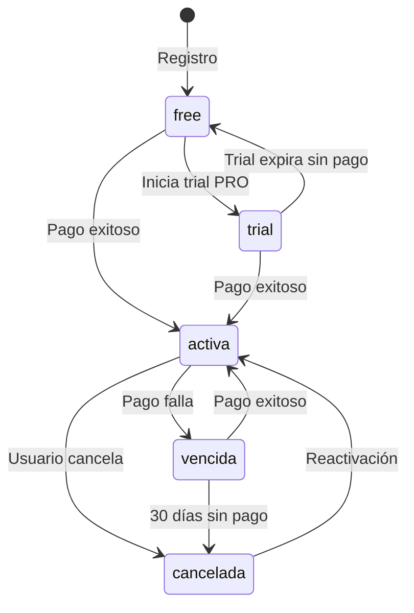

# 5. Flujos de Usuario

> Última actualización: 2026-02-05

## Referencias

| Documento | Relación |
|-----------|----------|
| [01_MODELO_NEGOCIO](./01_MODELO_NEGOCIO.md) | Define tipos de usuario |
| [02_ARQUITECTURA_PANTALLAS](./02_ARQUITECTURA_PANTALLAS.md) | Pantallas involucradas |
| [04_MODELO_DATOS](./04_MODELO_DATOS.md) | Tablas afectadas |

## Matriz de Impacto

| Si cambia... | Actualizar... |
|--------------|---------------|
| Flujo de checkout | 04_MODELO_DATOS (pagos), 03_WIREFRAMES/checkout.md |
| Estados de suscripción | 04_MODELO_DATOS (suscripciones) |
| Onboarding | 03_WIREFRAMES (pantallas involucradas) |

---

## F-01: Visitante → Usuario Free

```
┌─────────────────────────────────────────────────────────────────────────┐
│                                                                          │
│  1. DESCUBRIMIENTO                                                       │
│     ┌─────────┐                                                          │
│     │ Landing │ ──→ Ve features, precios, CTA                           │
│     └────┬────┘                                                          │
│          │                                                               │
│          ▼                                                               │
│  2. REGISTRO                                                             │
│     ┌─────────┐     ┌─────────┐     ┌─────────┐                         │
│     │ Click   │ ──→ │ Form    │ ──→ │ Email   │                         │
│     │ "Free"  │     │ registro│     │ confirm │                         │
│     └─────────┘     └─────────┘     └────┬────┘                         │
│                                          │                               │
│                                          ▼                               │
│  3. ONBOARDING                                                           │
│     ┌─────────┐     ┌─────────┐     ┌─────────┐                         │
│     │ Welcome │ ──→ │ Tour    │ ──→ │Dashboard│                         │
│     │ screen  │     │ guiado  │     │ (7 días)│                         │
│     └─────────┘     └─────────┘     └─────────┘                         │
│                                                                          │
└─────────────────────────────────────────────────────────────────────────┘
```

### Pasos Detallados

| Paso | Pantalla | Acción | Siguiente |
|------|----------|--------|-----------|
| 1 | [P-01](./03_WIREFRAMES/publicas.md#p-01-landing-page) | Click "Comenzar Gratis" | P-05 |
| 2 | [P-05](./03_WIREFRAMES/publicas.md#p-05-registro) | Completar form | Email |
| 3 | Email | Click "Verificar" | Dashboard |
| 4 | [P-09](./03_WIREFRAMES/suscriptor.md#p-09-dashboard) | Tour guiado | Uso normal |

### Tablas Afectadas

- `auth.users` - Nuevo registro
- `suscripciones` - Plan 'free' automático

---

## F-02: Usuario Free → Pro (Upgrade)

```
┌─────────────────────────────────────────────────────────────────────────┐
│                                                                          │
│  1. TRIGGER (cualquiera de estos)                                        │
│     ┌─────────────┐  ┌─────────────┐  ┌─────────────┐                   │
│     │ Intenta     │  │ Ve banner   │  │ Click en    │                   │
│     │ exportar    │  │ "Upgrade"   │  │ "Ver más"   │                   │
│     └──────┬──────┘  └──────┬──────┘  └──────┬──────┘                   │
│            │                │                │                           │
│            └────────────────┼────────────────┘                           │
│                             ▼                                            │
│  2. UPGRADE MODAL                                                        │
│     ┌─────────────────────────────┐                                      │
│     │  "Desbloqueá todas las      │                                      │
│     │   funcionalidades"          │                                      │
│     │                             │                                      │
│     │  [Ver planes] [Ahora no]    │                                      │
│     └──────────────┬──────────────┘                                      │
│                    │                                                     │
│                    ▼                                                     │
│  3. CHECKOUT                                                             │
│     ┌─────────┐     ┌─────────────┐     ┌─────────┐                     │
│     │ Página  │ ──→ │ MercadoPago │ ──→ │ Éxito   │                     │
│     │ precios │     │ checkout    │     │ redirect│                     │
│     └─────────┘     └─────────────┘     └────┬────┘                     │
│                                              │                           │
│                                              ▼                           │
│  4. ACTIVACIÓN                                                           │
│     ┌─────────────────────────────────────────────┐                     │
│     │  ✓ Plan actualizado                         │                     │
│     │  ✓ Acceso a histórico completo              │                     │
│     │  ✓ Email de confirmación enviado            │                     │
│     │                                             │                     │
│     │  [Ir al Dashboard]                          │                     │
│     └─────────────────────────────────────────────┘                     │
│                                                                          │
└─────────────────────────────────────────────────────────────────────────┘
```

### Triggers de Upgrade

| Trigger | Ubicación | Comportamiento |
|---------|-----------|----------------|
| Intento de export | Dashboard | Modal "Esta función requiere PRO" |
| Banner lateral | Sidebar | "Accedé a histórico completo" |
| Límite 7 días | Filtro fechas | "Desbloqueá fechas anteriores" |
| Alertas | P-13 | "Configurá alertas con PRO" |

### Tablas Afectadas

- `suscripciones` - Actualizar plan
- `pagos` - Nuevo registro

---

## F-03: Usuario Pro usa Dashboard

```
┌─────────────────────────────────────────────────────────────────────────┐
│                                                                          │
│  1. LOGIN                                                                │
│     ┌─────────┐     ┌─────────────┐                                     │
│     │ Login   │ ──→ │ Verificar   │ ──→ Plan PRO activo ✓               │
│     │ page    │     │ suscripción │                                     │
│     └─────────┘     └─────────────┘                                     │
│                                                                          │
│  2. NAVEGACIÓN TÍPICA                                                    │
│                                                                          │
│     ┌──────────────────────────────────────────────────────────┐        │
│     │                                                          │        │
│     │  Dashboard ←──────→ Skills ←──────→ Empresas             │        │
│     │      │                 │                │                │        │
│     │      ▼                 ▼                ▼                │        │
│     │  Filtrar datos    Comparar         Buscar empresa        │        │
│     │      │            ocupaciones           │                │        │
│     │      ▼                 │                ▼                │        │
│     │  Ver ofertas           │            Ver detalle          │        │
│     │      │                 │                │                │        │
│     │      └────────────────┬┴────────────────┘                │        │
│     │                       │                                  │        │
│     │                       ▼                                  │        │
│     │               ┌─────────────┐                            │        │
│     │               │  EXPORTAR   │                            │        │
│     │               │  Excel/PDF  │                            │        │
│     │               └─────────────┘                            │        │
│     │                                                          │        │
│     └──────────────────────────────────────────────────────────┘        │
│                                                                          │
│  3. CONFIGURAR ALERTA                                                    │
│     ┌─────────┐     ┌─────────────┐     ┌─────────────┐                 │
│     │ Alertas │ ──→ │ Nueva alerta│ ──→ │ Confirmar   │                 │
│     │ page    │     │ ocupación X │     │ frecuencia  │                 │
│     └─────────┘     └─────────────┘     └─────────────┘                 │
│                                              │                           │
│                                              ▼                           │
│                                      Email cuando hay                    │
│                                      nuevas ofertas                      │
│                                                                          │
└─────────────────────────────────────────────────────────────────────────┘
```

### Features Disponibles por Plan

| Feature | FREE | PRO |
|---------|------|-----|
| Dashboard básico | ✓ | ✓ |
| Histórico completo | ✗ | ✓ |
| Exportar Excel/PDF | ✗ | ✓ |
| Análisis empresas | ✗ | ✓ |
| Alertas | ✗ | ✓ |

---

## F-04: Webhook MercadoPago

```
┌─────────────────────────────────────────────────────────────────────────┐
│                                                                          │
│  PAGO APROBADO                                                           │
│                                                                          │
│  MercadoPago ──→ POST /api/webhooks/mercadopago                         │
│       │                    │                                             │
│       │                    ▼                                             │
│       │         ┌─────────────────────┐                                 │
│       │         │ Verificar firma     │                                 │
│       │         │ (seguridad)         │                                 │
│       │         └──────────┬──────────┘                                 │
│       │                    │                                             │
│       │                    ▼                                             │
│       │         ┌─────────────────────┐                                 │
│       │         │ Buscar suscripción  │                                 │
│       │         │ por mp_subscription │                                 │
│       │         └──────────┬──────────┘                                 │
│       │                    │                                             │
│       │                    ▼                                             │
│       │         ┌─────────────────────┐                                 │
│       │         │ Actualizar estado   │                                 │
│       │         │ suscripcion='activa'│                                 │
│       │         └──────────┬──────────┘                                 │
│       │                    │                                             │
│       │                    ▼                                             │
│       │         ┌─────────────────────┐                                 │
│       │         │ Insertar en pagos   │                                 │
│       │         │ estado='aprobado'   │                                 │
│       │         └──────────┬──────────┘                                 │
│       │                    │                                             │
│       │                    ▼                                             │
│       │         ┌─────────────────────┐                                 │
│       │         │ Enviar email        │                                 │
│       │         │ confirmación        │                                 │
│       │         └─────────────────────┘                                 │
│                                                                          │
│  ─────────────────────────────────────────────────────────────────────  │
│                                                                          │
│  PAGO RECHAZADO                                                          │
│                                                                          │
│  MercadoPago ──→ POST /api/webhooks/mercadopago                         │
│                            │                                             │
│                            ▼                                             │
│                  ┌─────────────────────┐                                │
│                  │ Insertar en pagos   │                                │
│                  │ estado='rechazado'  │                                │
│                  └──────────┬──────────┘                                │
│                             │                                            │
│                             ▼                                            │
│                  ┌─────────────────────┐                                │
│                  │ Enviar email        │                                │
│                  │ "Problema con pago" │                                │
│                  └─────────────────────┘                                │
│                                                                          │
└─────────────────────────────────────────────────────────────────────────┘
```

### Eventos de Webhook

| Evento MP | Acción Sistema |
|-----------|----------------|
| `payment.created` | Log, esperar confirmación |
| `payment.approved` | Activar suscripción |
| `payment.rejected` | Email usuario, log error |
| `subscription.cancelled` | Marcar suscripción cancelada |

### Seguridad del Webhook

1. **Verificar firma** - Header `x-signature` de MP
2. **Validar origen** - IP de MercadoPago
3. **Idempotencia** - Evitar procesar duplicados
4. **Logging** - Registrar todo para auditoría

---

## Estados de Suscripción



### Descripción de Estados

| Estado | Descripción | Acceso |
|--------|-------------|--------|
| `free` | Plan gratuito activo | 7 días de datos |
| `trial` | Período de prueba PRO | Full (temporal) |
| `activa` | Suscripción pagada | Full según plan |
| `vencida` | Pago pendiente | Degradado a FREE |
| `cancelada` | Usuario canceló | Hasta fin de período |
