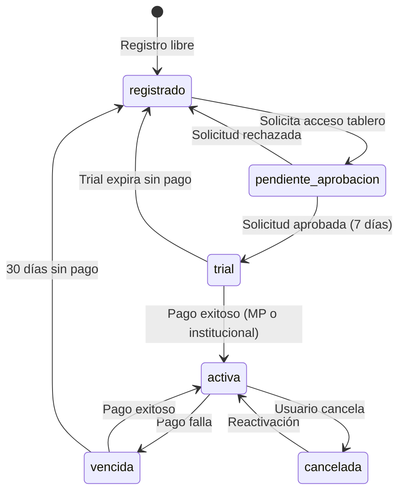

# 5. Flujos de Usuario

> Última actualización: 2026-02-07
> Versión: 2.0 — Modelo híbrido (registro libre + acceso gated + CMS)

## Referencias

| Documento | Relación |
|-----------|----------|
| [01_MODELO_NEGOCIO](./01_MODELO_NEGOCIO.md) | Define tipos de usuario y flujo de acceso |
| [02_ARQUITECTURA_PANTALLAS](./02_ARQUITECTURA_PANTALLAS.md) | Pantallas involucradas |
| [04_MODELO_DATOS](./04_MODELO_DATOS.md) | Tablas afectadas |

## Matriz de Impacto

| Si cambia... | Actualizar... |
|--------------|---------------|
| Flujo de checkout | 04_MODELO_DATOS (pagos), 03_WIREFRAMES/checkout.md |
| Estados de suscripción | 04_MODELO_DATOS (suscripciones) |
| Flujo de acceso gated | 04_MODELO_DATOS (solicitudes_acceso) |
| CMS | 04_MODELO_DATOS (contenidos, envios_contenido) |

---

## F-01: Visitante → Registrado

Registro libre sin selección de plan. Da acceso a contenido (informes, notas, análisis).

```
┌─────────────────────────────────────────────────────────────────────────┐
│                                                                          │
│  1. DESCUBRIMIENTO                                                       │
│     ┌─────────┐                                                          │
│     │ Landing │ ──→ Ve narrativa OEDE, funcionalidades, números         │
│     └────┬────┘                                                          │
│          │                                                               │
│          ▼                                                               │
│  2. REGISTRO LIBRE                                                       │
│     ┌─────────┐     ┌─────────┐     ┌─────────┐                         │
│     │ Click   │ ──→ │ Form    │ ──→ │ Email   │                         │
│     │"Regist."│     │ nombre, │     │ confirm │                         │
│     └─────────┘     │ email,  │     └────┬────┘                         │
│                     │ empresa,│          │                               │
│                     │ perfil  │          │                               │
│                     └─────────┘          │                               │
│                                          ▼                               │
│  3. ACCESO A CONTENIDO                                                   │
│     ┌──────────────┐     ┌──────────────┐                                │
│     │ Welcome      │ ──→ │ /contenido   │                                │
│     │ "Bienvenido, │     │ Informes y   │                                │
│     │ ya podés     │     │ notas        │                                │
│     │ acceder a    │     │ disponibles" │                                │
│     │ informes"    │     └──────────────┘                                │
│     └──────────────┘                                                     │
│                                                                          │
│  Nota: NO tiene acceso al dashboard.                                     │
│  Para el tablero → F-02                                                  │
│                                                                          │
└─────────────────────────────────────────────────────────────────────────┘
```

### Pasos Detallados

| Paso | Pantalla | Acción | Siguiente |
|------|----------|--------|-----------|
| 1 | [P-01](./03_WIREFRAMES/publicas.md#p-01-landing-page) | Click "Registrarse gratis" | P-05 |
| 2 | [P-05](./03_WIREFRAMES/publicas.md#p-05-registro) | Completar form (sin plan) | Email |
| 3 | Email | Click "Verificar" | P-26 |
| 4 | [P-26](./02_ARQUITECTURA_PANTALLAS.md) | Navega contenido | Uso normal |

### Tablas Afectadas

- `auth.users` — Nuevo registro
- `suscripciones` — Estado `registrado` automático

---

## F-02: Registrado → Solicita Acceso al Tablero

Flujo gated: el usuario solicita, MOL/OEDE aprueba, se activa trial de 7 días.

```
┌─────────────────────────────────────────────────────────────────────────┐
│                                                                          │
│  1. TRIGGER (cualquiera de estos)                                        │
│     ┌─────────────┐  ┌─────────────┐  ┌─────────────┐                   │
│     │ Banner en   │  │ CTA en      │  │ CTA en      │                   │
│     │ /contenido  │  │ landing     │  │ /precios    │                   │
│     │ "Accedé al  │  │ "Solicitar  │  │ "Solicitar  │                   │
│     │  tablero"   │  │  acceso"    │  │  acceso"    │                   │
│     └──────┬──────┘  └──────┬──────┘  └──────┬──────┘                   │
│            │                │                │                           │
│            └────────────────┼────────────────┘                           │
│                             ▼                                            │
│  2. FORMULARIO DE SOLICITUD                                              │
│     ┌──────────────────────────────────────┐                             │
│     │  P-28: /solicitar-acceso             │                             │
│     │                                      │                             │
│     │  ¿Por qué querés acceder             │                             │
│     │  al tablero?                         │                             │
│     │  ┌──────────────────────────────┐    │                             │
│     │  │ (motivo libre)               │    │                             │
│     │  └──────────────────────────────┘    │                             │
│     │                                      │                             │
│     │  [Enviar solicitud]                  │                             │
│     └──────────────────┬───────────────────┘                             │
│                        │                                                 │
│                        ▼                                                 │
│  3. ESPERA APROBACIÓN                                                    │
│     ┌──────────────────────────────────────┐                             │
│     │  "Tu solicitud fue enviada.          │                             │
│     │   Te notificaremos por email         │                             │
│     │   cuando sea aprobada."              │                             │
│     └──────────────────────────────────────┘                             │
│                        │                                                 │
│                        ▼                                                 │
│  4. ADMIN REVISA (P-29: /admin/solicitudes)                              │
│     ┌──────────────────────────────────────┐                             │
│     │  Admin ve: nombre, empresa, perfil,  │                             │
│     │  motivo de la solicitud.             │                             │
│     │                                      │                             │
│     │  [Aprobar]  [Rechazar + motivo]      │                             │
│     └──────────┬─────────────┬─────────────┘                             │
│                │             │                                           │
│         ┌──────┘             └──────┐                                    │
│         ▼                          ▼                                     │
│  5a. APROBADO                5b. RECHAZADO                               │
│  ┌──────────────────┐       ┌──────────────────┐                        │
│  │ Email: "¡Tu      │       │ Email: "Tu       │                        │
│  │ acceso fue        │       │ solicitud no fue │                        │
│  │ aprobado! Tenés   │       │ aprobada.        │                        │
│  │ 7 días de prueba" │       │ Motivo: ..."     │                        │
│  └────────┬─────────┘       └──────────────────┘                        │
│           │                                                              │
│           ▼                                                              │
│  6. TRIAL ACTIVO                                                         │
│  ┌──────────────────────────────────────┐                                │
│  │  /dashboard ── Acceso completo       │                                │
│  │  por 7 días (limitaciones TBD)       │                                │
│  └──────────────────────────────────────┘                                │
│                                                                          │
└─────────────────────────────────────────────────────────────────────────┘
```

### Pasos Detallados

| Paso | Pantalla | Acción | Siguiente |
|------|----------|--------|-----------|
| 1 | P-26 / P-01 / P-02 | Click "Solicitar acceso" | P-28 |
| 2 | [P-28](./02_ARQUITECTURA_PANTALLAS.md) | Completar motivo + enviar | Confirmación |
| 3 | - | Espera (email cuando se resuelve) | - |
| 4 | [P-29](./02_ARQUITECTURA_PANTALLAS.md) | Admin aprueba/rechaza | Email |
| 5 | Email | Link a /dashboard (si aprobado) | P-09 |
| 6 | [P-09](./03_WIREFRAMES/suscriptor.md#p-09-dashboard) | Trial 7 días | F-03 (upgrade) |

### Tablas Afectadas

- `solicitudes_acceso` — Nueva solicitud (estado `pendiente` → `aprobada`/`rechazada`)
- `suscripciones` — Si aprobada: nueva suscripción con estado `trial`, fecha_fin = +7 días

---

## F-03: Trial → Suscriptor (Checkout Dual)

Cuando el trial está por expirar o el usuario quiere suscribirse. Pago por MercadoPago (individuos) o mecanismo institucional (organismos).

```
┌─────────────────────────────────────────────────────────────────────────┐
│                                                                          │
│  1. TRIGGER                                                              │
│     ┌─────────────┐  ┌─────────────┐  ┌─────────────┐                   │
│     │ Banner:     │  │ Email:      │  │ Cuenta →    │                   │
│     │ "Te quedan  │  │ "Tu trial   │  │ Suscripción │                   │
│     │  3 días"    │  │  vence en   │  │ [Upgrade]   │                   │
│     │             │  │  3 días"    │  │             │                   │
│     └──────┬──────┘  └──────┬──────┘  └──────┬──────┘                   │
│            │                │                │                           │
│            └────────────────┼────────────────┘                           │
│                             ▼                                            │
│  2. SELECCIÓN DE CANAL                                                   │
│     ┌──────────────────────────────────────┐                             │
│     │  P-15 o P-06: ¿Cómo querés pagar?   │                             │
│     │                                      │                             │
│     │  ○ MercadoPago (tarjeta, transf.)    │                             │
│     │  ○ Institucional (orden de compra)   │                             │
│     │                                      │                             │
│     └──────────┬─────────────┬─────────────┘                             │
│                │             │                                           │
│         ┌──────┘             └──────┐                                    │
│         ▼                          ▼                                     │
│  3a. MERCADOPAGO               3b. INSTITUCIONAL                         │
│  ┌──────────────────┐       ┌──────────────────┐                        │
│  │ P-06: Checkout   │       │ Formulario con   │                        │
│  │ → Redirect a MP  │       │ datos de          │                        │
│  │ → Pago online    │       │ facturación.      │                        │
│  │ → Redirect back  │       │ MOL gestiona      │                        │
│  └────────┬─────────┘       │ offline.          │                        │
│           │                 └────────┬─────────┘                        │
│           │                          │                                   │
│           └──────────┬───────────────┘                                   │
│                      ▼                                                   │
│  4. ACTIVACIÓN                                                           │
│     ┌──────────────────────────────────────────────┐                    │
│     │  ✓ Plan actualizado a Suscriptor             │                    │
│     │  ✓ Acceso completo al tablero                │                    │
│     │  ✓ Email de confirmación enviado             │                    │
│     │                                              │                    │
│     │  [Ir al Dashboard]                           │                    │
│     └──────────────────────────────────────────────┘                    │
│                                                                          │
└─────────────────────────────────────────────────────────────────────────┘
```

### Canales de Pago

| Canal | Para quién | Método | Activación |
|-------|-----------|--------|------------|
| MercadoPago | Individuos, consultoras | Tarjeta, transferencia, efectivo | Automática (webhook) |
| Institucional | Organismos, gobierno, universidades | Orden de compra, facturación | Manual (admin confirma) |

### Tablas Afectadas

- `suscripciones` — Estado `trial` → `activa`, canal_pago asignado
- `pagos` — Nuevo registro con canal correspondiente

---

## F-04: Webhook MercadoPago

```
┌─────────────────────────────────────────────────────────────────────────┐
│                                                                          │
│  PAGO APROBADO                                                           │
│                                                                          │
│  MercadoPago ──→ POST /api/webhooks/mercadopago                         │
│       │                    │                                             │
│       │                    ▼                                             │
│       │         ┌─────────────────────┐                                 │
│       │         │ Verificar firma     │                                 │
│       │         │ (seguridad)         │                                 │
│       │         └──────────┬──────────┘                                 │
│       │                    │                                             │
│       │                    ▼                                             │
│       │         ┌─────────────────────┐                                 │
│       │         │ Buscar suscripción  │                                 │
│       │         │ por mp_subscription │                                 │
│       │         └──────────┬──────────┘                                 │
│       │                    │                                             │
│       │                    ▼                                             │
│       │         ┌─────────────────────┐                                 │
│       │         │ Actualizar estado   │                                 │
│       │         │ suscripcion='activa'│                                 │
│       │         │ canal='mercadopago' │                                 │
│       │         └──────────┬──────────┘                                 │
│       │                    │                                             │
│       │                    ▼                                             │
│       │         ┌─────────────────────┐                                 │
│       │         │ Insertar en pagos   │                                 │
│       │         │ estado='aprobado'   │                                 │
│       │         │ canal='mercadopago' │                                 │
│       │         └──────────┬──────────┘                                 │
│       │                    │                                             │
│       │                    ▼                                             │
│       │         ┌─────────────────────┐                                 │
│       │         │ Enviar email        │                                 │
│       │         │ confirmación        │                                 │
│       │         └─────────────────────┘                                 │
│                                                                          │
│  ─────────────────────────────────────────────────────────────────────  │
│                                                                          │
│  PAGO RECHAZADO                                                          │
│                                                                          │
│  MercadoPago ──→ POST /api/webhooks/mercadopago                         │
│                            │                                             │
│                            ▼                                             │
│                  ┌─────────────────────┐                                │
│                  │ Insertar en pagos   │                                │
│                  │ estado='rechazado'  │                                │
│                  └──────────┬──────────┘                                │
│                             │                                            │
│                             ▼                                            │
│                  ┌─────────────────────┐                                │
│                  │ Enviar email        │                                │
│                  │ "Problema con pago" │                                │
│                  └─────────────────────┘                                │
│                                                                          │
└─────────────────────────────────────────────────────────────────────────┘
```

### Eventos de Webhook

| Evento MP | Acción Sistema |
|-----------|----------------|
| `payment.created` | Log, esperar confirmación |
| `payment.approved` | Activar suscripción |
| `payment.rejected` | Email usuario, log error |
| `subscription.cancelled` | Marcar suscripción cancelada |

### Seguridad del Webhook

1. **Verificar firma** - Header `x-signature` de MP
2. **Validar origen** - IP de MercadoPago
3. **Idempotencia** - Evitar procesar duplicados
4. **Logging** - Registrar todo para auditoría

---

## F-05: CMS — Admin Publica Contenido (NUEVO)

Admin crea contenido desde datos del dashboard y el sistema lo distribuye a registrados.

```
┌─────────────────────────────────────────────────────────────────────────┐
│                                                                          │
│  1. ADMIN CREA CONTENIDO                                                 │
│     ┌──────────────────────────────────────┐                             │
│     │  P-30: /admin/contenidos             │                             │
│     │                                      │                             │
│     │  [+ Nuevo contenido]                 │                             │
│     │                                      │                             │
│     │  Título: _______________             │                             │
│     │  Tipo: [Informe ▼]                   │                             │
│     │  Categoría: [Mensual ▼]              │                             │
│     │  Tags: [tecnología] [+]              │                             │
│     │                                      │                             │
│     │  Contenido: [Editor WYSIWYG]         │                             │
│     │  PDF adjunto: [Subir archivo]        │                             │
│     │                                      │                             │
│     │  [Guardar borrador] [Publicar]       │                             │
│     └──────────────────┬───────────────────┘                             │
│                        │                                                 │
│                        ▼                                                 │
│  2. PUBLICAR                                                             │
│     ┌──────────────────────────────────────┐                             │
│     │  Estado: borrador → publicado        │                             │
│     │  Disponible en /contenido            │                             │
│     │                                      │                             │
│     │  ¿Enviar por email a registrados?    │                             │
│     │  ○ Sí, a todos                       │                             │
│     │  ○ Sí, segmentado por perfil/interés │                             │
│     │  ○ No, solo publicar en web          │                             │
│     │                                      │                             │
│     │  [Confirmar publicación]             │                             │
│     └──────────────────┬───────────────────┘                             │
│                        │                                                 │
│                        ▼                                                 │
│  3. DISTRIBUCIÓN                                                         │
│     ┌──────────────────────────────────────┐                             │
│     │  Sistema envía email a registrados:  │                             │
│     │                                      │                             │
│     │  "Nuevo informe disponible:          │                             │
│     │   [Título del contenido]             │                             │
│     │                                      │                             │
│     │   [Ver informe] [Descargar PDF]"     │                             │
│     │                                      │                             │
│     │  Para cada destinatario:             │                             │
│     │  → envios_contenido (tracking)       │                             │
│     └──────────────────┬───────────────────┘                             │
│                        │                                                 │
│                        ▼                                                 │
│  4. MÉTRICAS                                                             │
│     ┌──────────────────────────────────────┐                             │
│     │  P-30: Admin ve en dashboard CMS:    │                             │
│     │                                      │                             │
│     │  Enviados: 850                       │                             │
│     │  Abiertos: 312 (36.7%)              │                             │
│     │  Descargas PDF: 145                  │                             │
│     │  Vistas web: 278                     │                             │
│     └──────────────────────────────────────┘                             │
│                                                                          │
└─────────────────────────────────────────────────────────────────────────┘
```

### Tablas Afectadas

- `contenidos` — CRUD de informes/notas/análisis
- `envios_contenido` — Registro de cada envío por email (tracking apertura/click)

### Pantallas Involucradas

| Pantalla | Rol | Acción |
|----------|-----|--------|
| P-30 | Admin | Crear, editar, publicar contenido |
| P-26 | Registrado | Ver lista de contenidos disponibles |
| P-27 | Registrado | Ver detalle de un contenido |
| P-03 | Visitante | Preview (título + descripción, requiere registro para acceder) |

---

## F-06: Evaluación de Compatibilidad + Reporte para Empresas (NUEVO — V-17)

Flujo completo con dos caminos de entrada (trabajador independiente y gestor de oficina de empleo), captura de competencias con 3 vías, matching contra perfil consolidado argentino, y generación del reporte.

### Dos caminos de entrada

| Camino | Usuario | Entrada | Estado |
|--------|---------|---------|--------|
| A. Mi Futuro Laboral | Trabajador independiente | `/mi-futuro-laboral` → `/skills?tab=myskills` | Landing existe, cards de evaluación por crear |
| B. Oficina de Empleo | Gestor / orientador | `/oficina-empleo` → perfil trabajador | Hub wireframe, funcionalidad por conectar |

Ambos caminos convergen en el mismo motor de matching (`MySkillsSearch`) y producen el mismo reporte.

### Captura de competencias (Paso 2) — 3 vías combinables

| Vía | Pregunta | Cómo funciona | Estado |
|-----|----------|---------------|--------|
| 1. Por ocupación | "¿En qué trabajaste?" | Busca ocupación ESCO → extrae competencias del perfil consolidado argentino | ✅ Existe |
| 2. Por tarea/habilidad | "¿Qué sabés hacer?" | Busca directo en catálogo ESCO + emergentes argentinas (por nombre y definición) | ❌ Nuevo |
| 3. Texto libre | "Contanos con tus palabras" | Describe experiencia → NLP identifica competencias | ❌ Nuevo |

**Elemento clave:** Cada competencia identificada muestra su **definición ESCO** para que el trabajador confirme (✓), marque como dudoso (?), o descarte (✕). Resuelve el problema de que muchas personas no se identifican con nombres técnicos formales.

### Taxonomía de referencia: Perfil Consolidado Argentino

El matching no usa ESCO genérico sino el **Perfil Consolidado Argentino** (tabla `esco_argentino`), que incluye:
- Skills ESCO estándar (14,257) marcadas como `esco_common`
- Skills emergentes del mercado argentino aprobadas por analistas, marcadas como `argentina_approved`
- Cada ocupación tiene su versión (v1, v2...) que se incrementa con cada aprobación
- El reporte registra la versión usada (`perfil_consolidado_version`) para reproducibilidad

> Estado: Sistema de perfiles consolidados **ya implementado** (tabla, API CRUD, panel de aprobación en /admin/skills → tab Consolidado).

### Flujo completo

```
┌─────────────────────────────────────────────────────────────────────────┐
│                                                                          │
│  1. GESTOR O TRABAJADOR GENERA REPORTE (desde "Mis Skills", paso 3)     │
│     ┌──────────────────────────────────────────────────────┐            │
│     │  P-10: /dashboard/skills → Tab "Mis Skills"          │            │
│     │                                                      │            │
│     │  Ocupación: Desarrollador de software                │            │
│     │  Compatibilidad: 78%                                 │            │
│     │  Skills cubiertas: 7/9 esenciales                    │            │
│     │                                                      │            │
│     │  [Generar Reporte para Empresa]                      │            │
│     └──────────────────┬───────────────────────────────────┘            │
│                        │                                                 │
│                        ▼                                                 │
│  2. CONFIRMAR DATOS DEL REPORTE (modal)                                 │
│     ┌──────────────────────────────────────────────────────┐            │
│     │  Nombre del candidato: [Juan Pérez     ]             │            │
│     │  DNI: [30.123.456         ]                          │            │
│     │  Vacante: [Desarrollador de software   ]             │            │
│     │                                                      │            │
│     │  El reporte estará disponible por 60 días.           │            │
│     │                                                      │            │
│     │  [Cancelar]  [Generar Reporte + PDF]                 │            │
│     └──────────────────┬───────────────────────────────────┘            │
│                        │                                                 │
│                        ▼                                                 │
│  3. REPORTE GENERADO                                                    │
│     ┌──────────────────────────────────────────────────────┐            │
│     │  ✓ Reporte creado exitosamente                       │            │
│     │                                                      │            │
│     │  [Descargar PDF]  [Copiar link]  [Ver reporte web]   │            │
│     └──────────────────────────────────────────────────────┘            │
│                        │                                                 │
│                        │  (trabajador entrega PDF al reclutador)        │
│                        ▼                                                 │
│  4. RECLUTADOR ESCANEA QR                                               │
│     ┌──────────────────────────────────────────────────────┐            │
│     │  P-35: /reporte/{token}                              │            │
│     │                                                      │            │
│     │  ┌── Datos del Perfil ──────────────────────────┐    │            │
│     │  │ Candidato: Juan Pérez                        │    │            │
│     │  │ Vacante: Desarrollador de software           │    │            │
│     │  │ Compatibilidad: 78% ████████░░ 7/9 esencial. │    │            │
│     │  └──────────────────────────────────────────────┘    │            │
│     │                                                      │            │
│     │  ┌── Mapa de Competencias Requeridas ───────────┐    │            │
│     │  │ ✓ JavaScript        ✓ Python                 │    │            │
│     │  │ ✓ SQL               ✓ Testing                │    │            │
│     │  │ ✓ Git               ✓ Agile                  │    │            │
│     │  │ ✓ REST APIs         ✗ Docker (gap)           │    │            │
│     │  │                     ✗ CI/CD (gap)            │    │            │
│     │  │                                              │    │            │
│     │  │ [+ Agregar competencia] [✕ Quitar seleccion.] │    │            │
│     │  │ (recalcula automáticamente al editar)         │    │            │
│     │  └──────────────────────────────────────────────┘    │            │
│     │                                                      │            │
│     │  ┌── Brecha Técnica ────────────────────────────┐    │            │
│     │  │ Competencias faltantes: Docker, CI/CD        │    │            │
│     │  └──────────────────────────────────────────────┘    │            │
│     │                                                      │            │
│     │  Conocé más sobre el MOL → [mol-nextjs.vercel.app]   │            │
│     └──────────────────────────────────────────────────────┘            │
│                                                                          │
└─────────────────────────────────────────────────────────────────────────┘
```

### Pasos Detallados

| Paso | Pantalla | Actor | Acción | Siguiente |
|------|----------|-------|--------|-----------|
| 0a | /mi-futuro-laboral | Trabajador | Click "Evaluar mi compatibilidad" | P-10 Mis Skills |
| 0b | /oficina-empleo | Gestor | Accede a perfil trabajador | P-10 Mis Skills |
| 1 | P-10 paso 1 | Ambos | Ingresa datos del trabajador (nombre, DNI) | Paso 2 |
| 2 | P-10 paso 2 | Ambos | Captura competencias (3 vías: ocupación, tarea, texto libre) | Paso 3 |
| 3a | P-10 paso 3, tab Ocupaciones | Ambos | Ve ranking de ocupaciones compatibles | Explora tabs o click "Reporte" |
| 3b | P-10 paso 3, tab Ofertas | Ambos | Ve ofertas reales que matchean, con gap personalizado | Click "Reporte" (vinculado a oferta) |
| 3c | P-10 paso 3, tab Capacitación | Ambos | Ve cursos sugeridos para cubrir brechas + transición laboral (por preferencia o por demanda del mercado) | Informativo |
| 4 | Modal en P-10 | Ambos | Confirma datos candidato + vacante | API genera reporte |
| 5 | P-10 | Ambos | Descarga PDF / copia link | Entrega |
| 6 | (fuera del sistema) | Trabajador | Entrega PDF al reclutador | Reclutador escanea |
| 7 | P-35 | Reclutador | Escanea QR, ve reporte, edita competencias | Fin |

### Tablas Afectadas

- `reportes_compatibilidad` — INSERT con snapshot de matching + token + `perfil_consolidado_version` + `origen`
- `perfiles_trabajadores` — Lectura/creación del perfil
- `esco_argentino` — Lectura del perfil consolidado argentino para la ocupación
- `uso_features` — Tracking de uso (feature: 'reporte_compatibilidad')

### Consideraciones

- **Dos caminos, mismo flujo:** Ambos caminos convergen en MySkillsSearch. La diferencia es narrativa y punto de entrada.
- **Perfil Consolidado Argentino:** El matching usa `esco_argentino` (ESCO + emergentes), no ESCO genérico. El reporte registra la versión.
- **3 vías de captura:** El trabajador no necesita conocer su ocupación formal. Puede describir tareas o escribir texto libre.
- **Definiciones visibles:** Cada competencia muestra su definición ESCO para confirmar/descartar.
- **Sin autenticación para reclutador:** Accede por token público UUID no adivinable.
- **Expiración:** 60 días por defecto. Quien generó puede revocar.
- **Snapshot inmutable:** Los datos se congelan al generar. Cambios posteriores no afectan.
- **Interactividad:** El reclutador puede editar competencias requeridas y el recálculo es en frontend (no persiste).

---

## Estados de Suscripción



### Descripción de Estados

| Estado | Descripción | Acceso |
|--------|-------------|--------|
| `registrado` | Registro libre, sin tablero | Contenido (informes, notas) |
| `pendiente_aprobacion` | Solicitó acceso, esperando MOL | Contenido |
| `trial` | Aprobado, 7 días de prueba | Dashboard (limitaciones TBD) |
| `activa` | Suscripción pagada (MP o institucional) | Dashboard completo |
| `vencida` | Pago pendiente | Degradado a registrado |
| `cancelada` | Usuario canceló | Contenido hasta fin de período |

---

## F-07: Técnico OE orienta formación con impacto medible (Bloque 8°)

```
Técnico atiende al trabajador (S2-4)
    ↓
Ve brechas del perfil (skills faltantes para ocupaciones compatibles)
    ↓
Abre tab Formación (S2-8)
    ↓
Ve cursos del catálogo de la OE agrupados por brecha
    ↓
Cada curso muestra IMPACTO: "si completa X, su match sube de 61% a 78%"
    ↓
Click "Derivar a este curso" → registra derivación en el caso
    ↓
Seguimiento: derivado → en curso → completado → perfil actualizado
```

### Tablas Afectadas

- `cursos_oe` — catálogo de cursos mapeados a skills ESCO
- `perfiles_trabajadores` — se actualiza skills cuando completa el curso

---

## F-08: Empresa publica búsqueda y preselecciona (Bloque 11°)

```
Empresa se registra (S3-4)
    ↓
Crea perfil de puesto (S3-6): título + skills requeridas (ESCO + emergentes)
    ↓
Publica búsqueda → sistema rankea pool de candidatos con opt-in
    ↓
Ve candidatos ordenados por match % con brecha específica (S3-10)
    ↓
Compara side-by-side con mismo perfil de puesto (S3-8)
    ↓
Preselecciona → candidato recibe notificación (si tiene email)
    ↓
Historial guardado: candidato, match, fecha, puesto (S3-7)
```

### Tablas Afectadas

- `vacantes_empresa` — vacante con skills ESCO
- `perfiles_trabajadores` — candidatos con opt-in
- `organizaciones` — empresa registrada

---

## F-09: Trabajador carga título → skills automáticas (Bloque 12°)

```
Trabajador en paso 2 (captura skills) elige Vía 4: "¿Qué estudiaste?"
    ↓
Busca su título: "tecnicatura en redes"
    ↓
Sistema busca en base de resoluciones oficiales + catálogos academias
    ↓
Encuentra: "Tecnicatura Superior en Redes — UTN, Res. ME 1234/2024"
    ↓
Muestra skills derivadas con definición ESCO (6 skills)
    ↓
Trabajador confirma/descarta cada skill (mismo UI que otras vías)
    ↓
Skills verificadas se marcan con badge "Verificado por formación"
    ↓
Si no encuentra su título → carga manual (nombre + institución)
```

### Tablas Afectadas

- `resoluciones_formacion` — base de títulos mapeados a skills
- `perfiles_trabajadores` — skills derivadas de formación

---

## F-10: Integración S1 ↔ S2 — Vinculación trabajador-OE por DNI

### Principio

El trabajador tiene UN solo perfil en todo el sistema. El DNI es el vinculador. El perfil se crea en S1 (trabajador solo) o en S2 (técnico de OE), y se comparte entre ambos cuando hay vínculo.

### Escenario A: Trabajador se autoevaluó en S1, después va a una OE

```
Trabajador usó S1 → tiene perfil con DNI 30.123.456
    ↓
Va a la OE de su barrio
    ↓
Técnico pone DNI 30.123.456 en el sistema
    ↓
Sistema encuentra perfil existente:
  "Juan Pérez — 12 skills — 3 ocupaciones compatibles — 1 reporte generado"
    ↓
Técnico pregunta: "¿Vinculamos este perfil a nuestra oficina?"
    ↓
Trabajador acepta (verbalmente, técnico confirma)
    ↓
Perfil queda vinculado: organizacion_id = OE del técnico
    ↓
Técnico puede ver skills, resultados, agregar nota, derivar a cursos
Trabajador sigue viendo todo desde S1 (su perfil no cambia)
Los reportes que el trabajador generó en S1 siguen siendo privados
```

### Escenario B: Trabajador atendido en OE, después usa S1 solo

```
Técnico crea perfil en OE para el trabajador (DNI 30.123.456)
    ↓
Trabajador quiere seguir explorando desde su celular
    ↓
Entra a S1 (/mi-futuro-laboral) → se registra con email
    ↓
Sistema le pide DNI (opcional para evaluar, obligatorio para guardar)
    ↓
Pone DNI 30.123.456 → sistema detecta perfil existente (creado por OE)
    ↓
"Ya tenés un perfil creado en la OE [nombre]. ¿Querés usarlo?"
    ↓
Acepta → ve su perfil completo (skills, resultados)
    ↓
Puede enriquecer desde S1 (agregar ocupaciones, skills)
    ↓
Lo que agregue también lo ve el técnico de la OE
```

### Escenario C: Trabajador acepta ser visible en pool

```
Trabajador en S1 o en OE → toggle "Quiero ser visible para búsquedas"
    ↓
Elige alcance:
  ○ Solo en mi provincia
  ○ En todo el país
  ○ No quiero ser visible (default)
    ↓
Si es visible → OEs y empresas (S3 registrado) pueden encontrarlo
    ↓
En la búsqueda aparece ANONIMIZADO:
  "Perfil #4523 — CABA — 12 skills — 78% match con Desarrollador SW"
    ↓
OE o empresa solicita contacto → trabajador recibe notificación
    ↓
Trabajador acepta → se revela nombre y datos de contacto
```

### Qué ve cada uno

| Dato | Trabajador (S1) | Técnico OE (S2) | Nota |
|------|-----------------|------------------|------|
| Skills del perfil | ✅ | ✅ (si vinculado) | Compartido |
| Ocupaciones compatibles | ✅ | ✅ | Compartido |
| Reportes generados por trabajador | ✅ | ❌ | Privados del trabajador |
| Reportes generados por OE | ✅ (los suyos) | ✅ | Los que son para él |
| Nota del técnico | ❌ | ✅ | Privada de la OE |
| Derivaciones a cursos | ✅ (ve a qué lo derivaron) | ✅ (estado seguimiento) | — |
| Historial de atención | ❌ | ✅ | Privado de la OE |
| Datos personales (DNI, email) | ✅ | ✅ (si vinculado) | — |

### Vinculación técnica

```sql
-- perfiles_trabajadores tiene:
-- - created_by: quien lo creó (puede ser el trabajador o el técnico)
-- - organizacion_id: NULL si solo S1, UUID si vinculado a OE
-- - dni: vinculador universal

-- Buscar perfil existente por DNI
SELECT * FROM perfiles_trabajadores WHERE dni = '30123456';

-- Vincular a OE (técnico confirma)
UPDATE perfiles_trabajadores
SET organizacion_id = 'uuid-oe'
WHERE dni = '30123456';

-- El trabajador sigue viendo su perfil via created_by o dni
-- La OE lo ve via organizacion_id
```

### Opt-in para pool

```sql
-- Campos en perfiles_trabajadores:
-- opt_in_pool: BOOLEAN DEFAULT FALSE
-- opt_in_alcance: VARCHAR(20) — 'provincial', 'nacional', NULL
-- opt_in_at: TIMESTAMPTZ — cuándo aceptó
-- opt_in_provincia: VARCHAR(100) — provincia del trabajador

-- Query de la OE buscando candidatos:
SELECT * FROM perfiles_trabajadores
WHERE opt_in_pool = TRUE
  AND (opt_in_alcance = 'nacional'
       OR (opt_in_alcance = 'provincial' AND opt_in_provincia = 'CABA'))
  AND organizacion_id IS DISTINCT FROM 'uuid-mi-oe' -- no mis propios
```

### Consideraciones de seguridad

- El DNI no se muestra en búsquedas del pool (solo perfil anonimizado)
- La vinculación requiere que el trabajador acepte (no es automática)
- Un perfil puede estar vinculado a más de una OE (si el trabajador se atiende en varias)
- La OE solo ve la nota de su propia atención, no la de otra OE
- Revocar opt-in: el trabajador puede desactivar la visibilidad en cualquier momento

---

## F-12: Curación automática del perfil argentino (Bloque 9°)

```
Pipeline procesa ofertas nuevas → sync_to_supabase.py sube a Supabase
    ↓
Al final del sync: supabase.rpc('recalcular_emergentes')
    ↓
Sistema detecta: "8 skills emergentes nuevas (≥30% frecuencia)"
    ↓
Guarda en tabla emergentes_pendientes
    ↓
Analista abre P-36 → ve badge "8 pendientes"
    ↓
Click → va al panel Consolidado → revisa una por una:
  - Docker (45% ofertas) → [Aprobar]
  - Atención al público (32%) → [Aprobar]
  - Limpieza (35%) → [Rechazar] (no es skill laboral específica)
    ↓
Cuando está conforme → vuelve a P-36 → "Crear versión v2.0"
    ↓
Sistema congela snapshot → regenera skills_searchable.json
    ↓
Todo el matching apunta a v2.0
```

### Tablas Afectadas

- `emergentes_pendientes` — INSERT automático post-sync, UPDATE manual del analista
- `esco_argentino` — UPDATE al aprobar emergente
- `perfil_argentino_versiones` — INSERT al crear corte

---

## F-13: Inteligencia local para la OE (Bloque 10°)

```
Coordinador de OE abre S2-10 (Inteligencia local)
    ↓
Sistema calcula automáticamente:
  1. Top skills demandadas en ofertas de la jurisdicción
  2. Top skills disponibles en la cartera de la OE
  3. Brecha: demandadas - disponibles = gap estructural
  4. Cursos del catálogo de la OE vs brechas
    ↓
Coordinador ve:
  - "Docker se pide en 78% de ofertas IT pero solo 5% de tu cartera lo tiene"
  - "No tenés cursos de Docker — recomendamos incorporar formación"
    ↓
Puede exportar reporte institucional PDF para presentar al municipio
```

### Tablas Afectadas

- `ofertas_dashboard` — lectura filtrada por jurisdicción
- `perfiles_trabajadores` — lectura filtrada por organizacion_id
- `cursos_oe` — lectura para detectar cursos faltantes

---

## F-11: Onboarding primera OE — del acuerdo institucional a la primera atención

### Proceso institucional (fuera del sistema)

```
OEDE contacta municipio/provincia
    ↓
Firma convenio de colaboración
    ↓
Municipio designa técnicos que van a usar el sistema
    ↓
OEDE recibe: nombre OE, jurisdicción, emails de técnicos
```

### Alta en el sistema (Admin OEDE)

```
Admin entra a /admin/organizaciones (por crear)
    ↓
Crear organización:
  - Nombre: "OE Municipal Avellaneda"
  - Tipo: oficina_empleo
  - Jurisdicción: "Buenos Aires - Avellaneda"
    ↓
Asignar usuarios:
  - maria@avellaneda.gob.ar → rol: coordinador
  - juan@avellaneda.gob.ar → rol: tecnico
    ↓
Sistema envía email a cada técnico:
  "Fuiste dado de alta en el MOL. Ingresá con tu email."
```

### Primer ingreso del técnico

```
Técnico recibe email → entra al link
    ↓
Login con email institucional (Supabase Auth)
    ↓
Primera vez → ve pantalla de bienvenida:
  "Bienvenido/a a la OE Municipal Avellaneda"
  "Para empezar, cargá tu planilla de personas."
    ↓
3 opciones (en orden sugerido):
  1. [Cargar personas]    ← mínimo para arrancar
  2. [Cargar vacantes]    ← opcional
  3. [Cargar cursos]      ← opcional
    ↓
Descarga template Excel con columnas sugeridas
```

### Templates Excel descargables

**Template Personas** (mínimo: solo nombre):

| Columna | Obligatoria | Ejemplo | Variantes aceptadas |
|---------|------------|---------|---------------------|
| nombre | ✅ | Juan Pérez | nombre_completo, apellido_nombre |
| dni | Recomendado | 30123456 | documento |
| telefono | Opcional | 1155667788 | tel, celular |
| email | Opcional | juan@email.com | correo |
| ocupacion | Recomendado | Albañil | ocupacion_actual, puesto |
| skills | Opcional | Soldadura, electricidad | competencias, habilidades |
| notas | Opcional | Tiene carnet conducir | observaciones |

**Template Vacantes:**

| Columna | Obligatoria | Ejemplo |
|---------|------------|---------|
| titulo | ✅ | Desarrollador Python |
| empresa | ✅ | TechCorp SA |
| descripcion | Recomendado | Buscamos desarrollador con 2 años... |
| ubicacion | Opcional | Avellaneda |
| modalidad | Opcional | Presencial |
| contacto | Opcional | rrhh@techcorp.com |

**Template Cursos:**

| Columna | Obligatoria | Ejemplo |
|---------|------------|---------|
| nombre | ✅ | Introducción a la programación |
| duracion | Recomendado | 3 meses |
| modalidad | Opcional | Presencial |
| certificacion | Opcional | Certificado municipal |
| institucion | Opcional | CENOF Avellaneda |

### Importación y procesamiento

```
Técnico sube Excel de personas
    ↓
Sistema parsea + sanitiza (parser existente, lib/parse-pool-import.ts)
    ↓
Preview: "Se encontraron 150 personas. 3 sin nombre (se saltan)."
  +----------------------------------------------------------+
  | Nombre          | DNI      | Ocupación    | Skills       |
  |-----------------|----------|--------------|--------------|
  | Juan Pérez      | 30123456 | Albañil      | Soldadura    |
  | María López     | 31456789 | Cajera       |              |
  | Pedro García    | 32789012 | Electricista | Electricidad |
  +----------------------------------------------------------+
  Mostrando 3 de 150  |  [Cancelar]  [Confirmar importación]
    ↓
Confirmar → sistema:
  1. Crea perfiles_trabajadores con organizacion_id de la OE
  2. Si tiene "ocupacion" → busca en ESCO → extrae skills automáticamente
  3. Si tiene "skills" → las agrega como skills declaradas
    ↓
"150 personas importadas. 89 con skills derivadas automáticamente."
    ↓
Técnico ya puede ver su panel de casos y empezar a atender
```

### Datos mínimos para que funcione

| Pool | Mínimo para arrancar | Qué habilita |
|------|---------------------|-------------|
| **Personas** | ✅ Solo esto alcanza | Panel de casos, matching contra ofertas MOL, reportes |
| **Vacantes** | ❌ Opcional | Matching bidireccional (empresa trae puesto → ranking cartera) |
| **Cursos** | ❌ Opcional | Tab capacitación con impacto medible de cursos propios |

Sin vacantes locales, el técnico igual puede matchear contra el pool general de ofertas del MOL en la jurisdicción. Sin cursos propios, puede derivar a cursos de fuentes externas (CABA, nacionales).

### Capacitación del técnico

No requiere capacitación formal. Se le entrega:

1. **PDF de 2 páginas** con capturas de pantalla:
   - Página 1: Cómo importar tu planilla (3 pasos)
   - Página 2: Cómo atender un caso (buscar por DNI → ver matching → generar reporte)

2. **Video de 5 minutos** (grabación de pantalla):
   - Importar personas → ver panel → atender un caso → generar reporte PDF

3. **La UI se explica sola:** cada pantalla tiene texto guía:
   - "Para empezar, cargá tu planilla de personas"
   - "Buscá al trabajador por DNI"
   - "Estas son las ocupaciones compatibles con su perfil"

### Métricas de onboarding exitoso

| Métrica | Objetivo |
|---------|---------|
| Tiempo desde alta hasta primera importación | < 1 hora |
| Personas importadas en primer carga | > 50 |
| Primera atención con matching | Mismo día del alta |
| Primer reporte PDF generado | Primera semana |
| Técnico usa el sistema sin ayuda | Segunda semana |

---

## Historial de Cambios

| Fecha | Versión | Cambio |
|-------|---------|--------|
| 2026-02-05 | 1.0 | Flujos SaaS: Visitante→Free, Free→Pro, Uso dashboard, Webhook MP |
| 2026-02-07 | 2.0 | Modelo híbrido: F-01 registro libre, F-02 acceso gated con aprobación, F-03 checkout dual, F-05 CMS. Estados: registrado, pendiente_aprobacion, trial |
| 2026-03-18 | 2.1 | F-06 Reporte de Compatibilidad Laboral (V-17): flujo gestor genera → PDF con QR → reclutador accede → edita competencias |
| 2026-03-21 | 2.3 | F-07 formación con impacto (Bloque 8°), F-08 empresa publica búsqueda (Bloque 11°), F-09 Vía 4 título → skills (Bloque 12°) |
| 2026-03-21 | 2.4 | F-10 Integración S1↔S2: vinculación por DNI, 3 escenarios, opt-in por jurisdicción, tabla visibilidad, SQL vinculación |
| 2026-03-21 | 2.5 | F-11 Onboarding primera OE. F-12 Curación automática perfil (Bloque 9°). F-13 Inteligencia local OE (Bloque 10°) |
| 2026-03-20 | 2.2 | F-06 ampliado: 2 caminos (S1+S2), 4 vías captura (+ formación/título), 3 tabs resultados, transición dual, ESCO Argentino. Fuente: MOL_Skills_Intelligence.docx v5 |
