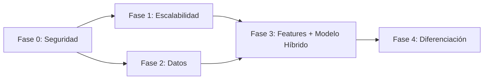

# 9. Roadmap de Implementación

> Última actualización: 2026-02-11
> Versión: 2.1 — Modelo híbrido + tensión de demanda (V-16)

## Referencias

| Documento | Relación |
|-----------|----------|
| [06_SEGURIDAD](./06_SEGURIDAD.md) | Fase 0 completa |
| [07_ESCALABILIDAD](./07_ESCALABILIDAD.md) | Fase 1 |
| [08_PROPUESTA_VALOR](./08_PROPUESTA_VALOR.md) | Fases 2-4 |
| [01_MODELO_NEGOCIO](./01_MODELO_NEGOCIO.md) | Modelo híbrido v2.0 |

## Matriz de Impacto

| Si cambia... | Actualizar... |
|--------------|---------------|
| Prioridades | Este documento |
| Issues resueltos | Marcar como completado aquí |
| Nuevos issues | Agregar a fase correspondiente |

---

## Visión General

```
FASE 0          FASE 1           FASE 2           FASE 3          FASE 4
Seguridad       Escalabilidad    Valor Datos      Features        Diferenciación
─────────────────────────────────────────────────────────────────────────────────►
                                                                             TIEMPO

[BLOQUEANTE]    [1 semana]       [2-3 semanas]    [4-6 semanas]   [2-3 meses]

- Tokens        - Paginación     - Backfill NLP   - Registro      - ML Predict
- RLS           - Cache          - Validación     - Acceso gated  - Salarios
- Open Redirect - Vistas SQL     - Salarios       - CMS           - Personaliz.
- Roles Admin   - Índices        - Tendencias     - Checkout dual - Integrac.
                                 - Tensión demanda- Alertas
```

---

## Fase 0: Seguridad (BLOQUEANTE)

**Estado:** 🟡 En progreso (3/5 tareas completadas)
**Duración estimada:** 2-3 días
**Requisito:** Completar ANTES de cualquier otra fase

### Tareas

| ID | Tarea | Prioridad | Estado |
|----|-------|-----------|--------|
| S-01 | Rotar tokens expuestos | CRITICO | 🟡 Código limpio, **rotación manual pendiente** |
| S-02 | Fix open redirect en callback | CRITICO | ✅ Completado 2026-02-22 |
| S-03 | Implementar RLS en tablas | CRITICO | ⬜ |
| S-04 | Verificar rol en APIs admin | CRITICO | ✅ Completado 2026-02-22 |
| S-07 | Headers de seguridad | ALTO | ⬜ |

### Checklist Pre-Fase-1

```
□ Tokens de Supabase rotados (código limpio, rotación manual PENDIENTE)
✓ .env* en .gitignore
✓ Redirect validado contra whitelist (S-02)
□ RLS activo en suscripciones, pagos, alertas, solicitudes_acceso, contenidos
✓ Middleware verifica rol admin (S-04)
□ Headers de seguridad en next.config.js
```

### Criterio de Éxito

- 0 vulnerabilidades críticas
- Penetration test básico sin hallazgos graves

---

## Fase 1: Escalabilidad Básica

**Estado:** 🟢 Completada (5/7 tareas core, 2 mejoras pendientes)
**Duración estimada:** 1 semana

### Tareas

| ID | Tarea | Prioridad | Estado |
|----|-------|-----------|--------|
| E-01 | Reemplazar .limit(10000) | CRITICO | ✅ Completado 2026-02-23 (SQL RPCs) |
| E-02 | Usar vistas SQL existentes | CRITICO | ✅ Completado 2026-02-23 (5 RPCs) |
| E-03 | Implementar React Query | CRITICO | ✅ Completado 2026-02-23 |
| **E-16** | **Insights SQL (no fetchAllPaginated)** | **CRITICO** | ✅ Completado 2026-02-07 |
| E-05 | Agregar índices críticos | ALTO | ✅ Completado 2026-02-23 (3 índices performance) |
| S-05 | Rate limiting en APIs | ALTO | ⬜ |
| S-06 | Validación con Zod | ALTO | ⬜ |

> **E-01/E-02/E-03 Resueltos:** 5 SQL RPCs (`get_panorama`, `get_evolucion`, `get_requerimientos`, `get_skills_resumen`, `get_sidebar_counts`) + React Query hooks + componentes migrados. 153 tests passing.

### Criterio de Éxito

| Métrica | Antes | Después |
|---------|-------|---------|
| Time to First Byte | ~800ms | < 400ms |
| Queries por página | ~10 | < 5 |
| Datos truncados | Sí | No |

---

## Fase 2: Valor de Datos

**Estado:** ⬜ Pendiente
**Duración estimada:** 2-3 semanas

### Tareas

| ID | Tarea | Prioridad | Estado |
|----|-------|-----------|--------|
| V-02 | Backfill NLP (13k ofertas) | CRITICO | ⬜ |
| V-01 | Acelerar validación | CRITICO | ⬜ |
| V-04 | Habilitar análisis salarios | CRITICO | ⬜ |
| V-07 | Gráficos tendencias | ALTO | ⬜ |
| V-16 | Tensión de demanda (scatter plot + filtro sidebar) | ALTO | ⚠️ Parcial (datos existen, UI pendiente) |

### Metas de Datos

| Métrica | Inicio | Meta |
|---------|--------|------|
| Ofertas con NLP | 49% | 80% |
| Ofertas validadas | 1% | 10% |
| Dashboard con salarios | No | Sí |
| Tensión demanda en dashboard | Datos listos | Scatter plot + filtro |

---

## Fase 3: Features Comerciales + Modelo Híbrido

**Estado:** ⬜ Pendiente
**Duración estimada:** 4-6 semanas

### Tareas — Acceso y Autenticación

| ID | Tarea | Prioridad | Pantalla |
|----|-------|-----------|----------|
| - | Registro libre (sin plan) | ALTO | P-05 |
| - | Área de contenido (registrados) | ALTO | P-26, P-27 |
| - | Solicitud de acceso al tablero | ALTO | P-28 |
| - | Gestión solicitudes (admin) | ALTO | P-29 |
| - | Workflow aprobación + email | ALTO | P-29 → email |
| - | Activación trial automática (7 días) | ALTO | Función BD |

### Tareas — CMS

| ID | Tarea | Prioridad | Pantalla |
|----|-------|-----------|----------|
| - | CRUD de contenidos (admin) | ALTO | P-30 |
| - | Distribución por email | ALTO | Sistema |
| - | Métricas de contenido (aperturas, descargas) | MEDIO | P-30 |

### Tareas — Pago Dual

| ID | Tarea | Prioridad | Pantalla |
|----|-------|-----------|----------|
| - | Checkout MercadoPago | ALTO | P-06, P-07, P-08 |
| - | Flujo pago institucional (orden compra) | ALTO | P-06 variante |
| - | Gestión suscripciones | ALTO | P-15 |
| - | Webhook MercadoPago (F-04) | ALTO | API |

### Tareas — Features Dashboard

| ID | Tarea | Prioridad | Pantalla |
|----|-------|-----------|----------|
| V-05 | Alertas por email | ALTO | P-13 |
| V-09 | Export Excel/PDF | ALTO | P-12 |
| V-08 | API pública (Institucional) | ALTO | Nueva |
| V-10 | Skills gap analysis | ALTO | Nueva |

### Criterio de Éxito

| Métrica | Meta |
|---------|------|
| Usuarios registrados | 200 |
| Solicitudes de tablero | 50 |
| Suscriptores activos | 10 |
| Contenidos publicados | 6 |
| Tasa apertura emails | > 30% |

---

## Fase 4: Diferenciación

**Estado:** ⬜ Pendiente
**Duración estimada:** 2-3 meses

### Tareas

| ID | Tarea | Descripción |
|----|-------|-------------|
| V-03 | ML Predictivo | Tendencias futuras de ocupaciones |
| V-06 | Comparador salarios | Por ocupación, provincia |
| V-14 | Dashboard personalizable | Widgets drag & drop |
| - | Integración LinkedIn | Import de perfil |
| - | Segmentación de contenido | CMS envía por interés/perfil |

---

## Dependencias entre Fases



| Dependencia | Razón |
|-------------|-------|
| F0 → F1 | No escalar un sistema inseguro |
| F0 → F2 | Datos sensibles requieren RLS |
| F1 → F3 | Features necesitan performance |
| F2 → F3 | Features necesitan datos validados |
| F3 → F4 | Diferenciación sobre base sólida |

---

## Hitos y Releases

### MVP (Fase 0 + 1 + 2 parcial)

**Meta:** Sistema funcional con datos confiables

```
✓ Seguridad básica implementada
✓ Dashboard sin problemas de performance
✓ 10% ofertas validadas
✓ Análisis de salarios básico
```

### Release 1.0 (+ Fase 3)

**Meta:** Producto con modelo híbrido funcionando

```
✓ Registro libre + acceso gated
✓ CMS publicando contenido a registrados
✓ MercadoPago + pago institucional
✓ Alertas y exports
✓ 200 registrados, 10 suscriptores
```

### Release 2.0 (+ Fase 4)

**Meta:** Diferenciación de mercado

```
✓ Predicciones ML
✓ API para Institucional
✓ 1,000 registrados, 50 suscriptores
✓ 3 clientes institucionales
```

---

## Métricas de Seguimiento

### Técnicas

| Métrica | Fase 0 | Fase 1 | Fase 2 | Fase 3 |
|---------|--------|--------|--------|--------|
| Vulnerabilidades críticas | 4→0 | 0 | 0 | 0 |
| Time to Interactive | 4s | 2s | 2s | 1.5s |
| Ofertas validadas | 1% | 1% | 10% | 20% |
| Uptime | N/A | 99% | 99% | 99.5% |

### Negocio

| Métrica | MVP | 6 meses | 1 año |
|---------|-----|---------|-------|
| Usuarios registrados | 200 | 1,000 | 5,000 |
| Suscriptores tablero | 10 | 50 | 200 |
| Institucionales | 0 | 3 | 10 |
| Contenidos publicados | 6 | 15 | 30 |
| Tasa apertura emails | - | > 30% | > 35% |
| Churn | <10% | <5% | <3% |

---

## Próximos Pasos Inmediatos

**ANTES de crear pantallas nuevas:**

1. **URGENTE:** Rotar tokens de Supabase expuestos en Git
2. **URGENTE:** Agregar `.env*` a `.gitignore`
3. **URGENTE:** Fix open redirect en `app/auth/callback/route.ts`

**DESPUÉS de asegurar:**

1. Implementar RLS básico en tablas (incluir nuevas: solicitudes_acceso, contenidos)
2. Crear las 20 páginas placeholder
3. Implementar registro libre + área de contenido
4. Implementar flujo de solicitud de acceso
5. Integrar CMS básico
6. Integrar MercadoPago + flujo institucional
7. Acelerar pipeline de validación

---

## Notas de Planificación

- **No hay estimaciones de tiempo exactas** - Depende de recursos disponibles
- **Fases pueden solaparse** - Especialmente 2 y 3
- **Fase 0 es BLOQUEANTE** - No proceder sin completarla
- **Revisar este documento semanalmente** - Actualizar estados
- **Pricing pendiente** - El precio del plan suscriptor requiere benchmark (ver [01_MODELO_NEGOCIO](./01_MODELO_NEGOCIO.md#decisiones-pendientes))

---

## Historial de Cambios

| Fecha | Versión | Cambio |
|-------|---------|--------|
| 2026-02-05 | 1.0 | Roadmap SaaS (Free/Pro/Enterprise) |
| 2026-02-07 | 2.0 | Modelo híbrido en Fase 3: acceso gated, CMS, pago dual, workflow aprobación. Métricas actualizadas |
| 2026-02-11 | 2.1 | V-16 tensión de demanda en Fase 2 (parcial: datos existen, UI pendiente) |
